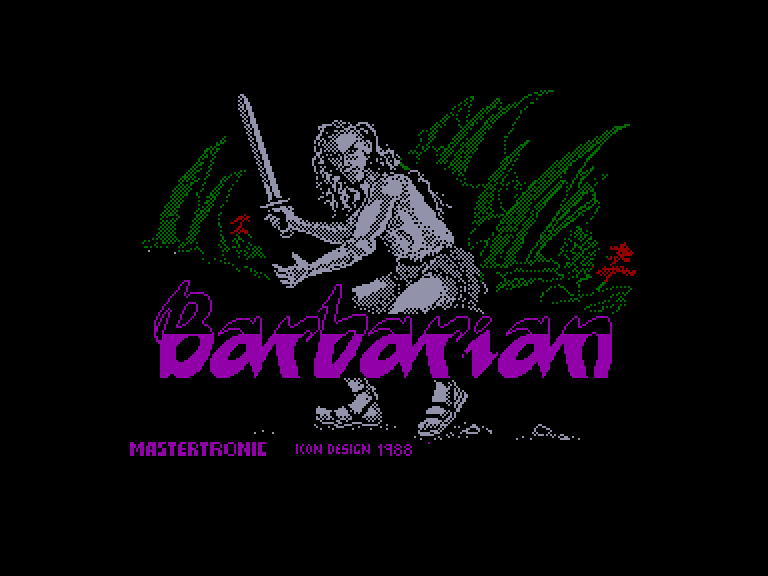
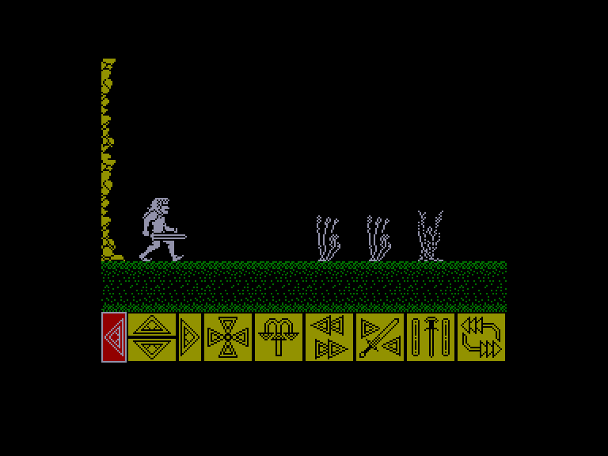
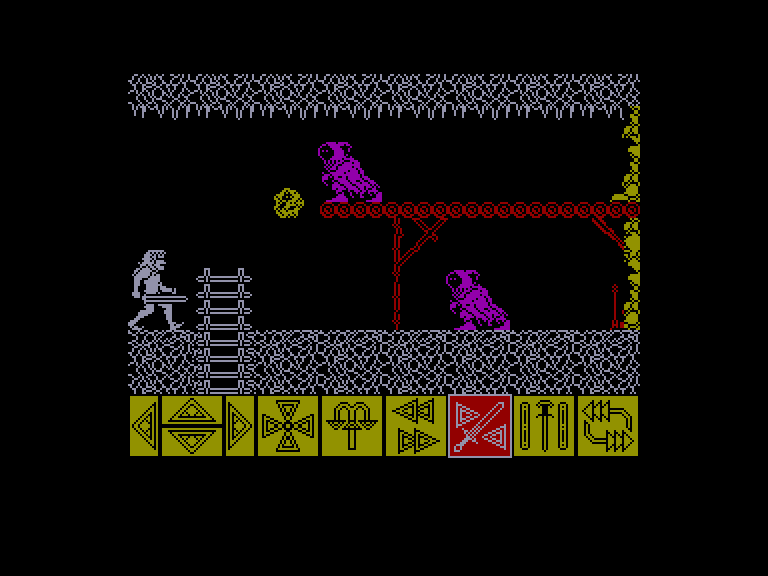
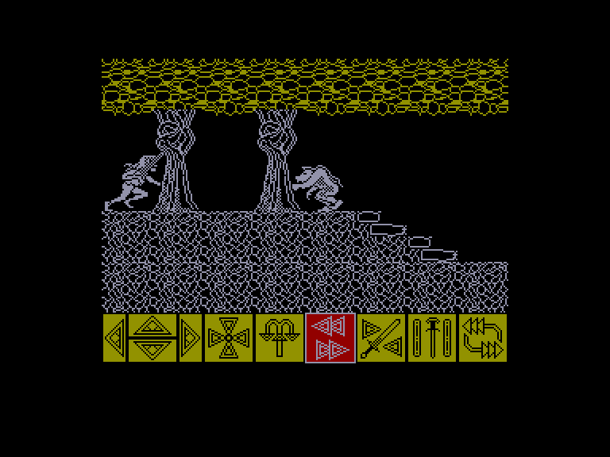

[0-9](../0/games-0.md) - [A](../a/games-a.md) - [B](../b/games-b.md) - [C](../c/games-c.md) - [D](../d/games-d.md) - [E](../e/games-e.md) - [F](../f/games-f.md) - [G](../g/games-g.md) - [H](../h/games-h.md) - [I](../i/games-i.md) - [J](../j/games-j.md) - [K](../k/games-k.md) - [L](../l/games-l.md) - [M](../m/games-m.md) - [N](../n/games-n.md) - [O](../o/games-o.md) - [P](../p/games-p.md) - [Q](../q/games-q.md) - [R](../r/games-r.md) - [S](../s/games-s.md) - [T](../t/games-t.md) - [U](../u/games-u.md) - [V](../v/games-v.md) - [W](../w/games-w.md) - [X](../x/games-x.md) - [Y](../y/games-y.md) - [Z](../z/games-z.md)

Ігри для [Enterprise 64k](../games-ep64.md) - [Enterprise 128k+RAMexp](../games-epramexp.md)

Ігри для систем [IS-DOS](../games-is-dos.md) - [SymbOS](../games-symbos.md) - [EDC Windows](../games-edcw.md)

Ігри для емуляторів [ZX Spectrum 48k/128k](../zxemu/games-zxemu.md) - [Amstrad CPC](../cpcemu/games-cpc.md) - [Sinclair ZX81](../zx81emu/games-zx81.md) - [Videoton TVC](../tvcemu/games-tvc.md) - [Commodore VIC-20](../vic20emu/games-vic20.md)

----------

# Barbarian

**ID:** barbarian-zx

## Скріншоти

## Опис

(temporary description generated by AI Assistant)

**Опис гри Barbarian:**

Barbarian — це екшн-гра, випущена в 1988 році компанією Melbourne House для платформ Spectrum (128k) та Enterprise. У грі ви берете на себе роль Хегора, барбаріана, який повинен подолати різні перешкоди та ворогів, щоб перемогти злого чаклуна Некрона, який загрожує королівству. Гравець досліджує підземелля, бореться з монстрами та збирає нові зброї, щоб стати сильнішим.

**Правила гри:**
1. Використовуйте джойстик або клавіатуру для переміщення Хегора вліво, вправо, вгору та вниз.
2. Використовуйте кнопки для виконання різних дій, таких як атака, захист, підняття предметів та використання зброї.
3. Уникайте зіткнень з ворогами, такими як чудовиська та інші небезпечні істоти, оскільки вони можуть забрати вашу енергію.
4. Збирайте нову зброю та предмети для покращення своїх можливостей.
5. Використовуйте ключі, щоб відкривати двері в підземеллях, але пам'ятайте, що ключі одноразові.
6. Пам'ятайте, що якщо ви покинете кімнату і повернетеся, всі переможені вороги можуть знову з'явитися.
7. Мета гри — перемогти Некрона та врятувати королівство, а також вийти з підземелля, коли ви досягнете виходу.

Гра має простий, але захоплюючий геймплей, що дозволяє насолоджуватися пригодами в світі барбаріанів. Успіхів у вашій місії!

## Основна інформація
- **Оригінальна платформа:** ZX Spectrum

## Посилання
- [Опис гри на ep128.hu (угорською)](http://www.ep128.hu/Games/Barbarian_3.htm)
- [Інформація про оригінальну версію](https://spectrumcomputing.co.uk/entry/405/ZX-Spectrum/Barbarian)
- [Завантажити гру](http://www.ep128.hu/Ep_Games/Prg/Barbarian_4.rar)

