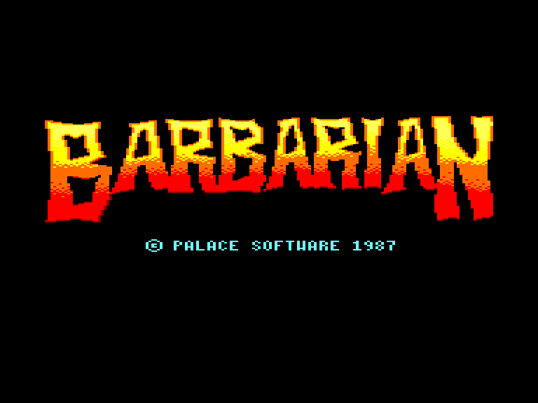
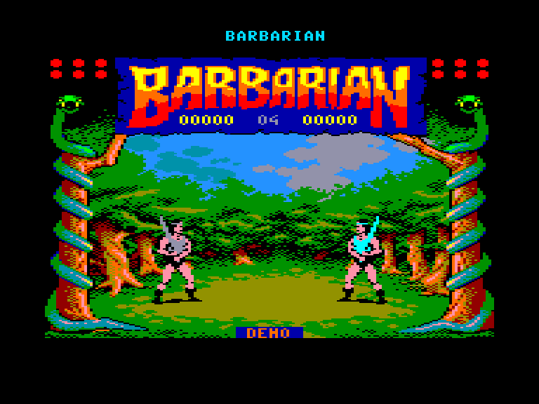
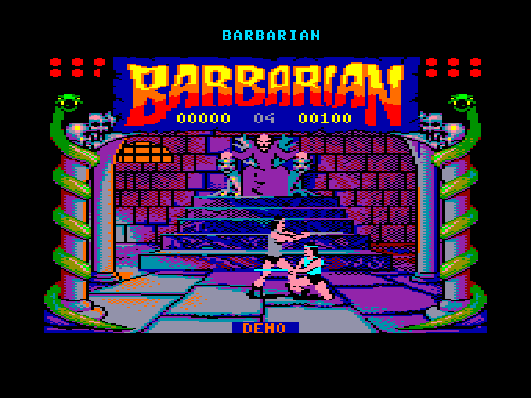
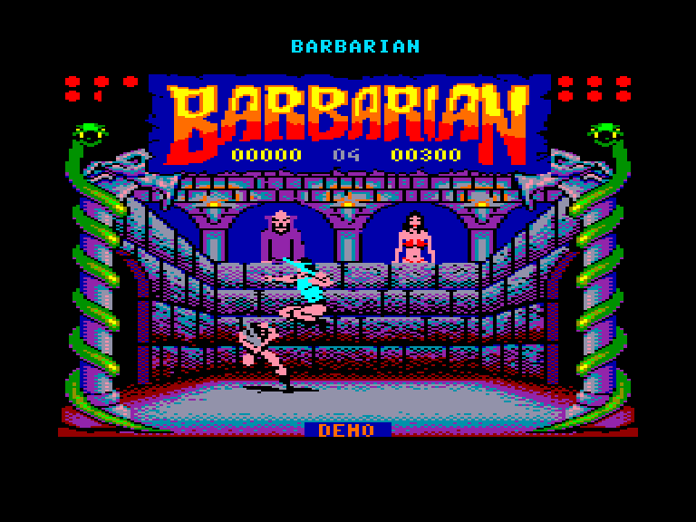

[0-9](../0/games-0.md) - [A](../a/games-a.md) - [B](../b/games-b.md) - [C](../c/games-c.md) - [D](../d/games-d.md) - [E](../e/games-e.md) - [F](../f/games-f.md) - [G](../g/games-g.md) - [H](../h/games-h.md) - [I](../i/games-i.md) - [J](../j/games-j.md) - [K](../k/games-k.md) - [L](../l/games-l.md) - [M](../m/games-m.md) - [N](../n/games-n.md) - [O](../o/games-o.md) - [P](../p/games-p.md) - [Q](../q/games-q.md) - [R](../r/games-r.md) - [S](../s/games-s.md) - [T](../t/games-t.md) - [U](../u/games-u.md) - [V](../v/games-v.md) - [W](../w/games-w.md) - [X](../x/games-x.md) - [Y](../y/games-y.md) - [Z](../z/games-z.md)

Ігри для [Enterprise 64k](../games-ep64.md) - [Enterprise 128k+RAMexp](../games-epramexp.md)

Ігри для систем [IS-DOS](../games-is-dos.md) - [SymbOS](../games-symbos.md) - [EDC Windows](../games-edcw.md)

Ігри для емуляторів [ZX Spectrum 48k/128k](../zxemu/games-zxemu.md) - [Amstrad CPC](../cpcemu/games-cpc.md) - [Sinclair ZX81](../zx81emu/games-zx81.md) - [Videoton TVC](../tvcemu/games-tvc.md) - [Commodore VIC-20](../vic20emu/games-vic20.md)

----------

# Barbarian: The Ultimate Warrior

**ID:** barbarian1-cpc

## Скріншоти

## Опис

(temporary description generated by AI Assistant)

**Опис гри Barbarian: The Ultimate Warrior:**

Barbarian: The Ultimate Warrior — це екшн-гра, випущена в 1987 році компанією Palace. У цій грі ви берете на себе роль барбаріана, який повинен боротися з ворогами, щоб стати найсильнішим воїном. Гра відзначається яскравою графікою та динамічним геймплеєм, а також можливістю грати в режимі для одного або двох гравців.

**Правила гри:**
1. Після завантаження гри натисніть **SPACE**, щоб почати.
2. Виберіть рівень, використовуючи функціональні клавіші (F1-F4).
3. Виберіть режим гри:
   - **MODE 1:** Один гравець, контроль за допомогою джойстика або клавіатури (Q, A, H, J для руху, SPACE для атаки).
   - **MODE 2:** Один гравець, контроль за допомогою другого джойстика або клавіатури.
   - **MODE 3:** Два гравці, де кожен контролює свого барбаріана.
4. Битва відбувається в стилі "битва на мечах", де ви повинні атакувати ворогів і уникати їхніх атак.
5. Збирайте предмети та енергію, щоб підвищити свої шанси на виживання.
6. Використовуйте різні стратегії в бою, щоб перемогти ворогів і завершити рівні.
7. Гра має кілька рівнів, які потрібно пройти, щоб дійти до фінального ворога.

Гра має просте управління, але вимагає тактики та швидкості в бойових ситуаціях. Успіхів у вашій битві за титул найкращого барбаріана!

## Основна інформація
- **Оригінальна платформа:** Amstrad CPC

## Посилання
- [Опис гри на ep128.hu (угорською)](http://www.ep128.hu/Ep_Games/Leiras/Barbarian.htm)
- [Інформація про оригінальну версію](https://www.cpc-power.com/index.php?page=detail&num=40)
- [Завантажити гру](http://www.ep128.hu/Ep_Games/Prg/Barbarian_CPC.rar)

**Дата генерації:** 29.07.2026

