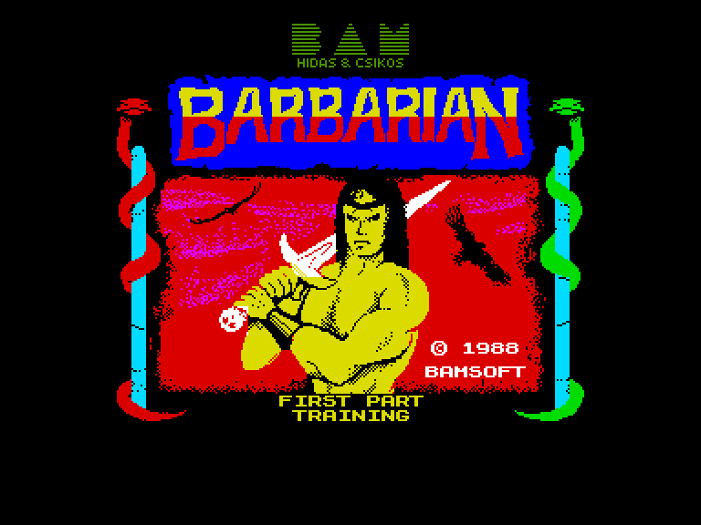
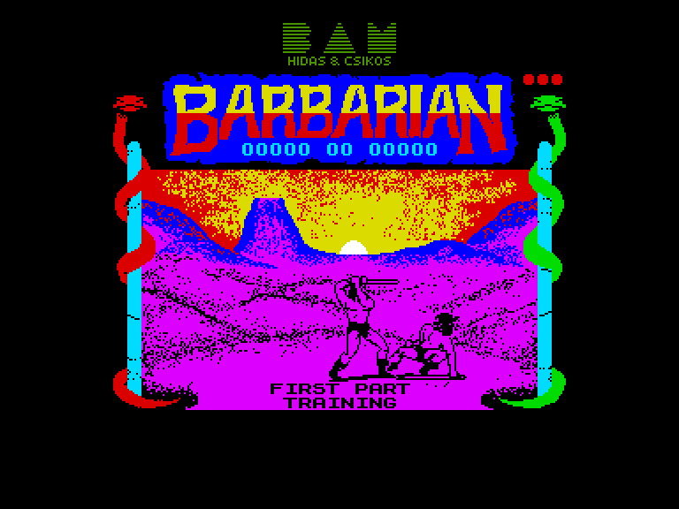
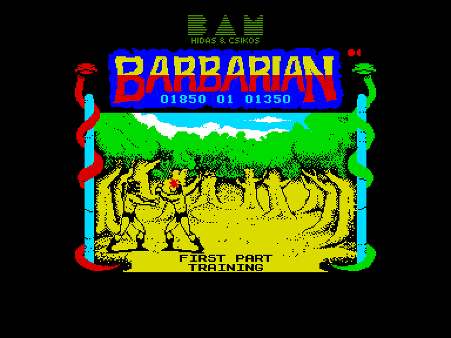
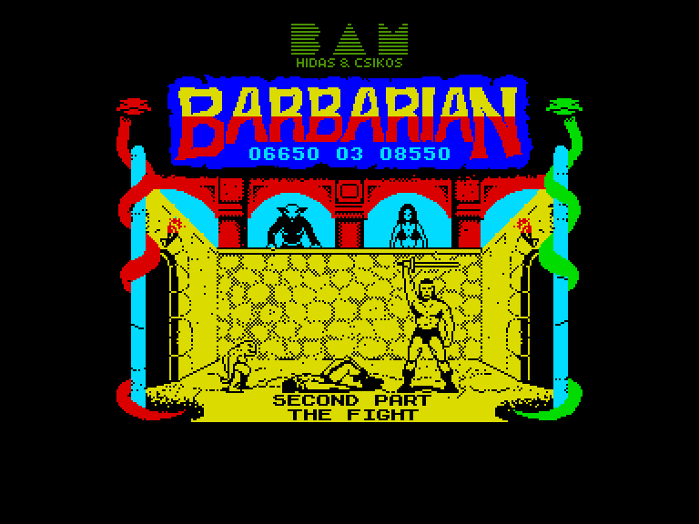

[0-9](../0/games-0.md) - [A](../a/games-a.md) - [B](../b/games-b.md) - [C](../c/games-c.md) - [D](../d/games-d.md) - [E](../e/games-e.md) - [F](../f/games-f.md) - [G](../g/games-g.md) - [H](../h/games-h.md) - [I](../i/games-i.md) - [J](../j/games-j.md) - [K](../k/games-k.md) - [L](../l/games-l.md) - [M](../m/games-m.md) - [N](../n/games-n.md) - [O](../o/games-o.md) - [P](../p/games-p.md) - [Q](../q/games-q.md) - [R](../r/games-r.md) - [S](../s/games-s.md) - [T](../t/games-t.md) - [U](../u/games-u.md) - [V](../v/games-v.md) - [W](../w/games-w.md) - [X](../x/games-x.md) - [Y](../y/games-y.md) - [Z](../z/games-z.md)

Ігри для [Enterprise 64k](../games-ep64.md) - [Enterprise 128k+RAMexp](../games-epramexp.md)

Ігри для систем [IS-DOS](../games-is-dos.md) - [SymbOS](../games-symbos.md) - [EDC Windows](../games-edcw.md)

Ігри для емуляторів [ZX Spectrum 48k/128k](../zxemu/games-zxemu.md) - [Amstrad CPC](../cpcemu/games-cpc.md) - [Sinclair ZX81](../zx81emu/games-zx81.md) - [Videoton TVC](../tvcemu/games-tvc.md) - [Commodore VIC-20](../vic20emu/games-vic20.md)

----------

# Barbarian: The Ultimate Warrior

**ID:** barbarian1-zx

## Скріншоти

## Опис

(temporary description generated by AI Assistant)

**Опис гри Barbarian: The Ultimate Warrior:**

Barbarian: The Ultimate Warrior — це екшн-гра, випущена в 1987 році компанією Palace для платформ Spectrum (48k) та Enterprise. Гра відтворює атмосферу фільму "Конан-варвар", де ви берете на себе роль барбаріана, який бореться з ворогами, використовуючи свою майстерність у бою. Гравець повинен перемогти ворогів, щоб звільнити принцесу Маріану з лап злого чаклуна Дракса.

**Правила гри:**
1. Після завантаження гри виберіть режим гри: один або два гравці.
2. Використовуйте клавіші або джойстик для управління персонажем (вправо, вліво, вгору, вниз).
3. Атака виконується натисканням кнопки "вогонь" (SPACE або відповідна клавіша на джойстику).
4. Гра складається з двох частин:
   - **Частина 1:** Тренувальний рівень, де гравець може вдосконалити свої навички, б'ючись з іншими воїнами.
   - **Частина 2:** Основний рівень, де ви повинні перемогти восьми ворогів, а потім самого чаклуна.
5. Уникайте атак ворогів і використовуйте різні комбінації рухів для виконання атак (стрибки, удари, захист).
6. Збирайте нові предмети та зброю, щоб підвищити свої шанси на перемогу.
7. Якщо ви не зможете перемогти ворога до закінчення часу, гра закінчиться, і переможе той, хто наніс більше ударів.
8. Гра має графіку та анімацію з великими спрайтами, що робить бій динамічним і захоплюючим.

Успіхів у вашій битві за звільнення принцеси!

## Основна інформація
- **Оригінальна платформа:** ZX Spectrum

## Посилання
- [Опис гри на ep128.hu (угорською)](http://www.ep128.hu/Games/Barbarian.htm)
- [Інформація про оригінальну версію](https://spectrumcomputing.co.uk/entry/407/ZX-Spectrum/Barbarian_The_Ultimate_Warrior)
- [Завантажити гру](http://www.ep128.hu/Ep_Games/Prg/Barbarian.rar)

**Дата генерації:** 28.07.2026

