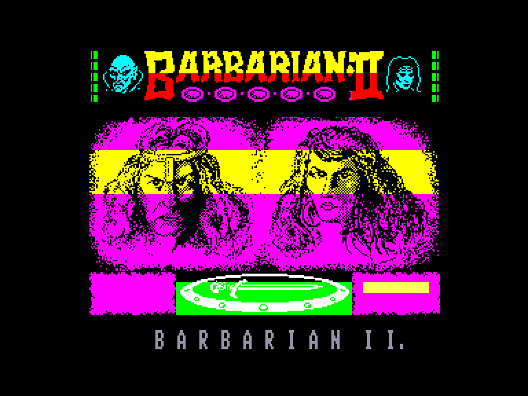
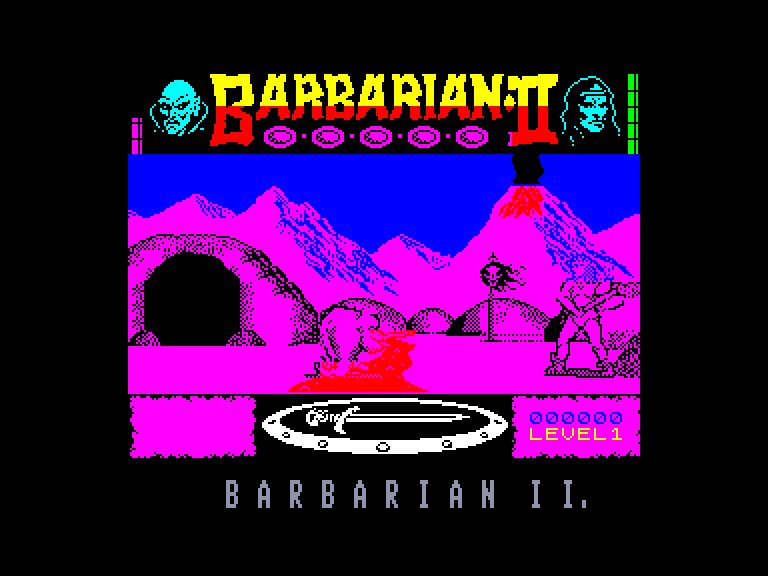
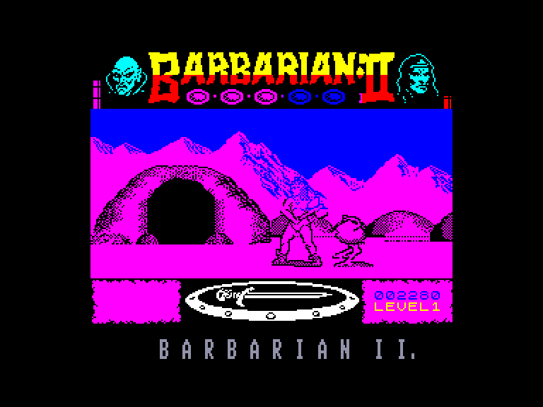
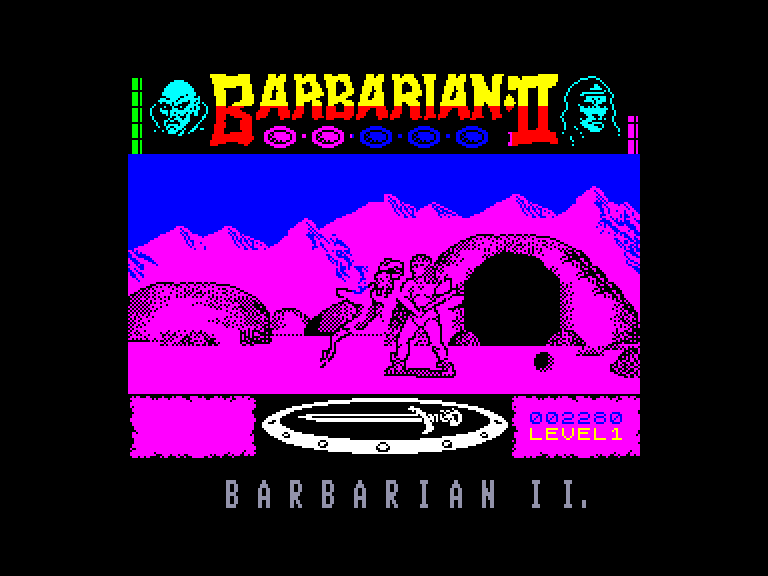

[0-9](../0/games-0.md) - [A](../a/games-a.md) - [B](../b/games-b.md) - [C](../c/games-c.md) - [D](../d/games-d.md) - [E](../e/games-e.md) - [F](../f/games-f.md) - [G](../g/games-g.md) - [H](../h/games-h.md) - [I](../i/games-i.md) - [J](../j/games-j.md) - [K](../k/games-k.md) - [L](../l/games-l.md) - [M](../m/games-m.md) - [N](../n/games-n.md) - [O](../o/games-o.md) - [P](../p/games-p.md) - [Q](../q/games-q.md) - [R](../r/games-r.md) - [S](../s/games-s.md) - [T](../t/games-t.md) - [U](../u/games-u.md) - [V](../v/games-v.md) - [W](../w/games-w.md) - [X](../x/games-x.md) - [Y](../y/games-y.md) - [Z](../z/games-z.md)

Ігри для [Enterprise 64k](../games-ep64.md) - [Enterprise 128k+RAMexp](../games-epramexp.md)

Ігри для систем [IS-DOS](../games-is-dos.md) - [SymbOS](../games-symbos.md) - [EDC Windows](../games-edcw.md)

Ігри для емуляторів [ZX Spectrum 48k/128k](../zxemu/games-zxemu.md) - [Amstrad CPC](../cpcemu/games-cpc.md) - [Sinclair ZX81](../zx81emu/games-zx81.md) - [Videoton TVC](../tvcemu/games-tvc.md) - [Commodore VIC-20](../vic20emu/games-vic20.md)

----------

# Barbarian II: The Dungeon of Drax

**Альтернативні назви:**
 - Barbarian II

**ID:** barbarian2-zx

## Примітка

ℹ Стара неофіційна конверсія з платформи ZX Spectrum.

## Скріншоти

## Опис

(temporary description generated by AI Assistant)  

**Опис гри Barbarian: The Dungeon of Drax:**  

Barbarian: The Dungeon of Drax — це екшн-гра, випущена в 1988 році компанією Palace Software для платформ Spectrum (128k) та Enterprise. У цій грі ви знову берете на себе роль барбаріана, який повинен врятувати принцесу Маріану від злого чаклуна Дракса. Гравець проходить через небезпечні лабіринти, борючись з різними ворогами, щоб досягти фінального протистояння з Драксом.  

**Правила гри:**  
1. Після завантаження виберіть режим гри: один або два гравці.  
2. У режимі одного гравця ви можете вибрати грати за барбаріана або принцесу, кожен з яких має свої унікальні навички.  
3. Використовуйте клавіші або джойстик для управління персонажем (рух, атака, захист).  
4. Гра складається з чотирьох рівнів, кожен з яких має своїх ворогів і пастки.  
5. Збирайте предмети, такі як ключі та зілля, щоб допомогти собі в проходженні рівнів.  
6. Уникайте атак ворогів і використовуйте свою зброю для боротьби з ними.  
7. Якщо ви отримуєте ушкодження, ваша енергія зменшується; якщо енергія досягає нуля, гра закінчується.  
8. У грі присутні різні вороги, включаючи драконів і демонів, з якими потрібно боротися.  
9. Використовуйте POKE команди для отримання додаткових переваг, таких як безсмертя.  

Гра має яскраву графіку та динамічний геймплей, що робить її захоплюючою для фанатів екшн-ігор. Успіхів у вашій місії!

## Основна інформація
- **Оригінальна платформа:** ZX Spectrum

## Посилання
- [Опис гри на ep128.hu (угорською)](http://www.ep128.hu/Games/Barbarian_2.htm)
- [Інформація про оригінальну версію](https://spectrumcomputing.co.uk/entry/409/ZX-Spectrum/Barbarian_II_The_Dungeon_of_Drax)
- [Завантажити гру](http://www.ep128.hu/Ep_Games/Prg/Barbarian_2.rar)

