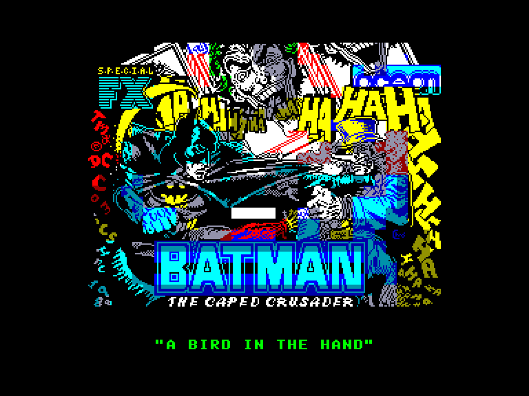
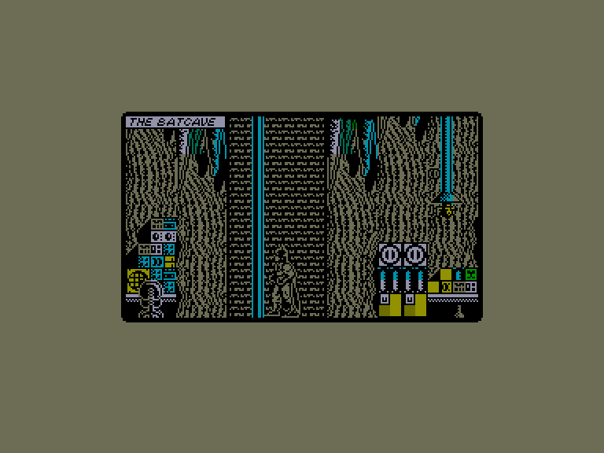
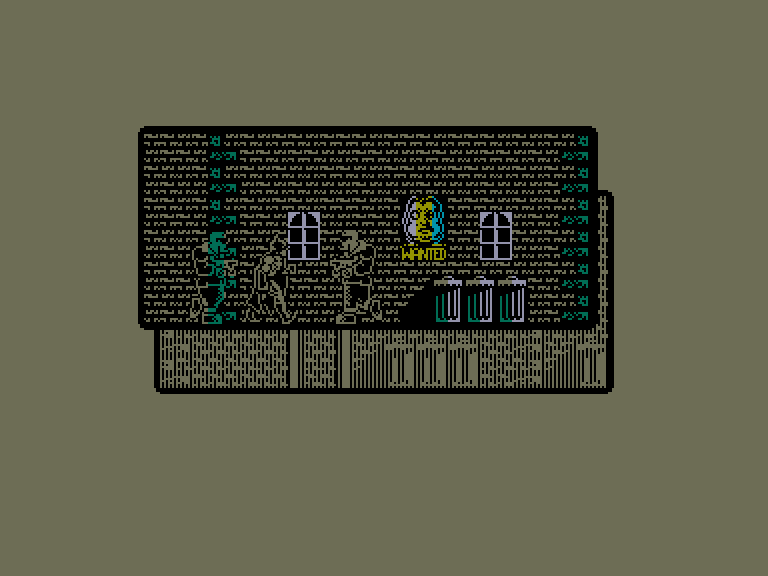
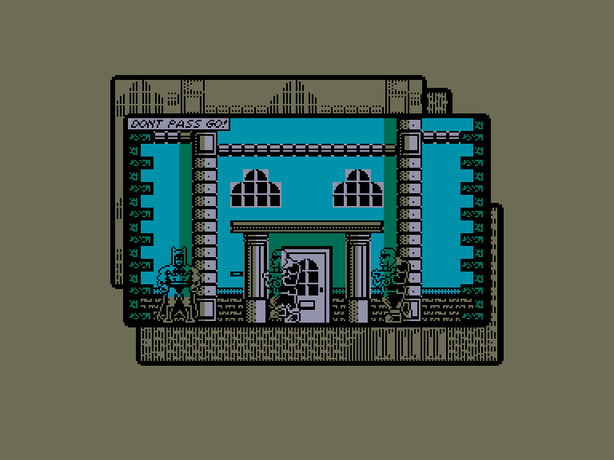

[0-9](../0/games-0.md) - [A](../a/games-a.md) - [B](../b/games-b.md) - [C](../c/games-c.md) - [D](../d/games-d.md) - [E](../e/games-e.md) - [F](../f/games-f.md) - [G](../g/games-g.md) - [H](../h/games-h.md) - [I](../i/games-i.md) - [J](../j/games-j.md) - [K](../k/games-k.md) - [L](../l/games-l.md) - [M](../m/games-m.md) - [N](../n/games-n.md) - [O](../o/games-o.md) - [P](../p/games-p.md) - [Q](../q/games-q.md) - [R](../r/games-r.md) - [S](../s/games-s.md) - [T](../t/games-t.md) - [U](../u/games-u.md) - [V](../v/games-v.md) - [W](../w/games-w.md) - [X](../x/games-x.md) - [Y](../y/games-y.md) - [Z](../z/games-z.md)

Ігри для [Enterprise 64k](../games-ep64.md) - [Enterprise 128k+RAMexp](../games-epramexp.md)

Ігри для систем [IS-DOS](../games-is-dos.md) - [SymbOS](../games-symbos.md) - [EDC Windows](../games-edcw.md)

Ігри для емуляторів [ZX Spectrum 48k/128k](../zxemu/games-zxemu.md) - [Amstrad CPC](../cpcemu/games-cpc.md) - [Sinclair ZX81](../zx81emu/games-zx81.md) - [Videoton TVC](../tvcemu/games-tvc.md) - [Commodore VIC-20](../vic20emu/games-vic20.md)

----------

# Batman: The Caped Crusader - A Bird in the Hand

**Альтернативні назви:**
 - Batman: The Caped Crusader - A Fete Worse Than Death

**ID:** batman-the-caped-crusader-zx

## Примітка

ℹ Стара неофіційна конверсія з платформи ZX Spectrum.

## Скріншоти

## Опис

Сюжет (в двох частинах) розгортається навколо найнебезпечніших ворогів Бетмена — Пінгвіна та Джокера:  

1) A Bird In The Hand  

Пінгвін, вийшовши з в'язниці, вирішує відкрити фабрику парасольок у Ґотем-Сіті. Та (звісно ж!) це лише прикриття для його таємного плану захопити світ за допомогою армії роботів-пінгвінів! Чи зможете ви, граючи за Бетмена, вимкнути головний комп'ютер фабрики й не дати йому «показати світу дулю»?  

2) A Fete Worse Than Death  

Робін загадково зник. Єдина зачіпка — гральна карта, яку залишив викрадач… Джокер! На звороті карти є послання: «Робін вирушив на свято, гірше за смерть, ґніт уже горить — тож не гай часу, йди за носом і пам'ятай: немає місця кращого за дім! Бум! Бум!». Чи зможете ви розгадати цю таємницю, урятувати Робіна та здолати Джокера?

## Основна інформація
- **Оригінальна платформа:** ZX Spectrum

## Посилання
- [Опис гри на ep128.hu (угорською)](http://www.ep128.hu/Games/Batman_Penguin.htm)
- [Опис гри на ep128.hu (угорською)](http://www.ep128.hu/Games/Batman_Joker.htm)
- [Інформація про оригінальну версію](https://spectrumcomputing.co.uk/entry/442/ZX-Spectrum/Batman_The_Caped_Crusader)
- [Завантажити гру](http://www.ep128.hu/Ep_Games/Prg/Batman-Penguin.rar)
- [Завантажити гру](http://www.ep128.hu/Ep_Games/Prg/Batman-Joker.rar)

## Детальна інформація

### Геймплей  

Зображення на екрані імітує комікс: Ґотем-Сіті та його мешканці з'являються в накладених кадрах (панелях). Будь-який текст (підказки, описи тощо) відображається у спеціальних текстових блоках відповідного кадру. Гравець у ролі Бетмена має повну свободу пересування й взаємодії з численними локаціями, розв'язуючи головоломки по дорозі.  

Натиснувши одночасно «вниз» і кнопку вогню, Бетмен потрапить на екран інвентарю (корисних знарядь). Тут відображаються всі підібрані предмети, а також піктограми керування для маніпуляцій із ними. (Також у цьому меню можна змінити різні налаштування графіки й звукових ефектів). Крім того, на цьому екрані показано рівень здоров'я Бетмена та відсоток проходження гри. Щоб використати предмет, потрібно навести Бет-курсор на потрібну річ, натиснути вогонь, а потім таким самим чином вибрати піктограму «Використати» (Utilise).