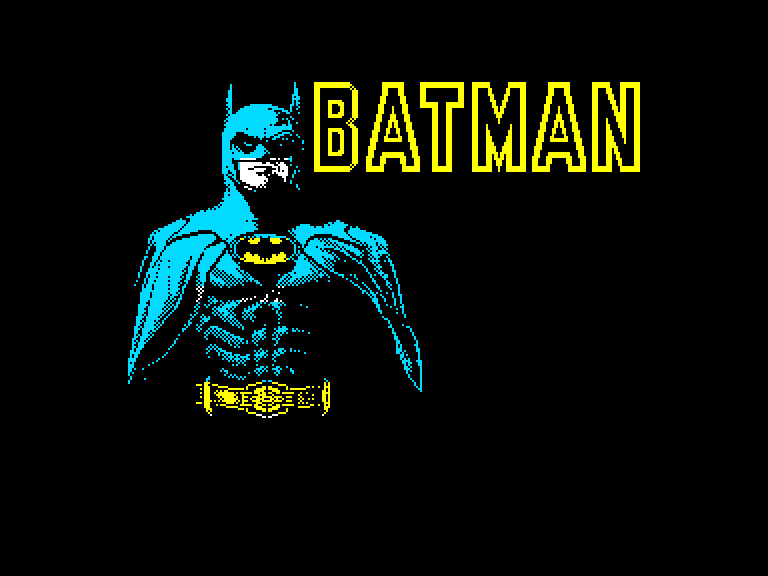
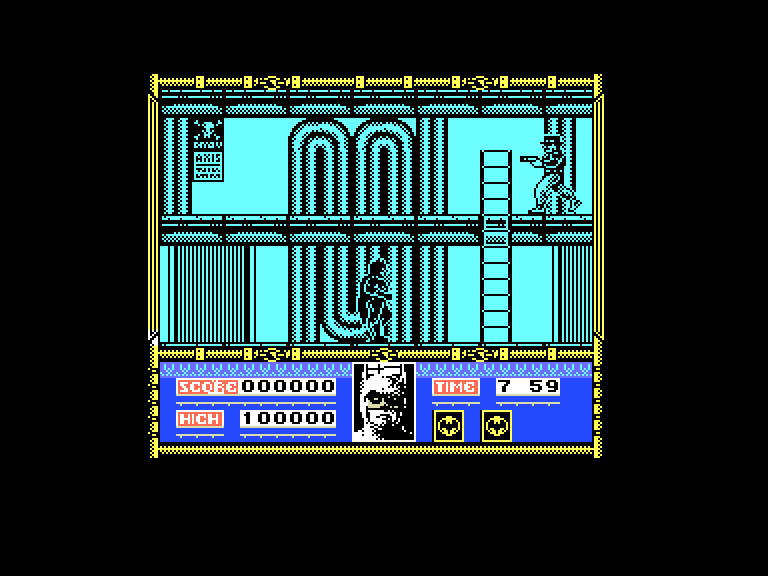
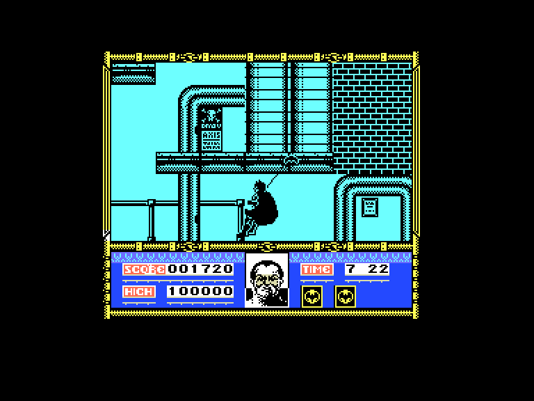
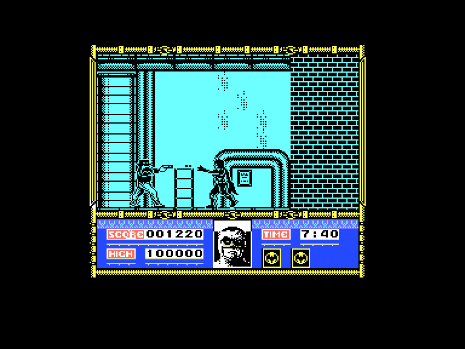

[0-9](../0/games-0.md) - [A](../a/games-a.md) - [B](../b/games-b.md) - [C](../c/games-c.md) - [D](../d/games-d.md) - [E](../e/games-e.md) - [F](../f/games-f.md) - [G](../g/games-g.md) - [H](../h/games-h.md) - [I](../i/games-i.md) - [J](../j/games-j.md) - [K](../k/games-k.md) - [L](../l/games-l.md) - [M](../m/games-m.md) - [N](../n/games-n.md) - [O](../o/games-o.md) - [P](../p/games-p.md) - [Q](../q/games-q.md) - [R](../r/games-r.md) - [S](../s/games-s.md) - [T](../t/games-t.md) - [U](../u/games-u.md) - [V](../v/games-v.md) - [W](../w/games-w.md) - [X](../x/games-x.md) - [Y](../y/games-y.md) - [Z](../z/games-z.md)

Ігри для [Enterprise 64k](../games-ep64.md) - [Enterprise 128k+RAMexp](../games-epramexp.md)

Ігри для систем [IS-DOS](../games-is-dos.md) - [SymbOS](../games-symbos.md) - [EDC Windows](../games-edcw.md)

Ігри для емуляторів [ZX Spectrum 48k/128k](../zxemu/games-zxemu.md) - [Amstrad CPC](../cpcemu/games-cpc.md) - [Sinclair ZX81](../zx81emu/games-zx81.md) - [Videoton TVC](../tvcemu/games-tvc.md) - [Commodore VIC-20](../vic20emu/games-vic20.md)

----------

# Batman: The Movie

**ID:** batman-the-movie-zx

## Примітка

ℹ Стара неофіційна конверсія з платформи ZX Spectrum.

## Скріншоти

## Опис

(temporary description generated by AI [Assistant])  

**Опис гри:**  

Гра "Бетмен: Фільм" запрошує вас у захоплюючий світ Готем-сіті, де ви візьмете на себе роль Бетмена, щоб зупинити Джокера і врятувати місто від його злочинних планів. Гравець пройде через різноманітні рівні, включаючи фабрику, вулиці Готема та міську катедру, виконуючи завдання та перемагати ворогів.  

**Правила гри:**  

1. **Мета гри:** Зупинити Джокера, врятувати Готем-сіті, і знайти три отруєні предмети, які він замаскував.  
   
2. **Управління:**  
   - **Стрілка вправо:** Гуляти вправо.  
   - **Стрілка вліво:** Гуляти вліво.  
   - **Стрілка вгору:** Підніматися або повертатися.  
   - **Стрілка вниз:** Опускатися або повертатися.  
   - **Стрибок:** Стрибати на сходи.  
   - **Присісти:** Присідати.  
   - **Атака:** Виконувати удари або кидати Батаранг.  
   - **Взаємодія:** Взаємодіяти з предметами у кімнаті.  

3. **Збір предметів:** Гравець може збирати різні предмети, які допомагають у грі. Якщо ви знайшли предмет, на екрані з'явиться повідомлення про його отримання.  

4. **Енергія:** Енергія Бетмена відображається на екрані. Коли вона знижується, зображення Бетмена змінюється на Джокера. Гравець повинен уникати атак ворогів, щоб зберегти свою енергію.  

5. **Рівні:** Гра складається з кількох рівнів, включаючи:  
   - **Axis Chemical Plant:** Гравець повинен уникати ворогів і кислотних крапель.  
   - **Вулиці Готема:** Гравець керує Batmobile, щоб дістатися до Дене́верного сховища.  
   - **Логічна гра:** Гравець повинен вгадати три отруєні предмети з десяти за обмежений час.  

6. **Фінальний рівень:** Гравець має пройти через катедру, де Джокер чекає на фінальну битву.  

7. **Чити:** Гравець може натиснути M, I, C, K під час гри, щоб перейти на наступний рівень. У версії для Enterprise, натискання ESC у меню запобігає витраті енергії під час гри.  

Гра "Бетмен: Фільм" обіцяє бути захоплюючою пригодою з чудовою графікою, музикою та ігровим процесом!

## Основна інформація
- **Оригінальна платформа:** ZX Spectrum

## Посилання
- [Опис гри на ep128.hu (угорською)](http://www.ep128.hu/Games/Batman_The_Movie.htm)
- [Інформація про оригінальну версію](https://spectrumcomputing.co.uk/entry/434/ZX-Spectrum/Batman_The_Movie)
- [Завантажити гру](http://www.ep128.hu/Ep_Games/Prg/Batman-The_Movie.rar)

## Відео

<iframe src="https://www.youtube.com/embed/MW3-f8Ud9mA"  
style="width:75%; aspect-ratio:16/9;" allowfullscreen></iframe>

