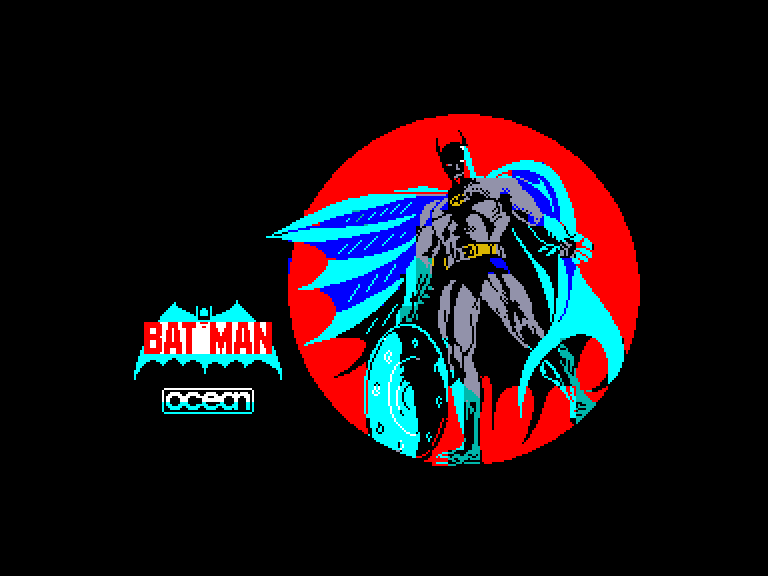
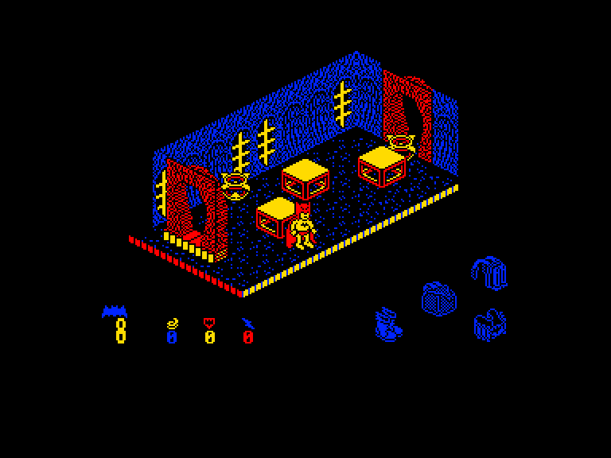
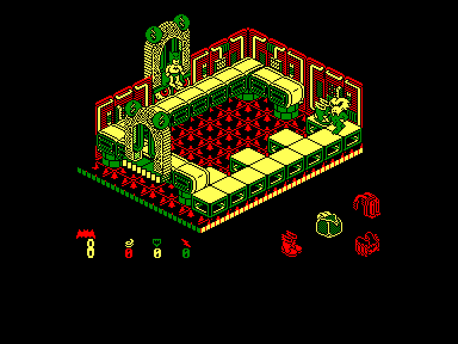
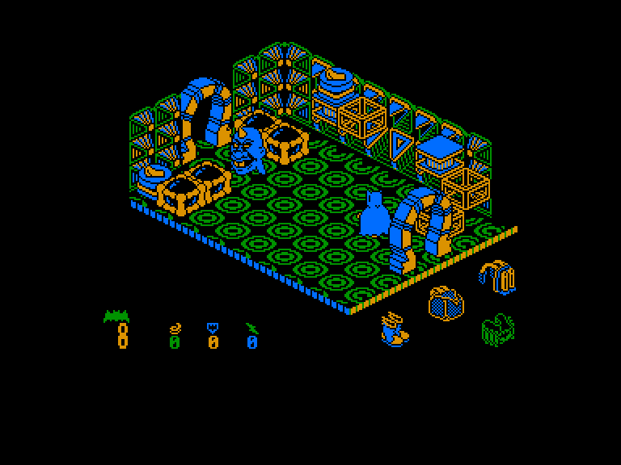

[0-9](../0/games-0.md) - [A](../a/games-a.md) - [B](../b/games-b.md) - [C](../c/games-c.md) - [D](../d/games-d.md) - [E](../e/games-e.md) - [F](../f/games-f.md) - [G](../g/games-g.md) - [H](../h/games-h.md) - [I](../i/games-i.md) - [J](../j/games-j.md) - [K](../k/games-k.md) - [L](../l/games-l.md) - [M](../m/games-m.md) - [N](../n/games-n.md) - [O](../o/games-o.md) - [P](../p/games-p.md) - [Q](../q/games-q.md) - [R](../r/games-r.md) - [S](../s/games-s.md) - [T](../t/games-t.md) - [U](../u/games-u.md) - [V](../v/games-v.md) - [W](../w/games-w.md) - [X](../x/games-x.md) - [Y](../y/games-y.md) - [Z](../z/games-z.md)

Ігри для [Enterprise 64k](../games-ep64.md) - [Enterprise 128k+RAMexp](../games-epramexp.md)

Ігри для систем [IS-DOS](../games-is-dos.md) - [SymbOS](../games-symbos.md) - [EDC Windows](../games-edcw.md)

Ігри для емуляторів [ZX Spectrum 48k/128k](../zxemu/games-zxemu.md) - [Amstrad CPC](../cpcemu/games-cpc.md) - [Sinclair ZX81](../zx81emu/games-zx81.md) - [Videoton TVC](../tvcemu/games-tvc.md) - [Commodore VIC-20](../vic20emu/games-vic20.md)

----------

# Batman

**Альтернативні назви:**
 - Bat Man

**ID:** batman

## Скріншоти

## Опис

(temporary description generated by AI [Assistant])

**Опис гри:**

У грі "Бетмен" ви берете на себе роль знаменитого супергероя, який повинен зібрати частини автомобіля для порятунку свого друга Робіна. Частини автомобіля розкидані в лабіринті, що складається з понад 120 кімнат, наповнених пастками та ворогами. Гравець повинен збирати різні корисні предмети, щоб покращити свої здібності та уникати небезпек на своєму шляху.

**Правила гри:**

1. **Мета гри:** Зібрати всі частини автомобіля, щоб врятувати Робіна.
2. **Керування:** Ви можете налаштувати управління джойстиком або клавішами за допомогою головного меню.
3. **Предмети:** Збирайте корисні предмети, такі як рюкзак, черевики, ракету та пояс, які допоможуть вам у грі.
4. **Здібності:** Збираючи фігурки Бетмена, ви можете покращувати свої здібності, такі як швидкість, невразливість та додаткові життя.
5. **Вороги:** Будьте обережні з ворогами, які можуть завдати шкоди. Деякі вороги рухаються випадковим чином, інші стоять на місці.
6. **Пастки:** Уникайте пасток, таких як рухомі платформи та обрушуючіся підлоги.
7. **Кімнати:** У кожній кімнаті можуть бути різні предмети та вороги, тому використовуйте свої навички, щоб їх обійти.
8. **Завершення гри:** Коли ви зберете всі частини автомобіля, дійдіть до кімнати з позначкою "X" на карті, щоб завершити гру.

Удачі у вашій місії з порятунку Робіна!

## Основна інформація
- **Оригінальна платформа:** Amstrad CPC
### Системні вимоги
- **Апаратні:** EP64, EP128

## Посилання
- [Опис гри на ep128.hu (угорською)](http://www.ep128.hu/Games/Batman.htm)
- [Інформація про оригінальну версію](https://www.cpc-power.com/index.php?page=detail&num=98)
- [Завантажити гру](http://www.ep128.hu/Ep_Games/Prg/Batman.rar)
- [Easy Load&Play](https://t.me/EP128k_Load_n_Play/89) *(Telegram-канал Vibrant Waves)*

**Дата генерації:** 28.07.2026

## Відео

<iframe src="https://www.youtube.com/embed/B4EQrZSQJEg"  
style="width:75%; aspect-ratio:16/9;" allowfullscreen></iframe>

- [Відео](https://tv.enterpriseforever.com/batman.mp4)
- [Відео](https://www.youtube.com/watch?v=xyf3CNXEP68)
- [Відео](https://youtu.be/mV0Szhtv3h4)
- [Відео](https://youtu.be/wLaM6ErbLBo)