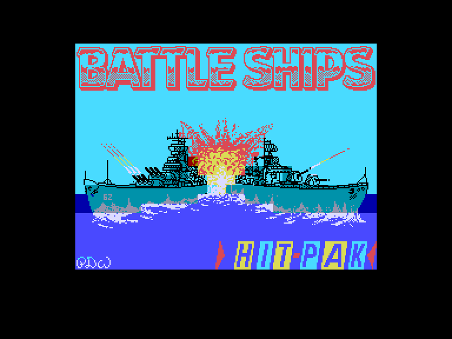
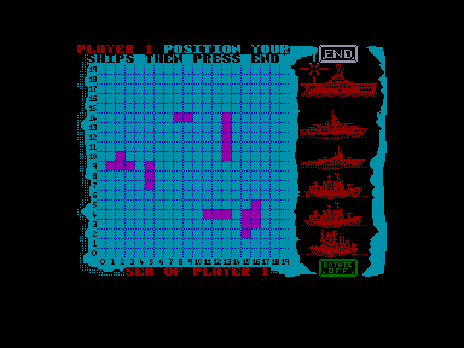
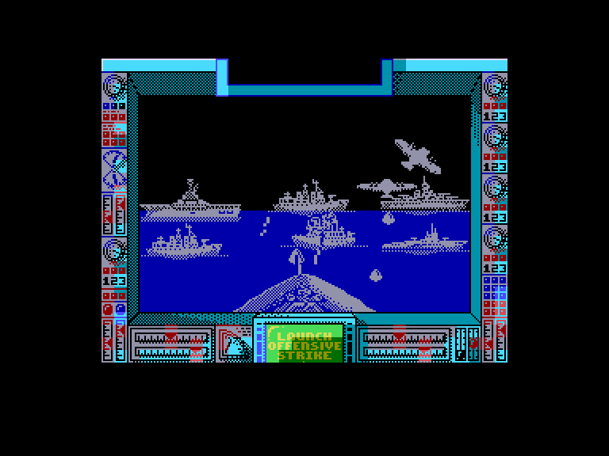
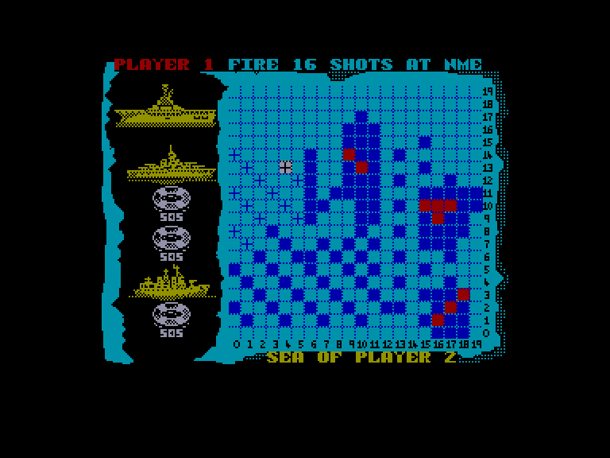

[0-9](../0/games-0.md) - [A](../a/games-a.md) - [B](../b/games-b.md) - [C](../c/games-c.md) - [D](../d/games-d.md) - [E](../e/games-e.md) - [F](../f/games-f.md) - [G](../g/games-g.md) - [H](../h/games-h.md) - [I](../i/games-i.md) - [J](../j/games-j.md) - [K](../k/games-k.md) - [L](../l/games-l.md) - [M](../m/games-m.md) - [N](../n/games-n.md) - [O](../o/games-o.md) - [P](../p/games-p.md) - [Q](../q/games-q.md) - [R](../r/games-r.md) - [S](../s/games-s.md) - [T](../t/games-t.md) - [U](../u/games-u.md) - [V](../v/games-v.md) - [W](../w/games-w.md) - [X](../x/games-x.md) - [Y](../y/games-y.md) - [Z](../z/games-z.md)

Ігри для [Enterprise 64k](../games-ep64.md) - [Enterprise 128k+RAMexp](../games-epramexp.md)

Ігри для систем [IS-DOS](../games-is-dos.md) - [SymbOS](../games-symbos.md) - [EDC Windows](../games-edcw.md)

Ігри для емуляторів [ZX Spectrum 48k/128k](../zxemu/games-zxemu.md) - [Amstrad CPC](../cpcemu/games-cpc.md) - [Sinclair ZX81](../zx81emu/games-zx81.md) - [Videoton TVC](../tvcemu/games-tvc.md) - [Commodore VIC-20](../vic20emu/games-vic20.md)

----------

# Battle Ships

**ID:** battle-ships-zx

## Примітка

ℹ Стара неофіційна конверсія з платформи ZX Spectrum.

## Скріншоти

## Опис

(temporary description generated by AI [Assistant])  

**Опис гри:**  

Гра "Battle Ships" — це захоплююча версія класичної гри "Морський бій", яка тепер доступна на Spectrum. У грі беруть участь дві флотилії, кожна з яких складається з 6 одиниць, які борються на 20x20 клітинному полі. Гравці спочатку розміщують свої кораблі на полі, після чого намагаються знищити кораблі суперника, використовуючи обмежену кількість пострілів.  

**Правила гри:**  

1. **Мета гри:** Знищити всі кораблі противника, перш ніж він знищить ваші.  

2. **Розміщення кораблів:**  
   - Кожен гравець розміщує свої 6 кораблів на полі, причому розміщення є таємним для супротивника.  
   - Гравець може змінювати позицію кораблів, натискаючи на бажаний корабель і переміщаючи його до потрібного місця.   
   - Гравець також може обертати кораблі, натискаючи на опцію "ROTATE".  

3. **Постріли:**  
   - Гравці по черзі здійснюють постріли, намагаючись вразити кораблі противника.  
   - Кількість пострілів, які гравець може зробити за один раунд, залежить від кількості залишених кораблів. Чим менше кораблів, тим менше пострілів.  
   - Якщо опція "SALVO FIRE" вимкнена, гравець завжди може зробити 4 постріли, незалежно від кількості залишених кораблів.  

4. **Гра з суперником:**  
   - Гравець може грати проти комп'ютера, грати з іншим гравцем або взяти участь у багатокористувацькому змаганні.  
   - Розміщення кораблів здійснюється за допомогою іконок на екрані.  

5. **Візуалізація бою:**  
   - Після кожної серії пострілів гра демонструє результат на добре продуманому екрані, де гравець може спостерігати за битвою та бачити, які кораблі були вражені і наскільки.  

6. **Атмосфера гри:**  
   - Гра пропонує атмосферу морського бою, що робить її цікавою та захопливою для гравців.  

"Battle Ships" — це чудова версія класичної гри, яка пропонує якісну графіку та захоплюючий ігровий процес на платформі Spectrum.

## Основна інформація
- **Оригінальна платформа:** ZX Spectrum

## Посилання
- [Опис гри на ep128.hu (угорською)](http://www.ep128.hu/Games/Battle_Ships.htm)
- [Інформація про оригінальну версію](https://spectrumcomputing.co.uk/entry/461/ZX-Spectrum/Battle_Ships)
- [Завантажити гру](http://www.ep128.hu/Ep_Games/Prg/Battle_Ships.rar)

## Відео

<iframe src="https://www.youtube.com/embed/7a_RR07LL5c"  
style="width:75%; aspect-ratio:16/9;" allowfullscreen></iframe>

