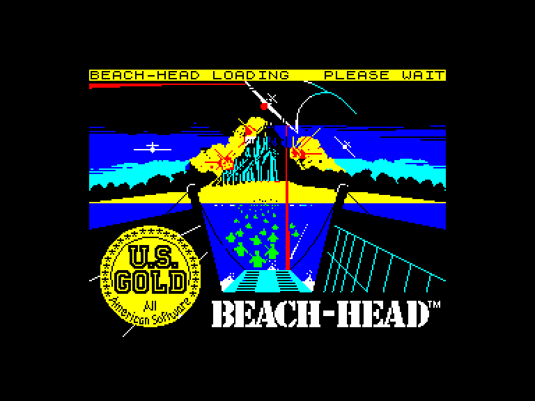
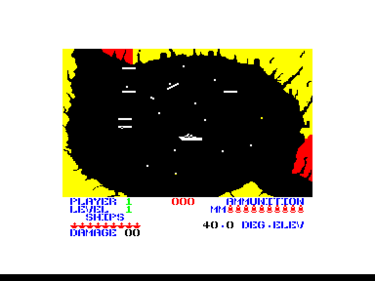
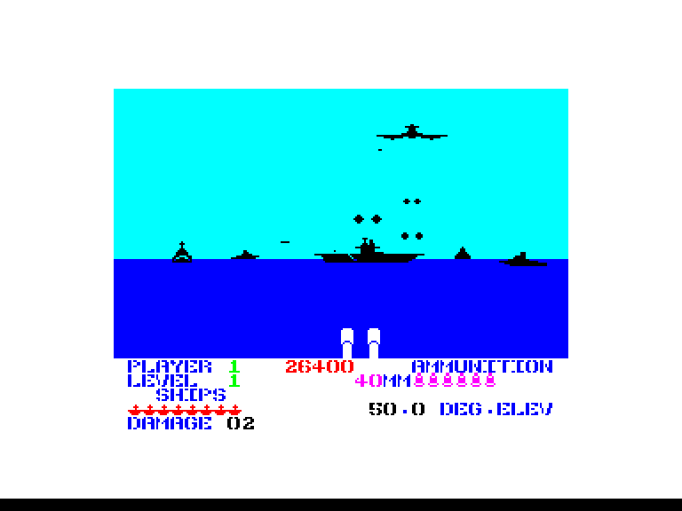
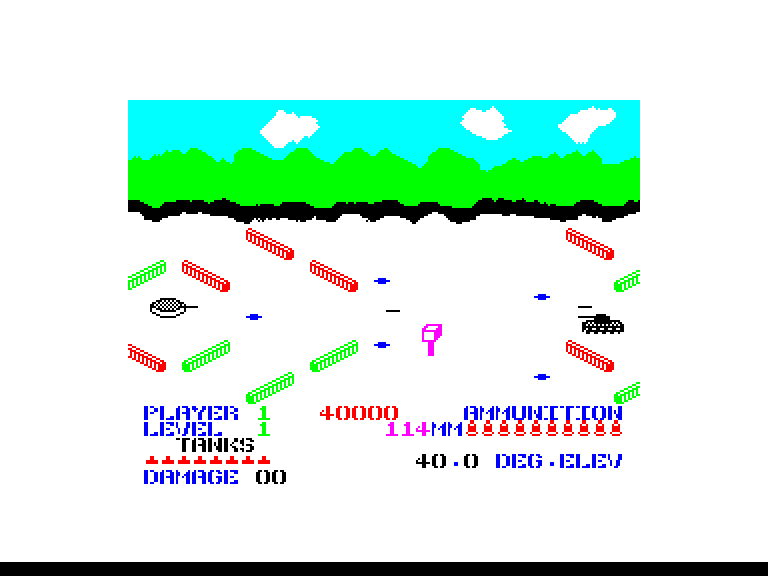

[0-9](../0/games-0.md) - [A](../a/games-a.md) - [B](../b/games-b.md) - [C](../c/games-c.md) - [D](../d/games-d.md) - [E](../e/games-e.md) - [F](../f/games-f.md) - [G](../g/games-g.md) - [H](../h/games-h.md) - [I](../i/games-i.md) - [J](../j/games-j.md) - [K](../k/games-k.md) - [L](../l/games-l.md) - [M](../m/games-m.md) - [N](../n/games-n.md) - [O](../o/games-o.md) - [P](../p/games-p.md) - [Q](../q/games-q.md) - [R](../r/games-r.md) - [S](../s/games-s.md) - [T](../t/games-t.md) - [U](../u/games-u.md) - [V](../v/games-v.md) - [W](../w/games-w.md) - [X](../x/games-x.md) - [Y](../y/games-y.md) - [Z](../z/games-z.md)

Ігри для [Enterprise 64k](../games-ep64.md) - [Enterprise 128k+RAMexp](../games-epramexp.md)

Ігри для систем [IS-DOS](../games-is-dos.md) - [SymbOS](../games-symbos.md) - [EDC Windows](../games-edcw.md)

Ігри для емуляторів [ZX Spectrum 48k/128k](../zxemu/games-zxemu.md) - [Amstrad CPC](../cpcemu/games-cpc.md) - [Sinclair ZX81](../zx81emu/games-zx81.md) - [Videoton TVC](../tvcemu/games-tvc.md) - [Commodore VIC-20](../vic20emu/games-vic20.md)

----------

# Beach-Head

**ID:** beach-head

**Жанри:** Аркада, Екшн

## Скріншоти

## Опис

(temporary description generated by AI [Assistant])

**Опис гри:**

Гра "Beach Head" — це захоплююча аркадна гра, де гравець бере на себе роль командира, що має завдання знищити диктатора Куна-Ліна та його армію. Гравець повинен провести атаку на ворожий острів, знищити ворожий флот і авіацію, а потім захопити головну базу противника.

**Правила гри:**

1. **Мета гри:** Знищити ворожий острів, знищивши флот і авіацію диктатора, а також захопити його головну базу.

2. **Початок гри:**
   - Після завантаження гри з'явиться меню, де ви можете вибрати різні параметри:
     - **S - Start:** почати гру.
     - **J - Select joystick:** вибрати джойстик.
     - **I - Instructions:** переглянути інструкції.
     - **P - No of Players:** вибрати кількість гравців.
     - **K - Define keys:** налаштувати клавіші управління.
     - **L - Skill level:** вибрати рівень складності (легкий, середній, важкий).

3. **Геймплей:**
   - Гравець починає з атаки на острів через морський шлях, маневруючи між ворожими кораблями та мінами.
   - Гравець має 10 кораблів, які потрібно провести через вузький прохід, уникаючи перешкод.
   - Якщо гравець успішно пройде через прохід, він переходить до етапу атаки з повітря, де йому потрібно знищити ворожі літаки.

4. **Атака з повітря:**
   - Гравець керує зенітною установкою на своєму кораблі та стріляє по ворожим літакам.
   - За знищення ворожих літаків нараховуються очки. Якщо гравець знищить бомбардувальник, він отримує 2000 очок.
   - Гравець може регулювати кут стрільби, щоб точно вразити ціль.

5. **Знищення ворожого флоту:**
   - Після знищення літаків гравець переходить до атаки на ворожий флот, де потрібно знищити ворожі кораблі.
   - Гравець повинен бути обережним, оскільки ворог також стріляє у відповідь.

6. **Завершення гри:**
   - Якщо гравець знищить усі ворожі кораблі, він успішно завершує місію і може перейти до сухопутної атаки.
   - На суші гравець керує танком, який повинен знищити ворожі позиції та уникати перешкод.

7. **Кількість життів:**
   - Гравець має обмежену кількість життів, які можна збільшити за допомогою чіт-коду: POKE 32963,x, де x — число від 1 до 255.

"Beach Head" — це гра, яка поєднує в собі елементи стратегії та динамічної дії, пропонуючи захоплюючий ігровий процес з чудовою графікою та звуковими ефектами.

## Основна інформація
- **Мови:** Англійська
- **Оригінальна платформа:** ZX Spectrum
### Системні вимоги
- **Апаратні:** EP64, EP128
### Геймплей
- **Керування:** Keyboard, Internal Joy, External Joy 1, External Joy 2
- **Кількість гравців:** 1 player, 2 players (alternate)
- **Додаткові теги:** Attribute mode
### Розробка
- **Рік випуску:** 1985
- **Автор:** David J. Anderson, Ian Morrison, Frederick David Thorpe, Bruce Carver

## Посилання
- [Опис гри на ep128.hu (угорською)](http://www.ep128.hu/Games/Beach_Head.htm)
- [Завантажити гру](http://www.ep128.hu/Ep_Games/Prg/Beach_Head.rar)
- [Easy Load&Play](https://t.me/EP128k_Load_n_Play/1038) *(Telegram-канал Vibrant Waves)*

**Дата генерації:** 28.07.2026

## Відео

<iframe src="https://www.youtube.com/embed/0qlBdPCVqQE"  
style="width:75%; aspect-ratio:16/9;" allowfullscreen></iframe>
