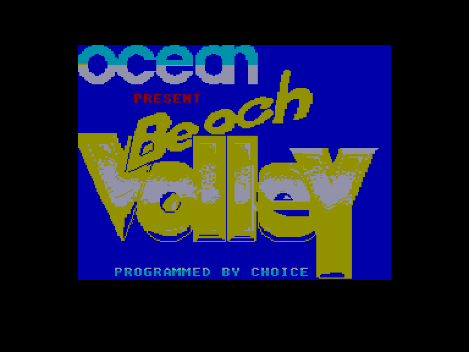
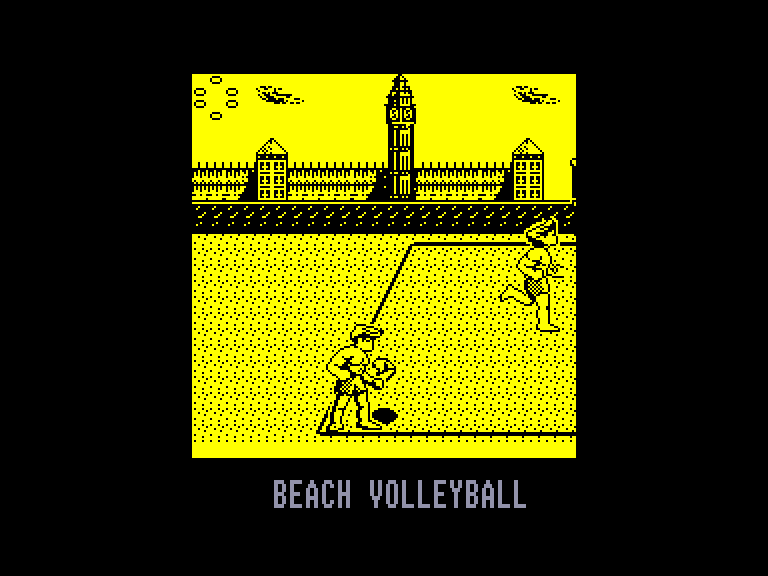
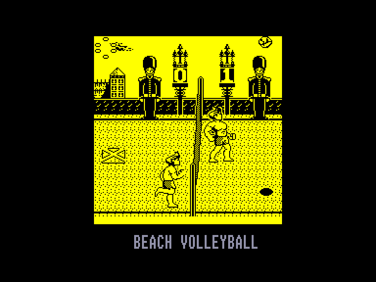
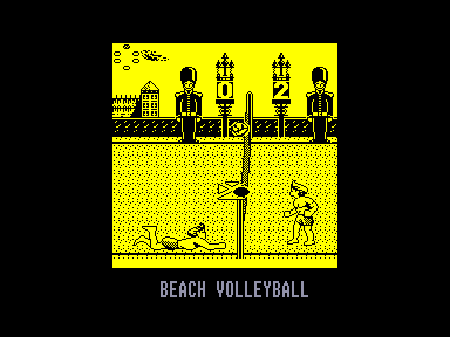

[0-9](../0/games-0.md) - [A](../a/games-a.md) - [B](../b/games-b.md) - [C](../c/games-c.md) - [D](../d/games-d.md) - [E](../e/games-e.md) - [F](../f/games-f.md) - [G](../g/games-g.md) - [H](../h/games-h.md) - [I](../i/games-i.md) - [J](../j/games-j.md) - [K](../k/games-k.md) - [L](../l/games-l.md) - [M](../m/games-m.md) - [N](../n/games-n.md) - [O](../o/games-o.md) - [P](../p/games-p.md) - [Q](../q/games-q.md) - [R](../r/games-r.md) - [S](../s/games-s.md) - [T](../t/games-t.md) - [U](../u/games-u.md) - [V](../v/games-v.md) - [W](../w/games-w.md) - [X](../x/games-x.md) - [Y](../y/games-y.md) - [Z](../z/games-z.md)

Ігри для [Enterprise 64k](../games-ep64.md) - [Enterprise 128k+RAMexp](../games-epramexp.md)

Ігри для систем [IS-DOS](../games-is-dos.md) - [SymbOS](../games-symbos.md) - [EDC Windows](../games-edcw.md)

Ігри для емуляторів [ZX Spectrum 48k/128k](../zxemu/games-zxemu.md) - [Amstrad CPC](../cpcemu/games-cpc.md) - [Sinclair ZX81](../zx81emu/games-zx81.md) - [Videoton TVC](../tvcemu/games-tvc.md) - [Commodore VIC-20](../vic20emu/games-vic20.md)

----------

# Beach Volley

**ID:** beach-volley-zx

## Примітка

ℹ Стара неофіційна конверсія з платформи ZX Spectrum.

## Скріншоти

## Опис

(temporary description generated by AI [Assistant])  

**Опис гри:**  

Гра "Beach Volley" — це спортивна аркадна гра, яка дозволяє гравцям насолоджуватися захоплюючими матчами з пляжного волейболу. Гравець управляє двома молодими англійцями, які змагаються з найкращими волейбольними командами світу. Гра пропонує різноманітні локації, включаючи Лондон, США, СРСР та Єгипет, де кожен матч проходить на фоні характерного для країни пейзажу.  

**Правила гри:**  

1. **Мета гри:** Знищити всі блоки на екрані, використовуючи м'яч, який відбивається від платформи.  

2. **Основні правила:**  
   - Гра проходить за правилами пляжного волейболу, де кожна команда складається з двох гравців.  
   - Гравці можуть отримувати очки, якщо м'яч приземлиться на території противника.  
   - Команда, що виграла раунд, отримує право на подачу м'яча.  
   - Гравці можуть торкатися м'яча тричі, перш ніж передати його на сторону противника (при цьому вони повинні чергуватися).  

3. **Система очок:**  
   - Для виграшу матчу необхідно набрати 7 очок.  
   - Існує обмеження по часу, тому матч може закінчитися, якщо не буде досягнуто 7 очок до закінчення часу.  

4. **Управління:**  
   - Гравець може управляти грою за допомогою клавіатури або джойстика.  
   - Гравець контролює персонажа, який найближче до м'яча, а комп'ютер керує партнером.  
   - Для подачі м'яча гравець натискає кнопку "вогонь" (fire), щоб підкинути м'яч, а потім знову натискає в потрібний момент, щоб вдарити по м'ячу.  

5. **Візуальні елементи:**  
   - Гравець може бачити тінь м'яча на піску, що допомагає визначити, куди приземлиться м'яч.  
   - Гравець повинен намагатися зайняти правильну позицію для удару.  

6. **Можливість гри:**  
   - Гру може грати один гравець або двоє гравців по черзі.  
   - Існує можливість налаштування управління, що дозволяє гравцям обрати зручні для себе клавіші.  

"Beach Volley" пропонує захоплюючий ігровий процес, відмінну графіку та звукові ефекти, що робить його ідеальним вибором для шанувальників спортивних ігор.

## Основна інформація
- **Оригінальна платформа:** ZX Spectrum

## Посилання
- [Опис гри на ep128.hu (угорською)](http://www.ep128.hu/Games/Beach_Volley.htm)
- [Інформація про оригінальну версію](https://spectrumcomputing.co.uk/entry/485/ZX-Spectrum/Beach_Volley)
- [Завантажити гру](http://www.ep128.hu/Ep_Games/Prg/Beach_Volley.rar)

