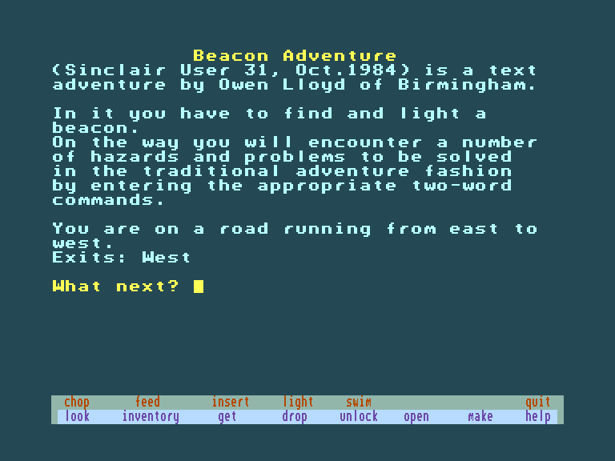
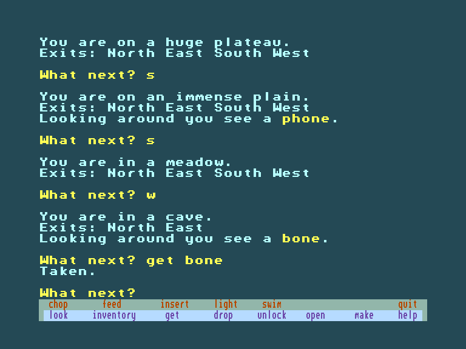
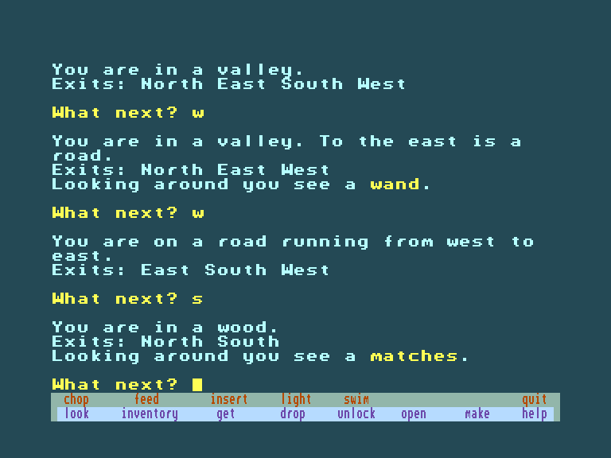

[0-9](../0/games-0.md) - [A](../a/games-a.md) - [B](../b/games-b.md) - [C](../c/games-c.md) - [D](../d/games-d.md) - [E](../e/games-e.md) - [F](../f/games-f.md) - [G](../g/games-g.md) - [H](../h/games-h.md) - [I](../i/games-i.md) - [J](../j/games-j.md) - [K](../k/games-k.md) - [L](../l/games-l.md) - [M](../m/games-m.md) - [N](../n/games-n.md) - [O](../o/games-o.md) - [P](../p/games-p.md) - [Q](../q/games-q.md) - [R](../r/games-r.md) - [S](../s/games-s.md) - [T](../t/games-t.md) - [U](../u/games-u.md) - [V](../v/games-v.md) - [W](../w/games-w.md) - [X](../x/games-x.md) - [Y](../y/games-y.md) - [Z](../z/games-z.md)

Ігри для [Enterprise 64k](../games-ep64.md) - [Enterprise 128k+RAMexp](../games-epramexp.md)

Ігри для систем [IS-DOS](../games-is-dos.md) - [SymbOS](../games-symbos.md) - [EDC Windows](../games-edcw.md)

Ігри для емуляторів [ZX Spectrum 48k/128k](../zxemu/games-zxemu.md) - [Amstrad CPC](../cpcemu/games-cpc.md) - [Sinclair ZX81](../zx81emu/games-zx81.md) - [Videoton TVC](../tvcemu/games-tvc.md) - [Commodore VIC-20](../vic20emu/games-vic20.md)

----------

# Beacon Adventure

**ID:** beacon-adventure-bas

## Примітка

ℹ Сучасна неофіційна конверсія.

## Скріншоти

## Опис

Наше завдання — дістатися острова на сході та ввести в експлуатацію розташований там сигнальний маяк.

## Посилання
- [Опис гри на ep128.hu (угорською)](http://www.ep128.hu/Ep_Games/Leiras/Basic_Program_Pack.htm)
- [Інформація про гру (SolutionArchive.com)](https://solutionarchive.com/game/id%2C2535/Beacon+Adventure.html)
- [Завантажити гру](http://www.ep128.hu/Ep_Games/Prg/Basic_Program_Pack.rar)

## Керування

`Keyboard`  

`F1`-`F8`, `Shift`+`F1`-`Shift`+`F8`: швидке введення команд (підказка на стрічці знизу екрану).

## Детальна інформація

### Історія розробки  

Гра Оуена Ллойда (Owen Lloyd) вийшла у журналі Sinclair User у вигляді лістингу для передруку. В оригінальному вигляді вона запускалася навіть на машинах із 16K пам'яті, тож і виконання було відповідне — мінімалістичне. Утім, розмір програми все одно виявився більшим, ніж зазвичай буває у ігор, написаних на Microsoft-BASIC. З одного боку, гра програмно далека від досконалості, а з іншого — через особливості Spectrum BASIC (зокрема, відсутність оператора ON GOTO) у ній є досить незграбні рішення. Саме тому слова не можна скорочувати (за винятком команд напрямку, які є однолітерними). Сам квест не надто складний: якщо помалювати карту, це розвага буквально на кілька хвилин.