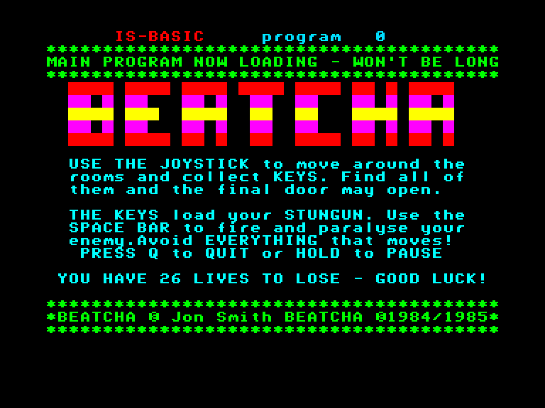
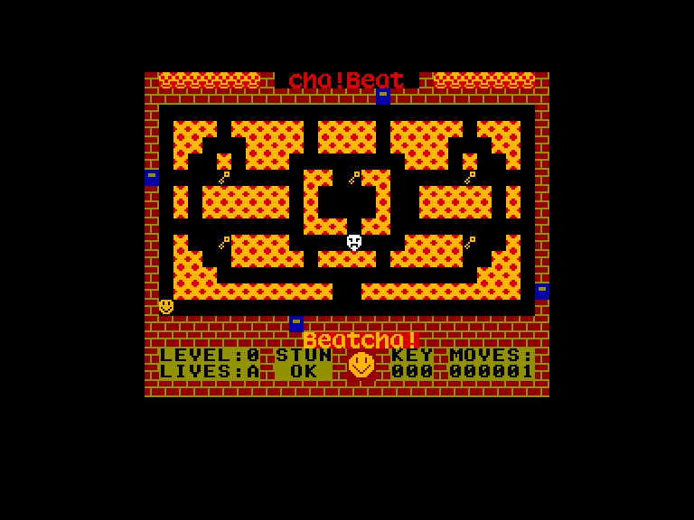
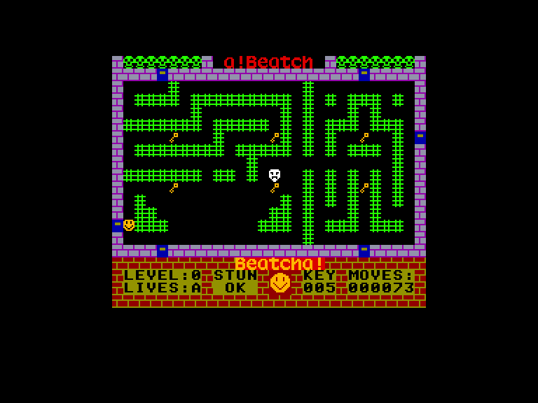
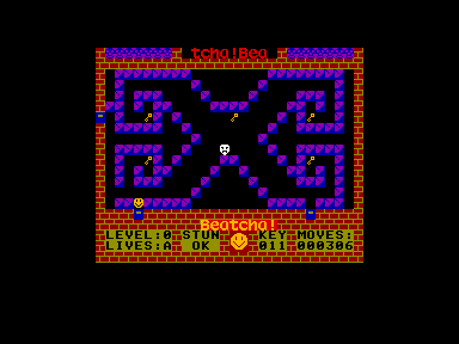

[0-9](../0/games-0.md) - [A](../a/games-a.md) - [B](../b/games-b.md) - [C](../c/games-c.md) - [D](../d/games-d.md) - [E](../e/games-e.md) - [F](../f/games-f.md) - [G](../g/games-g.md) - [H](../h/games-h.md) - [I](../i/games-i.md) - [J](../j/games-j.md) - [K](../k/games-k.md) - [L](../l/games-l.md) - [M](../m/games-m.md) - [N](../n/games-n.md) - [O](../o/games-o.md) - [P](../p/games-p.md) - [Q](../q/games-q.md) - [R](../r/games-r.md) - [S](../s/games-s.md) - [T](../t/games-t.md) - [U](../u/games-u.md) - [V](../v/games-v.md) - [W](../w/games-w.md) - [X](../x/games-x.md) - [Y](../y/games-y.md) - [Z](../z/games-z.md)

Ігри для [Enterprise 64k](../games-ep64.md) - [Enterprise 128k+RAMexp](../games-epramexp.md)

Ігри для систем [IS-DOS](../games-is-dos.md) - [SymbOS](../games-symbos.md) - [EDC Windows](../games-edcw.md)

Ігри для емуляторів [ZX Spectrum 48k/128k](../zxemu/games-zxemu.md) - [Amstrad CPC](../cpcemu/games-cpc.md) - [Sinclair ZX81](../zx81emu/games-zx81.md) - [Videoton TVC](../tvcemu/games-tvc.md) - [Commodore VIC-20](../vic20emu/games-vic20.md)

----------

# Beatcha

**ID:** beatcha

## Скріншоти

## Опис

(temporary description generated by AI [Assistant])

**Опис гри:**

Гра "Beach Head" — це захоплююча аркадна гра, в якій гравець намагається втекти з школи, збираючи ключі, які розкидані по всьому навчальному закладу. Гравець повинен уникати переслідування суворих вчителів, які намагаються зупинити його на шляху до виходу. Гра пропонує простий, але захоплюючий ігровий процес, що підходить для молодшої аудиторії.

**Правила гри:**

1. **Мета гри:** Зібрати 101 ключ, щоб відкрити двері і втекти зі школи.

2. **Управління:**
   - Гравець може вибрати управління клавіатурою або джойстиком (Kempston, Sinclair).
   - Клавіші управління для Spectrum: Z, X, L, M, ENTER.
   - У версії Enterprise використовується вбудований джойстик.

3. **Геймплей:**
   - Гравець повинен дослідити школу, щоб знайти ключі, які розкидані в різних кімнатах.
   - У кожній кімнаті гравець повинен уникати вчителів, які переслідують його. Вчителі мають різну швидкість, залежно від рівня складності.
   - Гравець може "знешкодити" вчителя на короткий час, натиснувши кнопку "вогонь" (fire), але це не працює у версії для Spectrum.
   - Гравець має 26 життів, які позначені літерами англійського алфавіту.

4. **Збір ключів:**
   - У школі є всього 103 ключі, але лише 101 з них потрібно зібрати, щоб відкрити двері.
   - Коли у гравця збереться 101 ключ, одна з дверей, яка раніше була закрита, відкриється.

5. **Показники гри:**
   - У нижній частині екрану відображаються кількість зроблених кроків (MOVES), зібрані ключі (KEYS), рівень складності (LEVEL) та кількість життів (LIVES).

6. **Пауза та вихід:**
   - Гравець може призупинити гру, натиснувши клавішу "P" на Spectrum, або "HOLD" на Enterprise.
   - Вихід з гри можливий через натискання клавіші "Q" на Enterprise.

7. **Чіти:**
   - Для отримання безсмертя в версії для Spectrum використовуйте POKE 29455,0.

"Beach Head" — це гра, яка вимагає терпіння і стратегічного мислення, пропонуючи гравцям веселий і динамічний ігровий процес.

## Основна інформація
### Системні вимоги
- **Апаратні:** EP64, EP128
- **Програмні:** IS-Basic

## Посилання
- [Опис гри на ep128.hu (угорською)](http://www.ep128.hu/Ep_Games/Leiras/Beatcha.htm)
- [Завантажити гру](http://www.ep128.hu/Ep_Games/Prg/Beatcha.rar)

