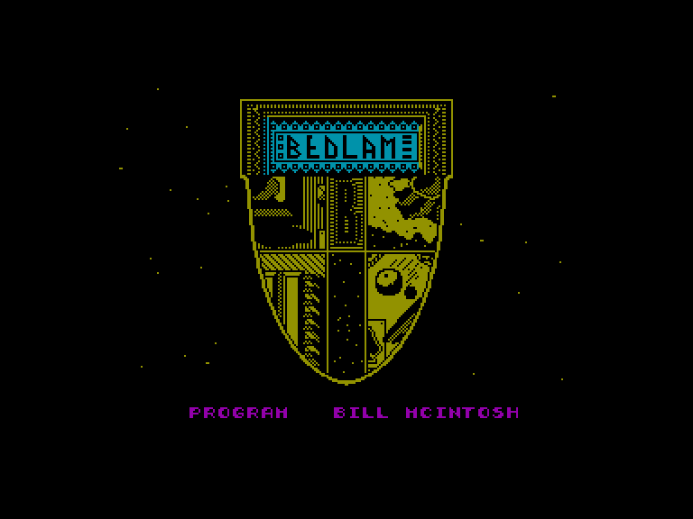
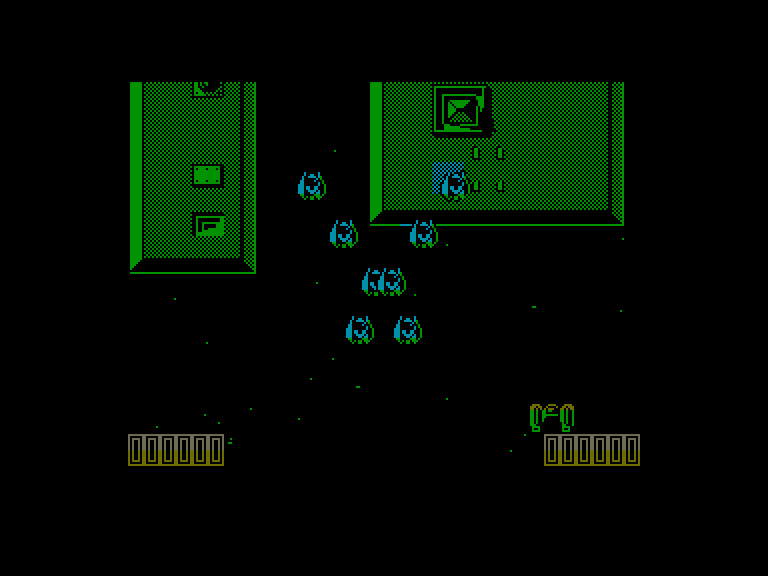
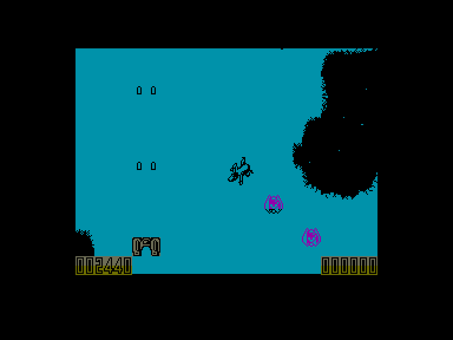
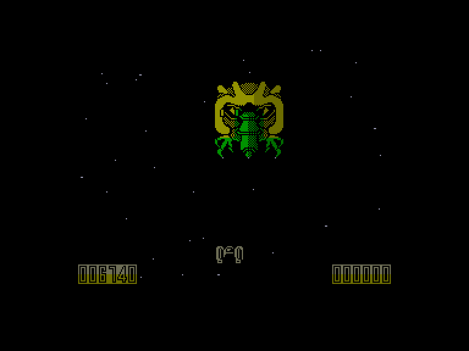

[0-9](../0/games-0.md) - [A](../a/games-a.md) - [B](../b/games-b.md) - [C](../c/games-c.md) - [D](../d/games-d.md) - [E](../e/games-e.md) - [F](../f/games-f.md) - [G](../g/games-g.md) - [H](../h/games-h.md) - [I](../i/games-i.md) - [J](../j/games-j.md) - [K](../k/games-k.md) - [L](../l/games-l.md) - [M](../m/games-m.md) - [N](../n/games-n.md) - [O](../o/games-o.md) - [P](../p/games-p.md) - [Q](../q/games-q.md) - [R](../r/games-r.md) - [S](../s/games-s.md) - [T](../t/games-t.md) - [U](../u/games-u.md) - [V](../v/games-v.md) - [W](../w/games-w.md) - [X](../x/games-x.md) - [Y](../y/games-y.md) - [Z](../z/games-z.md)

Ігри для [Enterprise 64k](../games-ep64.md) - [Enterprise 128k+RAMexp](../games-epramexp.md) - [2dfx](games-2dfx.md)

Ігри для систем [IS-DOS](../games-is-dos.md) - [SymbOS](../games-symbos.md) - [EDC Windows](../games-edcw.md)

Ігри для емуляторів [ZX Spectrum 48k/128k](../zxemu/games-zxemu.md) - [Amstrad CPC](../cpcemu/games-cpc.md) - [Sinclair ZX81](../zx81emu/games-zx81.md) - [Videoton TVC](../tvcemu/games-tvc.md) - [Commodore VIC-20](../vic20emu/games-vic20.md)

----------

# Bedlam

**ID:** bedlam-zx

## Примітка

ℹ Стара неофіційна конверсія з платформи ZX Spectrum.  
⚠ Може містити критичні помилки.

## Скріншоти

## Опис

(temporary description generated by AI [Assistant])  

**Опис гри:**  

Гра "Bedlam" — це захоплююча аркадна гра в жанрі "шутер", яка пропонує гравцям захоплюючий ігровий процес, де вони повинні знищити ворогів, що нападають, і уникати перешкод. Гра відзначається якісною графікою та звуковими ефектами, що робить її цікавою для гравців.  

**Правила гри:**  

1. **Мета гри:** Знищити всіх ворогів, які з'являються на екрані, і уникнути їх атак, щоб зберегти свої життя.  

2. **Управління:**  
   - Гравець може вибрати управління клавіатурою або джойстиком (Kempston, Sinclair).  
   - Управління для клавіатури: Z, X, L, M, ENTER.  
   - У версії Enterprise використовується вбудований джойстик.  

3. **Геймплей:**  
   - Гравець рухається вгору по екрану, в той час як вороги спускаються вниз, намагаючись вразити гравця.  
   - Гравець може стріляти у ворогів, знищуючи їх і отримуючи бали.  
   - Якщо гравець отримує удар, він втрачає життя. Гра закінчується, коли всі життя втрачені.  

4. **Вороги та перешкоди:**  
   - Вороги з'являються у формах, які рухаються по певних траєкторіях.  
   - Гравець повинен уникати зіткнень з ворогами та перешкодами, які можуть завдати шкоди.  

5. **Бонуси:**  
   - Іноді знищені вороги можуть залишати за собою бонуси, які покращують здібності гравця, наприклад, збільшення швидкості стрільби або тимчасову невразливість.  

6. **Система очок:**  
   - Гравці отримують бали за кожного знищеного ворога, що дозволяє їм підвищувати свій рейтинг.  

7. **Чіти:**  
   - Для отримання безсмертя в грі можна використовувати команди POKE, які дозволяють збільшити кількість життів.  

"Bedlam" — це динамічна гра, яка забезпечує гравцям можливість продемонструвати свої навички в стрільбі та уникненні атак, пропонуючи захоплюючий ігровий процес для всіх шанувальників жанру.

## Основна інформація
- **Оригінальна платформа:** ZX Spectrum

## Посилання
- [Опис на ep128.hu (угорською)](http://www.ep128.hu/Games/Bedlam.htm)
- [Інформація про оригінальну версію](https://spectrumcomputing.co.uk/entry/495/ZX-Spectrum/Bedlam)
- [Завантажити](http://www.ep128.hu/Ep_Games/Prg/Bedlam.rar)

