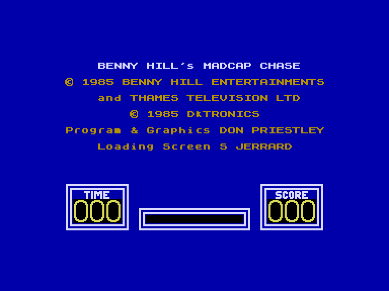
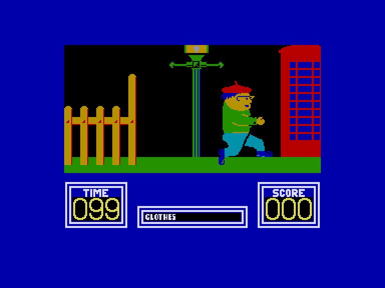
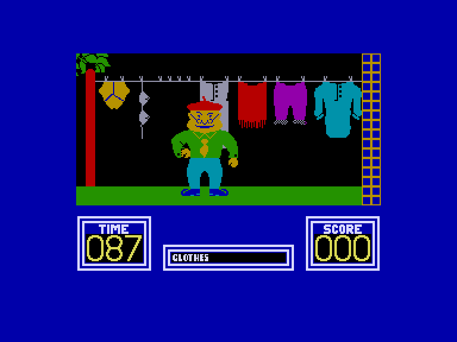
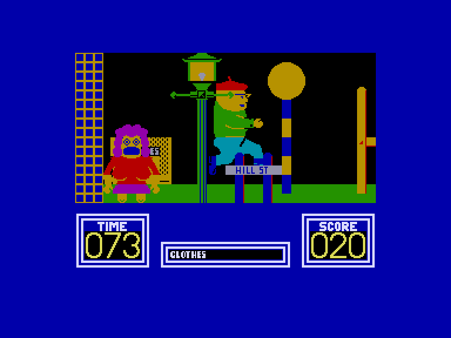

[0-9](../0/games-0.md) - [A](../a/games-a.md) - [B](../b/games-b.md) - [C](../c/games-c.md) - [D](../d/games-d.md) - [E](../e/games-e.md) - [F](../f/games-f.md) - [G](../g/games-g.md) - [H](../h/games-h.md) - [I](../i/games-i.md) - [J](../j/games-j.md) - [K](../k/games-k.md) - [L](../l/games-l.md) - [M](../m/games-m.md) - [N](../n/games-n.md) - [O](../o/games-o.md) - [P](../p/games-p.md) - [Q](../q/games-q.md) - [R](../r/games-r.md) - [S](../s/games-s.md) - [T](../t/games-t.md) - [U](../u/games-u.md) - [V](../v/games-v.md) - [W](../w/games-w.md) - [X](../x/games-x.md) - [Y](../y/games-y.md) - [Z](../z/games-z.md)

Ігри для [Enterprise 64k](../games-ep64.md) - [Enterprise 128k+RAMexp](../games-epramexp.md)

Ігри для систем [IS-DOS](../games-is-dos.md) - [SymbOS](../games-symbos.md) - [EDC Windows](../games-edcw.md)

Ігри для емуляторів [ZX Spectrum 48k/128k](../zxemu/games-zxemu.md) - [Amstrad CPC](../cpcemu/games-cpc.md) - [Sinclair ZX81](../zx81emu/games-zx81.md) - [Videoton TVC](../tvcemu/games-tvc.md) - [Commodore VIC-20](../vic20emu/games-vic20.md)

----------

# Benny Hill's Madcap Chase!

**ID:** benny-hill-zx

## Скріншоти

## Опис

(temporary description generated by AI [Assistant])

**Опис гри:**

Гра "Benny Hill's Madcap Chase!" — це веселий та динамічний аркадний шутер, в якому гравець виконує роль персонажа, що намагається втекти від переслідування вчительки, поки збирає різні предмети. Гра відзначається яскравою графікою та комедійним стилем, натхненним популярним телешоу "Benny Hill".

**Правила гри:**

1. **Мета гри:** Зібрати всі предмети, які розкидані по рівнях, і уникнути переслідування вчительки.

2. **Управління:**
   - Гравець може вибрати управління клавіатурою або джойстиком.
   - Управління для клавіатури: 
     - Z — вліво
     - X — вправо
     - Q — вгору
     - A — вниз
     - H — перезапуск
   - Для джойстика доступні різні варіанти, включаючи Kempston, Cursor, Sinclair та DK'tronics.

3. **Геймплей:**
   - Гравець починає гру з визначеним часом для проходження рівня.
   - На першому рівні потрібно зібрати розвішані на подвір'ї речі, такі як білизна, і доставити їх до місця збору.
   - Гравець повинен уникати вчительки, яка переслідує його, а також перешкод, таких як електричні стовпи.
   - Якщо гравець зіткнеться з перешкодою або буде спійманий вчителькою, він втратить очки.

4. **Система очок:**
   - Гравець отримує очки за кожен зібраний предмет.
   - Якщо гравець встигає зібрати всі предмети до закінчення часу, він отримує додаткові очки.

5. **Різні рівні:**
   - На кожному наступному рівні гравець стикається з новими викликами, такими як збір фруктів на другому рівні, де його переслідує охоронець.
   - На третьому рівні гравець повинен викрасти іграшки з магазину, уникаючи двох охоронців.

6. **Чіти:**
   - Для отримання безсмертя в грі можна використовувати команду POKE 34957,42.

"Madcap Chase!" — це гра, яка пропонує веселий та динамічний ігровий процес, що підходить для всіх вікових категорій, з легким гумором і яскравою графікою, що робить її ідеальною для шанувальників аркадних ігор.

## Основна інформація
- **Оригінальна платформа:** ZX Spectrum

## Посилання
- [Опис гри на ep128.hu (угорською)](http://www.ep128.hu/Games/Benny_Hill.htm)
- [Інформація про оригінальну версію](https://spectrumcomputing.co.uk/entry/507/ZX-Spectrum/Benny_Hills_Madcap_Chase)
- [Завантажити гру](http://www.ep128.hu/Ep_Games/Prg/Benny_Hill.rar)

**Дата генерації:** 28.07.2026

