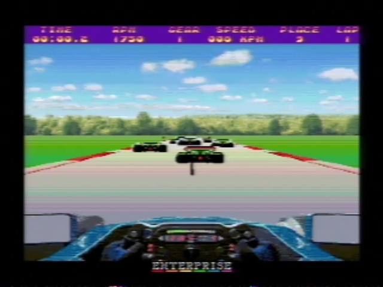
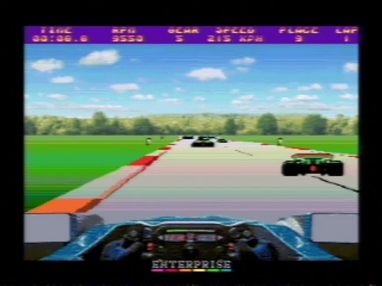
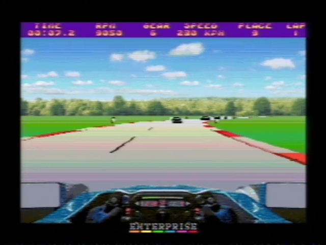
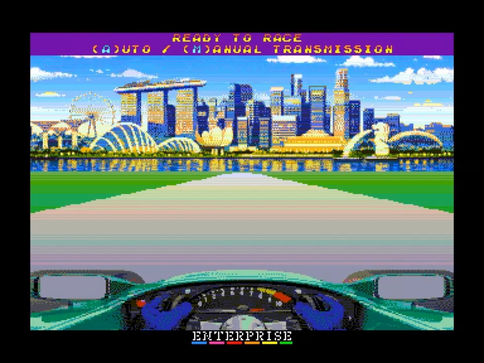

[0-9](../0/games-0.md) - [A](../a/games-a.md) - [B](../b/games-b.md) - [C](../c/games-c.md) - [D](../d/games-d.md) - [E](../e/games-e.md) - [F](../f/games-f.md) - [G](../g/games-g.md) - [H](../h/games-h.md) - [I](../i/games-i.md) - [J](../j/games-j.md) - [K](../k/games-k.md) - [L](../l/games-l.md) - [M](../m/games-m.md) - [N](../n/games-n.md) - [O](../o/games-o.md) - [P](../p/games-p.md) - [Q](../q/games-q.md) - [R](../r/games-r.md) - [S](../s/games-s.md) - [T](../t/games-t.md) - [U](../u/games-u.md) - [V](../v/games-v.md) - [W](../w/games-w.md) - [X](../x/games-x.md) - [Y](../y/games-y.md) - [Z](../z/games-z.md)

Ігри для [Enterprise 64k](../games-ep64.md) - [Enterprise 128k+RAMexp](../games-epramexp.md)

Ігри для систем [IS-DOS](../games-is-dos.md) - [SymbOS](../games-symbos.md) - [EDC Windows](../games-edcw.md)

Ігри для емуляторів [ZX Spectrum 48k/128k](../zxemu/games-zxemu.md) - [Amstrad CPC](../cpcemu/games-cpc.md) - [Sinclair ZX81](../zx81emu/games-zx81.md) - [Videoton TVC](../tvcemu/games-tvc.md) - [Commodore VIC-20](../vic20emu/games-vic20.md)

----------

# Best Practice

**Альтернативні назви:**
 - Best Practice: F1

**ID:** best-practice-f1

**Жанри:** Перегони, Симулятор

## Примітка

ℹ Прототип гри / Технодемка

## Скріншоти

## Основна інформація
- **Мови:** Англійська
- **Оригінальна платформа:** Enterprise
### Загальні системні вимоги
- **Апаратні:** EP128
### Геймплей
- **Кількість гравців:** 1 player
- **Додаткові теги:** Attribute mode, 4-color mode
### Розробка
- **Рік випуску:** 2026
- **Автор:** kroysoft

## Посилання
- [Тема на форумі enterpriseforever](https://enterpriseforever.com/jatekok/uj-jatek-bestpracticef1/)

## Відео

<iframe src="https://www.youtube.com/embed/rxwNAoErGdQ"  
style="width:75%; aspect-ratio:16/9;" allowfullscreen></iframe>

- [Відео](https://youtu.be/NBNYeOm8wXQ)
- [Відео](https://www.youtube.com/watch?v=BeWB2qWju2U)

## Детальна інформація

### Історія розробки  

> kroysoft:  
>   
> Програма планувалася як своєрідне технодемо, і я розробляю її вже майже 6 років. Це псевдо-3D гонки, які я початково назвав "Best Practice", бо на самому початку вирішив витиснути з заліза геть усе за допомогою "найкращих практик": максимум графічної деталізації та продуктивності. Спочатку це була суміш C та ASM — з практичних міркувань почав на C, але в результаті лишився чистий дистильований асемблер: з компілятором C не вистачало ні швидкодії, ні розміру пам'яті для коду.  
>   
> Все починалося як «навчальна практика», бо тоді я не планував нічого більшого, окрім процедурно згенерованого треку. Але за ці роки з'явилися суперники й мета гри. І хоча тут немає класичного меню чи наперед збережених трас, гру вже можна назвати повноцінною (і я сміливо її такою називаю): її можна перегравати безкінечно, адже траси не повторюються, поведінка суперників псевдовипадкова, та й сам гравець не зможе двічі однаково пройти той самий поворот...  
>   
> Теоретично код адаптивний: на машині з частотою 4/6 МГц гра іде з базовою графікою проти 3 суперників. На 7.125/8 МГц — 6 суперників і «середня» графіка, а на 10 МГц — фул-графіка та 8 суперників. Принаймні в емуляторі це працює саме так (якщо таймінги RAM налаштовані точно, то ці діапазони частот чудово визначаються під час завантаження — хоча я пробував, наприклад, на EP32, і там це автоналаштування працює некоректно).  
Плюс тут ще є temporal color blending (часове змішування кольорів) — теж не знаю, чи спрацює воно на реальному залізі: в ep128emu все ОК, а в ep32 — ні...  
>   
> Так, форуми про різні тактові частоти я читаю вже давно — саме звідти й з'явилися ці компроміси... Початково я, звісно, хотів реалізувати ВСЕ І ОДРАЗ для 4 МГц: фул-графіку, 50 FPS і казку в додачу. Але на початку проєкту швидко стало очевидно, що на 80 тисячах T-циклів дива не станеться.  
Тож я шукав компроміси та максимально можливі частоти, і зрештою фінальною метою стали 10 МГц. Саме під них я й оптимізував гру, яка за контентом була «готова» ще майже рік тому. Щоправда, тоді їй потрібна була емульована швидкість під 18–20 МГц, щоб у це взагалі можна було грати (що порівняно з 60–80 МГц на C+ASM вже було не так і погано...). Звісно, від початкових 50 FPS я давно відмовився: мій орієнтир — це 16.67 FPS, тобто «кожен третій тік 50 Гц». Не можу сказати, що мені вдається тримати їх завжди навіть на 10 МГц, але за ці роки я зрозумів, що більшість тогочасних подібних гонок не дотягували навіть до 10 FPS... тож це не так і погано. Навіть враховуючи, що на 4 МГц / Low-графіці воно лише наближається до 9–10 FPS, та й то в «найкращі моменти» (графіка досить динамічна, тому FPS взагалі нестабільний).  
>   
> До речі, гра використовує режим 4c Hi-Res, а для кокпіта — режим Attribute; вихідні зображення я підготував за допомогою epimgconv у формат, який «перетравлює» графічний чип Nick. З цього все й почалося. Фонове зображення було зроблене одного чудового весняного дня десь у нас в країні. Роздільна здатність — 336x256: я не хотів грати через маленьку шпаринку в центрі телевізора, тож тут на компроміси не йшов. Код на сьогодні «оптимізовано до нечитабельності», але він хоча б досі працює. З вищеописаних апетитів до частоти емулятора ви можете уявити, наскільки зросла продуктивність з тих пір, як я почав це під час COVID... (саме тоді мені до рук потрапила документація чипа Nick, і я був вражений тим, на що він був здатен у ті часи — і тим, наскільки це не використала жодна гра. Тоді й настав момент «потримай моє пиво»... правда, цей момент трохи затягнувся, але маємо що маємо 🙂).