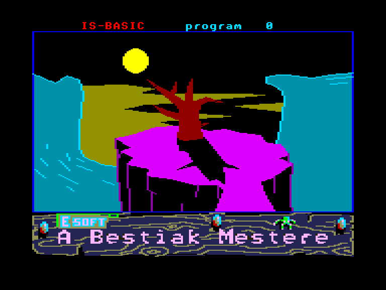
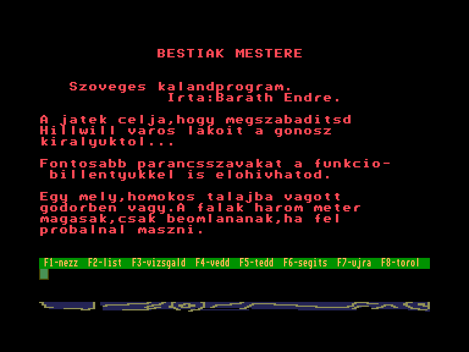
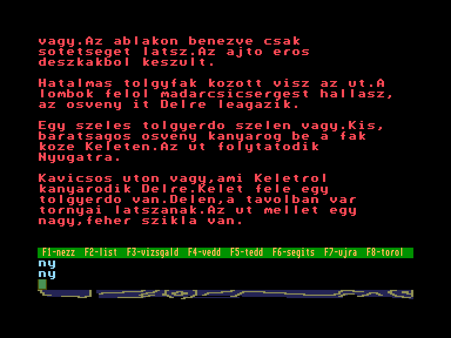
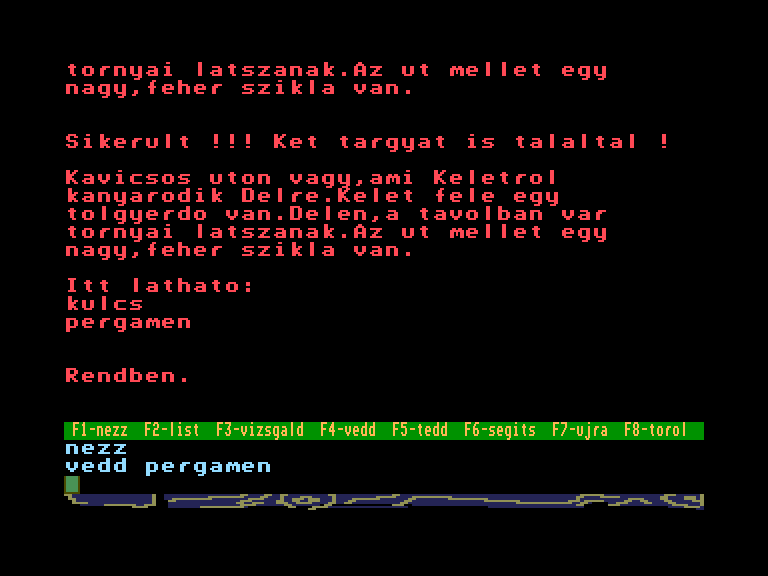

[0-9](../0/games-0.md) - [A](../a/games-a.md) - [B](../b/games-b.md) - [C](../c/games-c.md) - [D](../d/games-d.md) - [E](../e/games-e.md) - [F](../f/games-f.md) - [G](../g/games-g.md) - [H](../h/games-h.md) - [I](../i/games-i.md) - [J](../j/games-j.md) - [K](../k/games-k.md) - [L](../l/games-l.md) - [M](../m/games-m.md) - [N](../n/games-n.md) - [O](../o/games-o.md) - [P](../p/games-p.md) - [Q](../q/games-q.md) - [R](../r/games-r.md) - [S](../s/games-s.md) - [T](../t/games-t.md) - [U](../u/games-u.md) - [V](../v/games-v.md) - [W](../w/games-w.md) - [X](../x/games-x.md) - [Y](../y/games-y.md) - [Z](../z/games-z.md)

Ігри для [Enterprise 64k](../games-ep64.md) - [Enterprise 128k+RAMexp](../games-epramexp.md) - [2dfx](games-2dfx.md)

Ігри для систем [IS-DOS](../games-is-dos.md) - [SymbOS](../games-symbos.md) - [EDC Windows](../games-edcw.md)

Ігри для емуляторів [ZX Spectrum 48k/128k](../zxemu/games-zxemu.md) - [Amstrad CPC](../cpcemu/games-cpc.md) - [Sinclair ZX81](../zx81emu/games-zx81.md) - [Videoton TVC](../tvcemu/games-tvc.md) - [Commodore VIC-20](../vic20emu/games-vic20.md)

----------

# A Bestiák Mestere

**ID:** bestiak-mestere

**Жанри:** Текстова пригода

## Примітка

ℹ Хоумбрю-гра.

## Скріншоти

## Опис

(temporary description generated by AI [Assistant])  

**Опис гри:**  

Гра "A Bestiák Mestere" — це текстова пригодницька гра, яка пропонує гравцям захоплюючу подорож у світ фентезі, де вони повинні звільнити місто Хіллвіл від злого короля. Гравець повинен досліджувати різні локації, збирати предмети та вирішувати головоломки, щоб досягти мети.  

**Правила гри:**  

1. **Мета гри:** Зібрати всі ключі та предмети, необхідні для звільнення міста від злого короля.  

2. **Управління:**  
   - Гравець може вводити команди без акцентів, використовуючи текстові команди для взаємодії з ігровим світом.  
   - Основні команди:  
     - **ÁSS** — копати.  
     - **VEDD** — взяти предмет.  
     - **FÚJD** — подути в свисток.  
     - **NYISD** — відкрити двері.  
     - **RÚGD** — вдарити/виштовхнути.  
     - **NÉZZ** — оглянути.  
     - **ADD** — віддати предмет.  
     - **VISEL** — надіти предмет.  

3. **Геймплей:**  
   - Гравець починає в ямі і повинен копати, щоб знайти кістку, з якою можна взаємодіяти.  
   - Гравець повинен уникати вчителів та інших перешкод, які можуть призвести до втрати життя.  
   - Зібрані предмети можуть бути використані для відкриття нових шляхів або для отримання підказок.  

4. **Рівні:**  
   - Гра складається з кількох рівнів, де кожен рівень має свої унікальні завдання, такі як збір яблук, іграшок або інших предметів.  
   - На кожному рівні гравець стикається з новими ворогами та перешкодами.  

5. **Система очок:**  
   - Гравець отримує бали за кожен зібраний предмет і за виконані завдання.  
   - Гравець може втратити бали за зіткнення з ворогами або перешкодами.  

6. **Чіти:**  
   - Для отримання безсмертя можна використовувати команди POKE.  

7. **Кінець гри:**  
   - Гра закінчується, коли гравець звільняє місто від злого короля, або коли всі життя втрачені.  

"A Bestiák Mestere" — це гра, яка поєднує в собі елементи пригодницького жанру з текстовими командами, що робить її цікавою для шанувальників фентезі та головоломок.

## Основна інформація
- **Мови:** Угорська
### Загальні системні вимоги
- **Програмні:** IS-Basic
### Геймплей
- **Керування:** Keyboard
- **Кількість гравців:** 1 player

## Посилання
- [Опис на ep128.hu (угорською)](http://www.ep128.hu/Ep_Games/Leiras/Bestiak_Mestere.htm)
- [Завантажити](http://www.ep128.hu/Ep_Games/Prg/Bestiak_mestere.rar)

