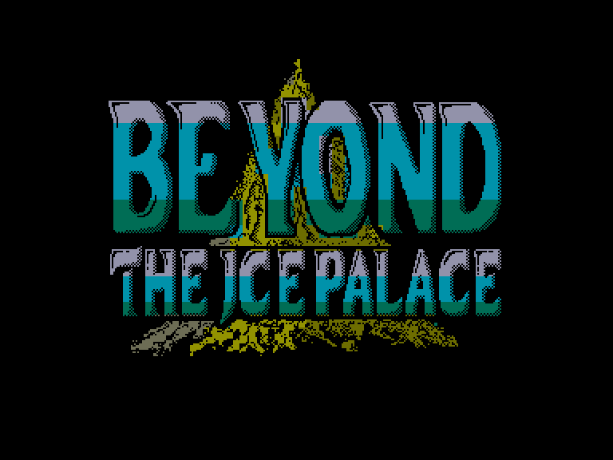
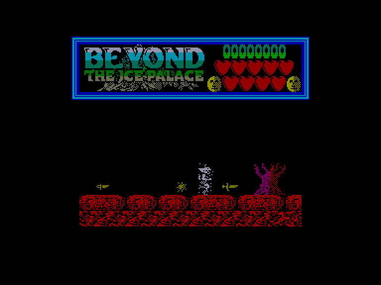
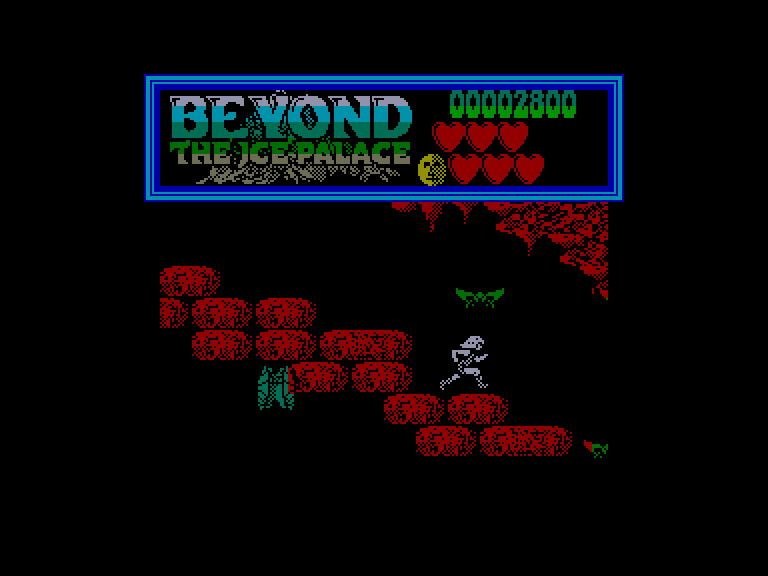
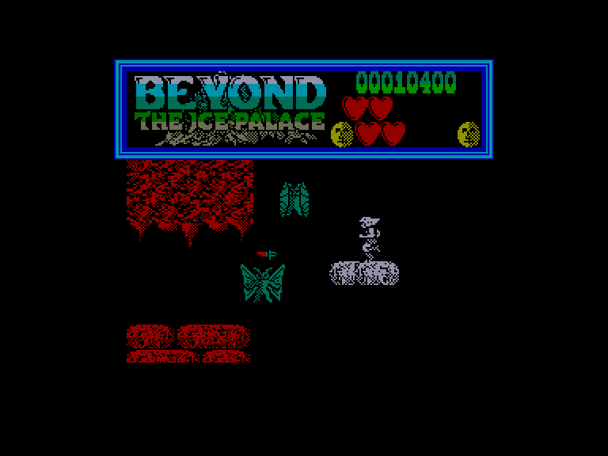

[0-9](../0/games-0.md) - [A](../a/games-a.md) - [B](../b/games-b.md) - [C](../c/games-c.md) - [D](../d/games-d.md) - [E](../e/games-e.md) - [F](../f/games-f.md) - [G](../g/games-g.md) - [H](../h/games-h.md) - [I](../i/games-i.md) - [J](../j/games-j.md) - [K](../k/games-k.md) - [L](../l/games-l.md) - [M](../m/games-m.md) - [N](../n/games-n.md) - [O](../o/games-o.md) - [P](../p/games-p.md) - [Q](../q/games-q.md) - [R](../r/games-r.md) - [S](../s/games-s.md) - [T](../t/games-t.md) - [U](../u/games-u.md) - [V](../v/games-v.md) - [W](../w/games-w.md) - [X](../x/games-x.md) - [Y](../y/games-y.md) - [Z](../z/games-z.md)

Ігри для [Enterprise 64k](../games-ep64.md) - [Enterprise 128k+RAMexp](../games-epramexp.md)

Ігри для систем [IS-DOS](../games-is-dos.md) - [SymbOS](../games-symbos.md) - [EDC Windows](../games-edcw.md)

Ігри для емуляторів [ZX Spectrum 48k/128k](../zxemu/games-zxemu.md) - [Amstrad CPC](../cpcemu/games-cpc.md) - [Sinclair ZX81](../zx81emu/games-zx81.md) - [Videoton TVC](../tvcemu/games-tvc.md) - [Commodore VIC-20](../vic20emu/games-vic20.md)

----------

# Beyond the Ice Palace

**ID:** beyond-the-ice-palace-zx

## Скріншоти

## Опис

(temporary description generated by AI [Assistant])

# Опис гри "Поза Льодовим Палацом"

"Поза Льодовим Палацом" — це захоплююча гра, розроблена компанією Elite у 1988 році, яка переносить гравців у світ, де добро і зло ведуть запеклу боротьбу. Гравець занурюється в містичний ландшафт, де темні духи загрожують спокою мирних лісорубів, руйнуючи їхні домівки. Відчайдушно намагаючись врятувати ліс, старі і мудрі духи випускають святий стрілу в небо, і той, хто її знайде, повинен протистояти силам темряви в боротьбі на життя і смерть.

## Правила гри

1. **Мета гри**: Гравець повинен пройти через небезпечні території, заповнені ворогами і пастками, щоб врятувати ліс від темряви.

2. **Персонаж**: Гравець контролює персонажа, який може бігати, стрибати, і використовувати різні види зброї для боротьби з ворогами.

3. **Зброя**: 
   - Найсильнішою зброєю є меч.
   - Можна також використовувати булаву проти ворогів на верхніх платформах.
   - Гравець може підбирати різні види зброї, але завжди слід намагатися повернутися до меча, якщо був підібраний менш потужний артефакт (наприклад, ніж).

4. **Духи лісу**: 
   - Гравець може викликати духів лісу, щоб вони допомогли у бою, але їх використання обмежене (початково два рази).
   - Духи можуть вбивати або ослаблювати ворогів, але їх слід використовувати обережно.

5. **Вороги**: 
   - Гравець зіткнеться з різними ворогами, такими як черв'яки, духи, зомбі та отруйні метелики.
   - Гіганти кидають сокири, а комахи стріляють вогняними стрілами.

6. **Перешкоди**: 
   - На шляху гравця можуть бути камені, які блокують шлях, та загадкові стіни, що піднімаються.
   - Гравець повинен бути обережним, піднімаючись по сходах, оскільки вороги можуть атакувати з верхніх платформ.

7. **Кінець гри**: 
   - Гравець досягає фінальної мети, перемігши злу відьму на третьому рівні складності.
   - Якщо гравець успішно завершує гру, ліс рятується; якщо ні — на його території залишиться лише смерть, вогонь і руйнування.

8. **Управління**: 
   - Гру можна контролювати за допомогою джойстика або клавіатури, з можливістю переналаштування.
   - Для завершення гри натискається клавіша BREAK.

9. **Тактика**: 
   - Не слід поспішати вперед, адже вороги будуть слідувати за вами.
   - Важливо бути обережним під час підйому по сходах і на ліфтах, оскільки можуть з’явитися вороги.

Гравець повинен проявити стратегічність і обережність, щоб успішно пройти всі рівні і врятувати ліс від темряви.

## Основна інформація
- **Оригінальна платформа:** ZX Spectrum

## Посилання
- [Опис гри на ep128.hu (угорською)](http://www.ep128.hu/Games/Beyond_the_Ice_Palace.htm)
- [Інформація про оригінальну версію](https://spectrumcomputing.co.uk/entry/512/ZX-Spectrum/Beyond_the_Ice_Palace)
- [Завантажити гру](http://www.ep128.hu/Ep_Games/Prg/Beyond_the_Ice_Palace.rar)

**Дата генерації:** 29.07.2026

