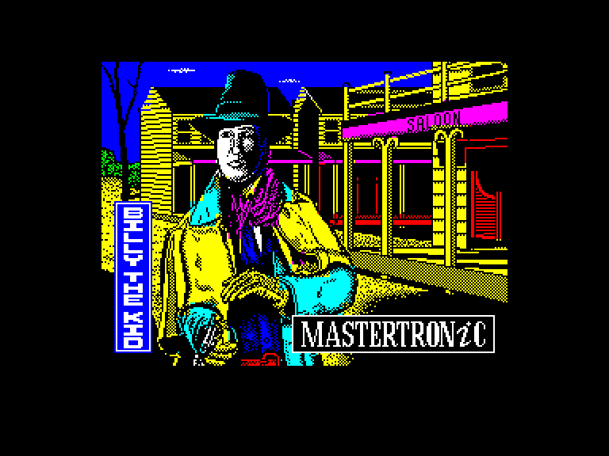
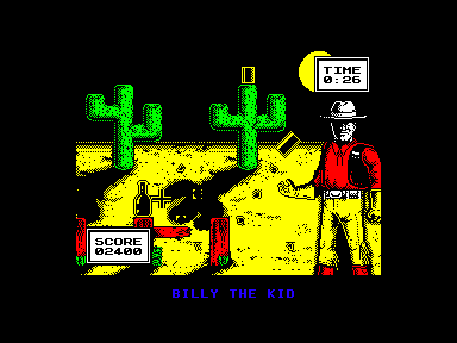
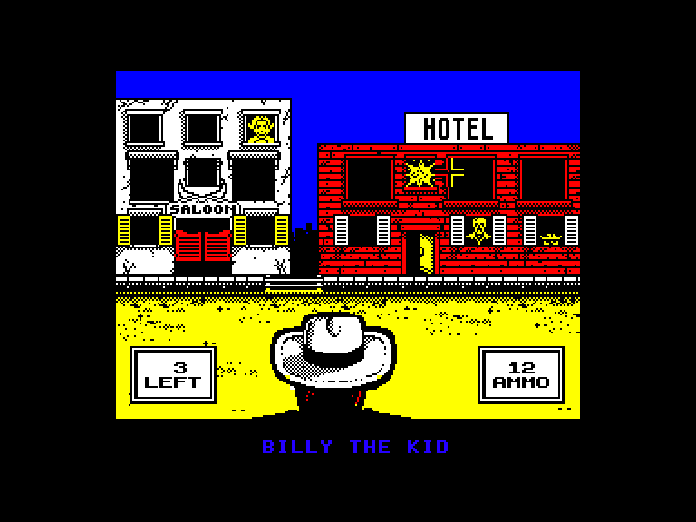
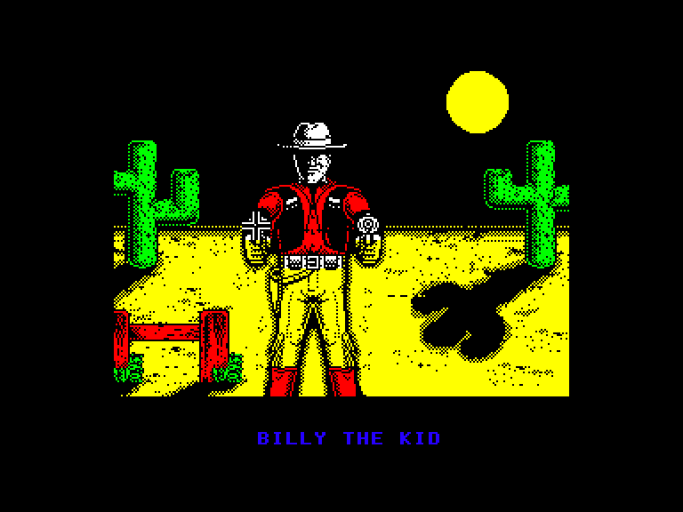

[0-9](../0/games-0.md) - [A](../a/games-a.md) - [B](../b/games-b.md) - [C](../c/games-c.md) - [D](../d/games-d.md) - [E](../e/games-e.md) - [F](../f/games-f.md) - [G](../g/games-g.md) - [H](../h/games-h.md) - [I](../i/games-i.md) - [J](../j/games-j.md) - [K](../k/games-k.md) - [L](../l/games-l.md) - [M](../m/games-m.md) - [N](../n/games-n.md) - [O](../o/games-o.md) - [P](../p/games-p.md) - [Q](../q/games-q.md) - [R](../r/games-r.md) - [S](../s/games-s.md) - [T](../t/games-t.md) - [U](../u/games-u.md) - [V](../v/games-v.md) - [W](../w/games-w.md) - [X](../x/games-x.md) - [Y](../y/games-y.md) - [Z](../z/games-z.md)

Ігри для [Enterprise 64k](../games-ep64.md) - [Enterprise 128k+RAMexp](../games-epramexp.md)

Ігри для систем [IS-DOS](../games-is-dos.md) - [SymbOS](../games-symbos.md) - [EDC Windows](../games-edcw.md)

Ігри для емуляторів [ZX Spectrum 48k/128k](../zxemu/games-zxemu.md) - [Amstrad CPC](../cpcemu/games-cpc.md) - [Sinclair ZX81](../zx81emu/games-zx81.md) - [Videoton TVC](../tvcemu/games-tvc.md) - [Commodore VIC-20](../vic20emu/games-vic20.md)

----------

# Billy the Kid

**ID:** billy-the-kid-zx

## Скріншоти

## Опис

(temporary description generated by AI [your name])

**Опис гри "Billy the Kid"**

Гра "Billy the Kid" є захоплюючою стрілялкою, що вийшла у 1989 році для платформ Spectrum (48k) та Enterprise. Назва гри походить від відомого персонажа Дикого Заходу - Біллі Кіда, який був знаменитим бандитом. Гравцям знадобляться спритні пальці, щоб впоратися з усіма викликами, які пропонує гра. Вона складається з простих елементів, але є досить кумедною та розважальною, з якісною графікою та звуками, особливо в 128K версії.

**Правила гри:**

1. **Меню управління**: Після завантаження гри з'являється меню, де ви можете вибрати спосіб управління: Sinclair, Kempston, Protek джойстик або клавіатуру. Розкладка клавіатури така:
   - Z - вліво
   - X - вправо
   - K - вгору
   - M - вниз
   - ENTER - вогонь

   Для навігації в меню використовуйте клавішу SPACE, а для вибору - ENTER. Пам'ятайте, що це меню не з'явиться знову, тому уважно налаштуйте управління.

2. **Структура гри**: Гра складається з трьох рівнів:

   - **Перший рівень**: Ви практикуєте стрільбу, стріляючи по консервним банкам та пляшкам у пустелі. За кожен влучний постріл ви отримуєте бали. Спочатку вам буде повідомлено, скільки балів потрібно набрати для проходження рівня (наприклад, 5000 балів на початковому рівні). У вас є безкінечні набої, тому намагайтеся влучити в банки, які кидає ваш супутник.

   - **Другий рівень**: Ви берете участь у вуличній перестрілці. Ваші вороги стріляють у вас з вікон, і вам потрібно їх знищити. Будьте обережні, адже іноді з'являються "цивільні", яких не можна влучати, інакше гра закінчиться. У вас обмежена кількість набоїв, тому не стріляйте без потреби.

   - **Третій рівень**: Ви берете участь у дуелі. Ваш суперник рухається в протилежному напрямку, а потім раптово розвертається. Вам потрібно швидко влучити в нього, інакше він вистрілить першим. Позиція прицілу випадкова, але зазвичай потрібно рухати його вліво.

3. **Кінець гри**: Якщо ви програєте, ви зможете записати своє ім'я в таблицю рекордів, використовуючи джойстик для вибору букв.

Гра "Billy the Kid" - це чудовий спосіб провести час, спробуйте її!

## Основна інформація
- **Оригінальна платформа:** ZX Spectrum

## Посилання
- [Опис гри на ep128.hu (угорською)](http://www.ep128.hu/Games/Billy_the_Kid.htm)
- [Інформація про оригінальну версію](https://spectrumcomputing.co.uk/entry/529/ZX-Spectrum/Billy_the_Kid)
- [Завантажити гру](http://www.ep128.hu/Ep_Games/Prg/Billy_the_Kid.rar)

