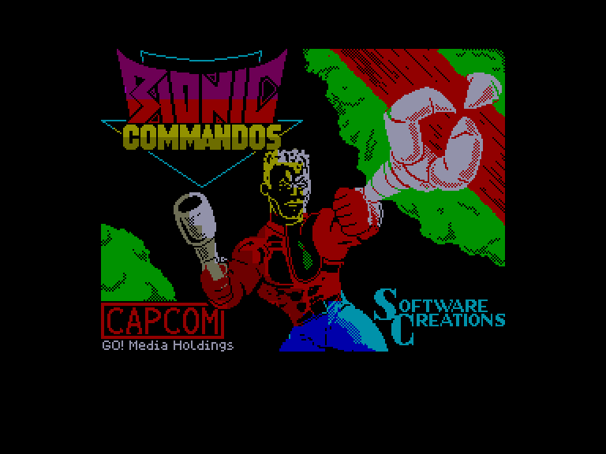
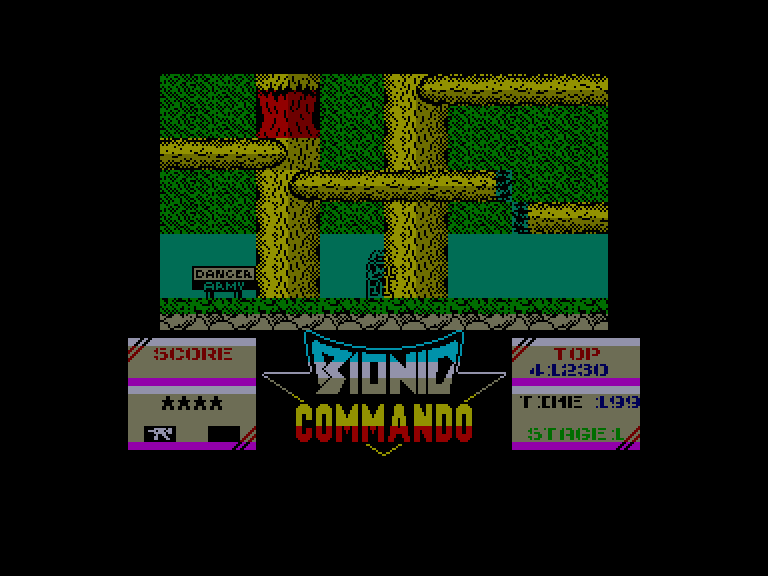
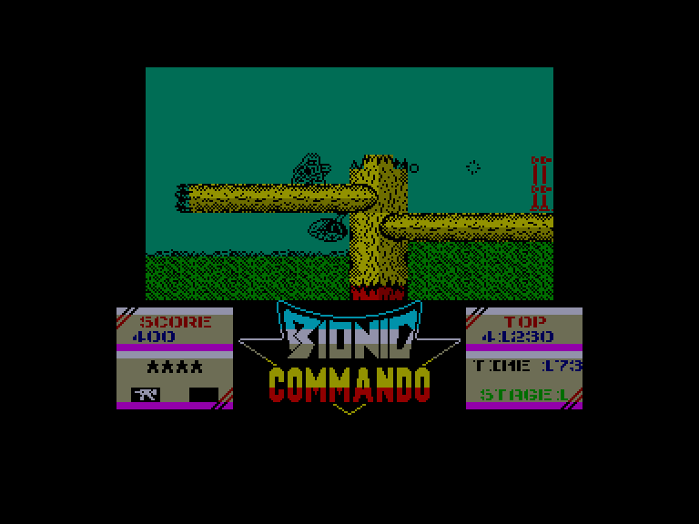
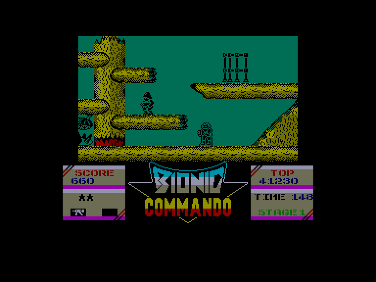

[0-9](../0/games-0.md) - [A](../a/games-a.md) - [B](../b/games-b.md) - [C](../c/games-c.md) - [D](../d/games-d.md) - [E](../e/games-e.md) - [F](../f/games-f.md) - [G](../g/games-g.md) - [H](../h/games-h.md) - [I](../i/games-i.md) - [J](../j/games-j.md) - [K](../k/games-k.md) - [L](../l/games-l.md) - [M](../m/games-m.md) - [N](../n/games-n.md) - [O](../o/games-o.md) - [P](../p/games-p.md) - [Q](../q/games-q.md) - [R](../r/games-r.md) - [S](../s/games-s.md) - [T](../t/games-t.md) - [U](../u/games-u.md) - [V](../v/games-v.md) - [W](../w/games-w.md) - [X](../x/games-x.md) - [Y](../y/games-y.md) - [Z](../z/games-z.md)

Ігри для [Enterprise 64k](../games-ep64.md) - [Enterprise 128k+RAMexp](../games-epramexp.md)

Ігри для систем [IS-DOS](../games-is-dos.md) - [SymbOS](../games-symbos.md) - [EDC Windows](../games-edcw.md)

Ігри для емуляторів [ZX Spectrum 48k/128k](../zxemu/games-zxemu.md) - [Amstrad CPC](../cpcemu/games-cpc.md) - [Sinclair ZX81](../zx81emu/games-zx81.md) - [Videoton TVC](../tvcemu/games-tvc.md) - [Commodore VIC-20](../vic20emu/games-vic20.md)

----------

# Bionic Commando

**Альтернативні назви:**
 - Bionic Commandos

**ID:** bionic-commando-zx

## Примітка

ℹ Стара неофіційна конверсія з платформи ZX Spectrum.

## Скріншоти

## Опис

(temporary description generated by AI [your name])  

**Опис гри: Bionic Commando**  

Світ опинився під загрозою: інопланетяни захопили Землю, і людство виявилося на межі зникнення. Єдина надія на порятунок – це ви, член елітного загону коммандос, який має завдання проникнути в головну базу ворога і знищити їхній головний бойовий комп'ютер.  

**Правила гри:**  

1. **Управління:**  
   - Після завантаження гри натисніть клавішу CAPS SHIFT для вибору способу управління. Доступні варіанти: клавіатура, Kempston, Cursor, Sinclair джойстик.  
   - Стандартна клавіатурна розкладка:   
     - 5 – вліво  
     - 8 – вправо  
     - 7 – вгору  
     - 6 – вниз  
     - 0 – вогонь  
   - Клавіші можна переналаштувати.  
   - Пауза гри: натисніть CAPS SHIFT + SPACE. Повторне натискання SPACE поверне вас до меню.  

2. **Початок гри:**  
   - Для початку гри натисніть ENTER або кнопку вогню.  
   - Ваш персонаж спускається на парашуті на місце дії. Спочатку у вас є двоствольна рушниця, але ви можете отримувати додаткове озброєння від союзників, яке також спускається з парашутом.  
   - Щоб отримати озброєння, стріляйте по парашуту, після чого зможете його підняти.  

3. **Переміщення:**  
   - Гра має платформенний стиль. Ви починаєте в нижньому правому куті екрану і повинні дістатися до верхнього лівого кута.  
   - Ваш герой не може стрибати, але має біомеханічну руку, якою може чіплятися за різні об'єкти.   
   - Для переміщення та стрільби використовуйте комбінації клавіш:  
     - Вниз + вогонь: стрільба в позиції присідання.  
     - Вгору + вогонь: запуск каната вгору.  
     - Вправо/вліво + вогонь: запуск руки вбік.  

4. **Вороги та перешкоди:**  
   - У грі є різноманітні вороги: солдати, роботи, літаючі об'єкти. Вони можуть бути досить витривалими.  
   - Якщо вас влучить ворог, ви втрачаєте життя. При втраті життя ви знову спускаєтеся з парашутом.  
   - У грі є також різні перешкоди, такі як міни, гнізда ос, решітки, гармати та двері, які потрібно знищити або відкрити, щоб продовжити рух.  

5. **Час:**  
   - На пізніших рівнях ви повинні завершити завдання в обмежений час. Час відображається в нижньому правому куті екрану.  

6. **Поради:**  
   - Якщо ви випустите канат, екран трохи підніметься, тому варто кілька разів стріляти вгору, щоб перевірити, чи немає об'єктів над вами.  

7. **Безсмертя:**  
   - Для отримання безсмертя введіть код: POKE 34690,0.  
   - Власники Enterprise можуть отримати безсмертя, утримуючи ESC і 7 під час завантаження.  

**Картки:**  
- [Карта 1](pic/!Map/BionicCommando_1.png)  
- [Карта 2](pic/!Map/BionicCommando_2.jpg)  

Гра Bionic Commando обіцяє захоплюючу пригоду, де вам доведеться проявити свою майстерність та стратегічне мислення, щоб врятувати людство від знищення.

## Основна інформація
- **Оригінальна платформа:** ZX Spectrum

## Посилання
- [Опис гри на ep128.hu (угорською)](http://www.ep128.hu/Games/Bionic_Comamndo.htm)
- [Інформація про оригінальну версію](https://spectrumcomputing.co.uk/entry/9309/ZX-Spectrum/Bionic_Commando)
- [Завантажити гру](http://www.ep128.hu/Ep_Games/Prg/Bionic_Commando.rar)

