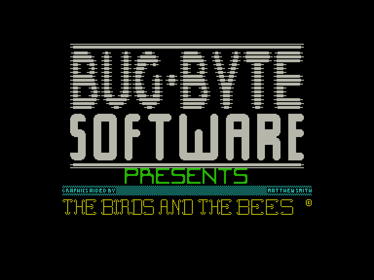
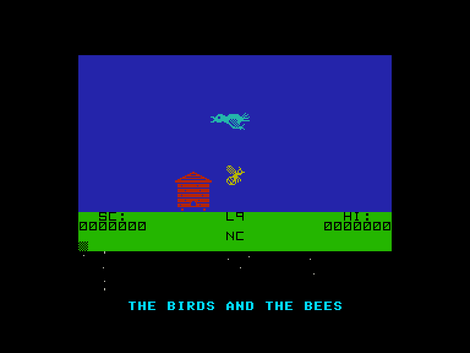
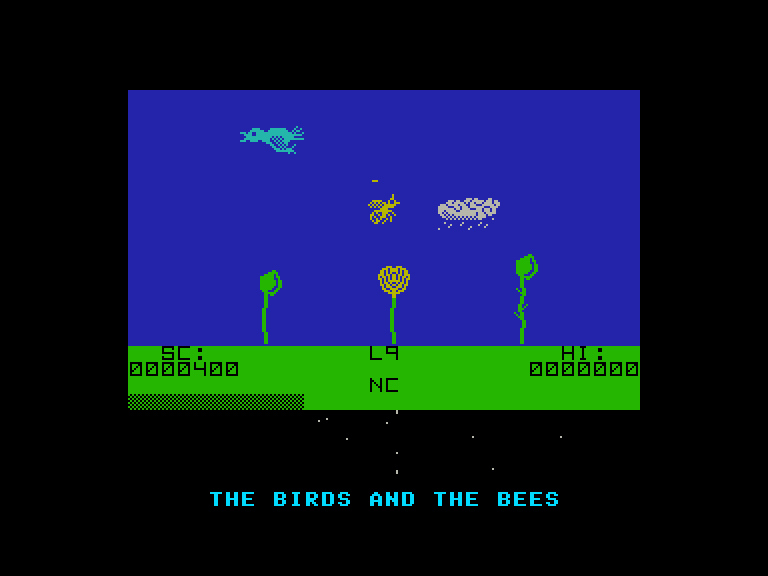
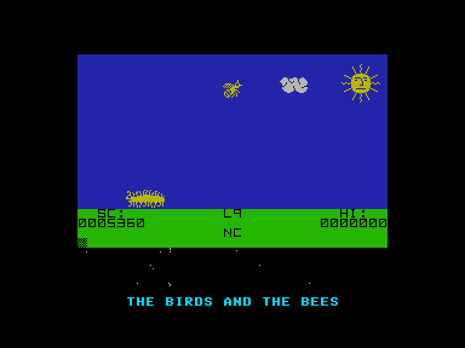

[0-9](../0/games-0.md) - [A](../a/games-a.md) - [B](../b/games-b.md) - [C](../c/games-c.md) - [D](../d/games-d.md) - [E](../e/games-e.md) - [F](../f/games-f.md) - [G](../g/games-g.md) - [H](../h/games-h.md) - [I](../i/games-i.md) - [J](../j/games-j.md) - [K](../k/games-k.md) - [L](../l/games-l.md) - [M](../m/games-m.md) - [N](../n/games-n.md) - [O](../o/games-o.md) - [P](../p/games-p.md) - [Q](../q/games-q.md) - [R](../r/games-r.md) - [S](../s/games-s.md) - [T](../t/games-t.md) - [U](../u/games-u.md) - [V](../v/games-v.md) - [W](../w/games-w.md) - [X](../x/games-x.md) - [Y](../y/games-y.md) - [Z](../z/games-z.md)

Ігри для [Enterprise 64k](../games-ep64.md) - [Enterprise 128k+RAMexp](../games-epramexp.md)

Ігри для систем [IS-DOS](../games-is-dos.md) - [SymbOS](../games-symbos.md) - [EDC Windows](../games-edcw.md)

Ігри для емуляторів [ZX Spectrum 48k/128k](../zxemu/games-zxemu.md) - [Amstrad CPC](../cpcemu/games-cpc.md) - [Sinclair ZX81](../zx81emu/games-zx81.md) - [Videoton TVC](../tvcemu/games-tvc.md) - [Commodore VIC-20](../vic20emu/games-vic20.md)

----------

# The Birds and the Bees

**ID:** birds-and-the-bees-zx

## Примітка

ℹ Неофіційна конверсія з платформи ZX Spectrum.

## Скріншоти

## Опис

(temporary description generated by AI [ChatGPT])  

# Опис гри "Птахи та бджоли"  

"Птахи та бджоли" — це захоплююча гра, в якій ви поринете у повсякденне життя бджіл. Гравець виступає в ролі маленької бджілки, яка протягом літа збирає нектар, перелітаючи з квітки на квітку. Гра розгортається в красивому саду, наповненому квітами, але будьте обережні — цей на перший погляд дружній сад приховує безліч небезпек.  

## Мета гри  

Ваша основна мета — зібрати достатню кількість нектару і повернутися до вулика. Гравець починає гру біля вулика і повинен літати праворуч до саду, де ростуть квіти. На нижній частині екрану є горизонтальна смуга (NC), яка показує, скільки нектару ви зібрали. Щоб виконати завдання, потрібно зібрати "медову шлункову" кількість нектару, яку можна приносити в кілька заходів.  

## Ускладнення  

На початку гри вам заважатимуть лише птахи. Є два види птахів:   
1. **Сині птахи** - спочатку вони не звертають на вас уваги, але їх потрібно уникати.  
2. **Чорні птахи** - більш агресивні, вони будуть переслідувати вас, якщо ви будете повільними. Ви можете уникнути їх, різко змінюючи напрямок.  

При проходженні рівнів з'являються нові вороги:  
- На другому рівні з'являється **стогін**.  
- На третьому рівні ви зустрінете **м'ясоїдні квіти** та **павутиння**.  
- На п'ятому рівні в сад проникає **ведмідь**, який чує запах меду і прямує до вулика. Це створює часовий ліміт для виконання завдання.  

Крім того, на більш високих рівнях з'являються **оса**, яка може бути такою ж маневреною, як і ви.   

## Управління  

Гру можна контролювати за допомогою клавіатури:  
- I - вліво  
- P - вправо  
- Q - вгору  
- Z - вниз  
- B, N, M, SPACE - вогонь  

Або за допомогою джойстика KEMPSTON або CURSOR.   

Для паузи натисніть CAPS SHIFT + SPACE, а для відновлення гри — H. Якщо ви втрачаєте життя, вам доведеться почати рівень спочатку.  

## Чит-коди  

Після завантаження гри ви можете активувати чит-коди:  
- F1 - безсмертя  
- F2 - невразливість  
- F3 - початок з 9 життями  

## Висновок  

"Птахи та бджоли" — це не лише гра на уважність, але й стратегія, де потрібно планувати свої дії, щоб уникнути ворогів і зібрати необхідну кількість нектару. Чи зможете ви стати найкращою бджолою в саду?   

(temporary description generated by AI [ChatGPT])

## Основна інформація
- **Оригінальна платформа:** ZX Spectrum
### Загальні системні вимоги
- **Апаратні:** EP64, EP128
### Геймплей
- **Додаткові теги:** SpeakEasy

## Посилання
- [Опис гри на ep128.hu (угорською)](http://www.ep128.hu/Games/Birds_and_the_Bees.htm)
- [Інформація про оригінальну версію](https://spectrumcomputing.co.uk/entry/536/ZX-Spectrum/The_Birds_and_the_Bees)
- [Завантажити гру](http://www.ep128.hu/Ep_Games/Prg/Birds_and_the_Bees.rar)

