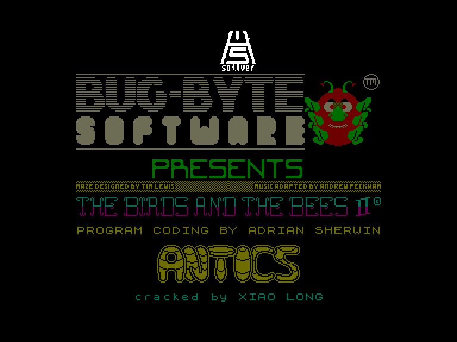
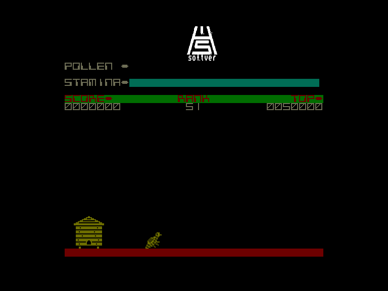
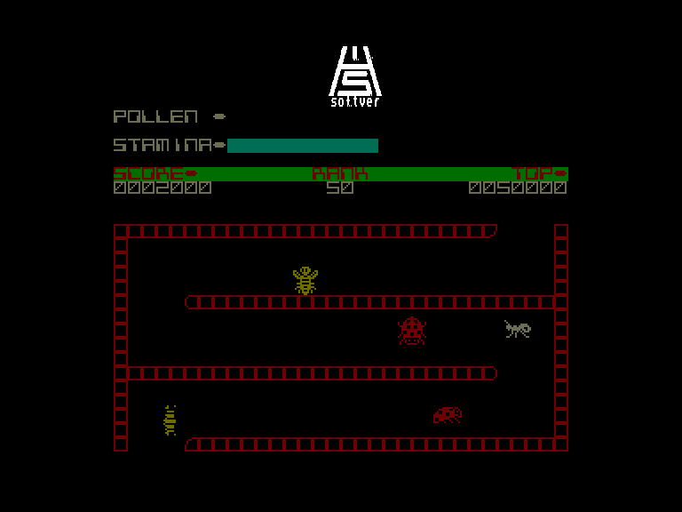
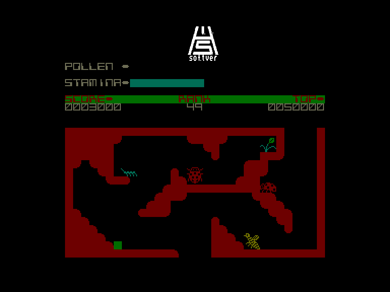

[0-9](../0/games-0.md) - [A](../a/games-a.md) - [B](../b/games-b.md) - [C](../c/games-c.md) - [D](../d/games-d.md) - [E](../e/games-e.md) - [F](../f/games-f.md) - [G](../g/games-g.md) - [H](../h/games-h.md) - [I](../i/games-i.md) - [J](../j/games-j.md) - [K](../k/games-k.md) - [L](../l/games-l.md) - [M](../m/games-m.md) - [N](../n/games-n.md) - [O](../o/games-o.md) - [P](../p/games-p.md) - [Q](../q/games-q.md) - [R](../r/games-r.md) - [S](../s/games-s.md) - [T](../t/games-t.md) - [U](../u/games-u.md) - [V](../v/games-v.md) - [W](../w/games-w.md) - [X](../x/games-x.md) - [Y](../y/games-y.md) - [Z](../z/games-z.md)

Ігри для [Enterprise 64k](../games-ep64.md) - [Enterprise 128k+RAMexp](../games-epramexp.md)

Ігри для систем [IS-DOS](../games-is-dos.md) - [SymbOS](../games-symbos.md) - [EDC Windows](../games-edcw.md)

Ігри для емуляторів [ZX Spectrum 48k/128k](../zxemu/games-zxemu.md) - [Amstrad CPC](../cpcemu/games-cpc.md) - [Sinclair ZX81](../zx81emu/games-zx81.md) - [Videoton TVC](../tvcemu/games-tvc.md) - [Commodore VIC-20](../vic20emu/games-vic20.md)

----------

# Antics

**Альтернативні назви:**
 - The Birds and the Bees II

**ID:** birds-and-the-bees2-zx

## Скріншоти

## Опис

(temporary description generated by AI [Assistant])

**Опис гри: Птахи та бджоли 2**

У грі "Птахи та бджоли 2" ви берете на себе роль бджілки на ім'я Борис, яка опинилася в небезпеці. Головний антагоніст - злі мурахи, які викрали Бориса і утримують його в підземному мурашнику. Ваше завдання - допомогти кузену Бориса, Барнабі, звільнити його та повернути до безпечного вулика.

**Правила гри:**

1. **Управління персонажем**: Ви керуєте Барнабі, який повинен пройти через небезпечні території, щоб дістатися до Бориса. Гра підтримує управління за допомогою клавіатури або джойстика (KEMPSON, SINCLAIR II).

2. **Здоров'я (STAMINA)**: У вас є лише одне життя. Здоров'я зменшується при контакті з ворогами (птахами, мурахами та іншими небезпечними істотами) та з часом. Якщо ваше здоров'я закінчиться, гра закінчується.

3. **Відновлення енергії**: Для відновлення енергії ви можете торкатися квітів. Коли ви доторкаєтеся до квітки, вона розкривається, і ви отримуєте нову енергію. Також, зібраний пилок (POLLEN) захищає вас від ворогів, дозволяючи вам уникати втрати енергії при зіткненні з ними.

4. **Використання квітів**: Кожну квітку можна відвідати лише один раз, щоб отримати пилок. Пам'ятайте, що з часом ваша енергія все ще зменшується, навіть якщо у вас є пилок.

5. **Перешкоди та проходи**: У мурашнику є багато заплутаних проходів. Деякі стіни можуть зруйнуватися, якщо ви влетите в них, відкриваючи нові шляхи. Деякі важливі проходи можна відкрити, торкнувшись певних квітів.

6. **Повернення до вулика**: Після звільнення Бориса вам потрібно повернутися до вулика. Він буде слідувати за вами, але через те, що він ослаблений, рухатиметься повільніше. Тому важливо зберегти хоча б одну квітку для повернення.

7. **Управління**: 
   - Клавіші для управління: 
     - Q, E, T, U, O - вліво
     - W, R, Y, I, P - вправо
     - Z-M - вгору
     - A - вимкнути музику / S - увімкнути музику
     - BREAK - вийти з гри

8. **Коди**: Для безкінечної енергії використовуйте POKE 57602,33; POKE 57604,192.

Гра "Птахи та бджоли 2" обіцяє захоплюючу подорож, повну небезпек і викликів, де вам потрібно проявити швидкість і стратегічне мислення, щоб досягти успіху.

## Основна інформація
- **Оригінальна платформа:** ZX Spectrum

## Посилання
- [Опис гри на ep128.hu (угорською)](http://www.ep128.hu/Games/Birds_and_the_Bees_2.htm)
- [Інформація про оригінальну версію](https://spectrumcomputing.co.uk/entry/537/ZX-Spectrum/Antics)
- [Завантажити гру](http://www.ep128.hu/Ep_Games/Prg/Birds_and_the_Bees_2.rar)

