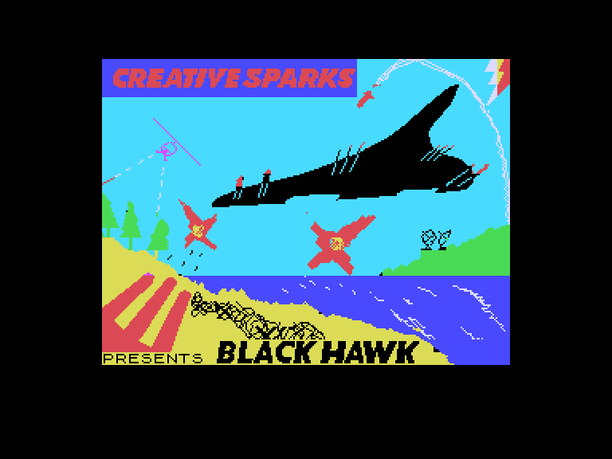
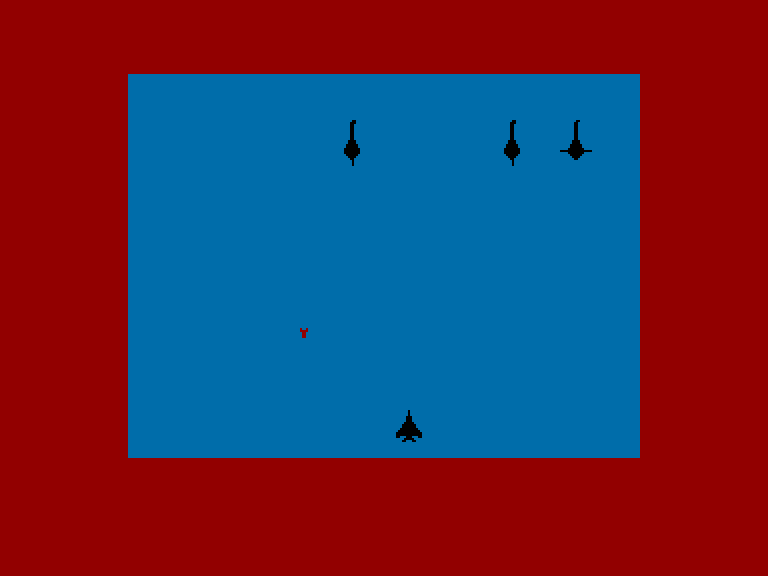
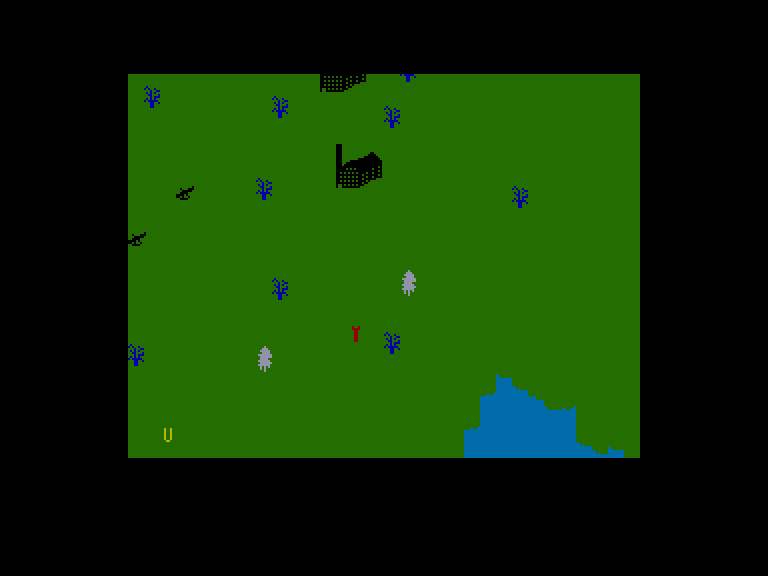
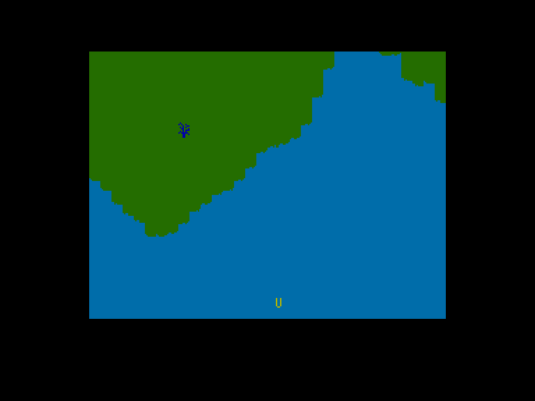

[0-9](../0/games-0.md) - [A](../a/games-a.md) - [B](../b/games-b.md) - [C](../c/games-c.md) - [D](../d/games-d.md) - [E](../e/games-e.md) - [F](../f/games-f.md) - [G](../g/games-g.md) - [H](../h/games-h.md) - [I](../i/games-i.md) - [J](../j/games-j.md) - [K](../k/games-k.md) - [L](../l/games-l.md) - [M](../m/games-m.md) - [N](../n/games-n.md) - [O](../o/games-o.md) - [P](../p/games-p.md) - [Q](../q/games-q.md) - [R](../r/games-r.md) - [S](../s/games-s.md) - [T](../t/games-t.md) - [U](../u/games-u.md) - [V](../v/games-v.md) - [W](../w/games-w.md) - [X](../x/games-x.md) - [Y](../y/games-y.md) - [Z](../z/games-z.md)

Ігри для [Enterprise 64k](../games-ep64.md) - [Enterprise 128k+RAMexp](../games-epramexp.md)

Ігри для систем [IS-DOS](../games-is-dos.md) - [SymbOS](../games-symbos.md) - [EDC Windows](../games-edcw.md)

Ігри для емуляторів [ZX Spectrum 48k/128k](../zxemu/games-zxemu.md) - [Amstrad CPC](../cpcemu/games-cpc.md) - [Sinclair ZX81](../zx81emu/games-zx81.md) - [Videoton TVC](../tvcemu/games-tvc.md) - [Commodore VIC-20](../vic20emu/games-vic20.md)

----------

# Black Hawk

**ID:** black-hawk-zx

## Примітка

ℹ Стара неофіційна конверсія з платформи ZX Spectrum.

## Скріншоти

## Опис

(temporary description generated by AI [Assistant])  

# Опис та правила гри "Black Hawk"  

"Black Hawk" - це рання гра жанру shoot-em-up, випущена компанією Creative Sparks у 1984 році для платформи Spectrum (48k). Гра має просту графіку, але пропонує цікаву механіку геймплею, що включає в себе елементи бойових дій на повітрі.  

## Мета гри  

Ваша задача полягає в тому, щоб знищити оборонні системи та військову продукцію ворога, використовуючи добре озброєний штурмовик. Ви будете наближатися до ворожої території з боку моря, а після виконання завдання - відступати назад у море. Ваше озброєння складається з ракет та кулемета, які ви можете використовувати для знищення ворожих цілей.  

## Основні елементи управління  

У меню гри ви можете налаштувати управління та вибрати рівень складності:  

- **O** (Ep-n **Q**) - Вибір управління: у 1984 році Kempston Interface ще не став домінуючим, тому ви можете вибрати будь-який джойстик або використовувати клавіатуру.  
  
- **Y** (Ep-n **T**) - Вибір рівня складності: всього два рівні складності.  

- **P** (Ep-n **U**) - Запуск гри.  

## Геймплей  

Гра має два види перегляду. На початку ви бачите радар, на якому ваш літак позначений літерою "U". У цьому режимі ви можете наводити ракети на цілі, використовуючи приціл. При натисканні кнопки вогню приціл активується, і ви можете переміщати його за допомогою стрілок. Ракета запускається через секунду після натискання кнопки.  

Коли ворожий об'єкт досягає нижньої частини екрана, гра переходить у "класичний" близький вид, де ви можете використовувати кулемет. Якщо вас влучать або ви зіткнетеся з ворогом, ваш літак буде знищено, і ви зможете спробувати знову з новим літаком.  

Ви отримуєте бали за кожного знищеного ворога та об'єкт, тому не варто економити ракети - їх кількість необмежена. Найнеприємнішими ворогами є ракети, які важко знищити, а також вертольоти та літаки, які почнуть стріляти по вам з 2-го рівня.  

## Нагороди та бонуси  

Після завершення кожного рівня ви отримуєте звіт, в якому відображається ваша ефективність та кількість життів. Залежно від вашої успішності, ви можете отримати додаткові види зброї для наступної місії:  

- **E.C.M. pod** (20%): електронний глушник, який робить ворожі радіолокаційні станції невидимими.  
  
- **XCANNON** (30%): швидкострільний кулемет для ближнього бою.  

- **BLITVIG** (40%): експериментальна зброя, що випромінює електромагнітні імпульси.  

- **WILD WASEL** (60%): робить ваш літак невразливим на 5 секунд.  

## Важливі зауваження  

Графіка гри може бути обмеженою, і на версії Spectrum літера "U" на радарі має зелений колір, що погано контрастує зі зеленим фоном. У версії Enterprise ця помилка виправлена, але там відсутні бонуси за ефективність.  

## Коди  

Для активації безсмертя використовуйте код: **POKE 34695,183**.  

Гра "Black Hawk" пропонує простий, але захоплюючий досвід, з можливістю вдосконалення вашої зброї та стратегій в залежності від успіху в боях.

## Основна інформація
- **Оригінальна платформа:** ZX Spectrum

## Посилання
- [Опис гри на ep128.hu (угорською)](http://www.ep128.hu/Games/Black_Hawk.htm)
- [Інформація про оригінальну версію](https://spectrumcomputing.co.uk/entry/549/ZX-Spectrum/Black_Hawk)
- [Завантажити гру](http://www.ep128.hu/Ep_Games/Prg/Black_Hawk.rar)

