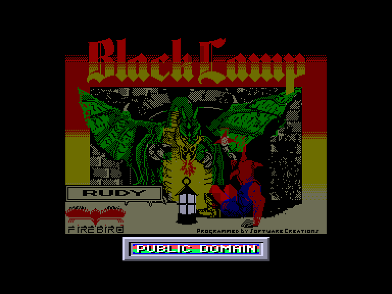
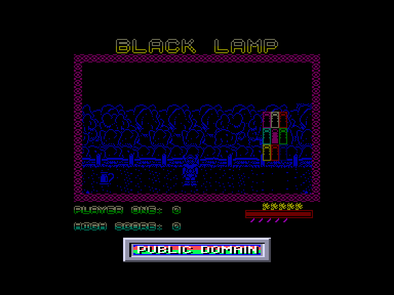
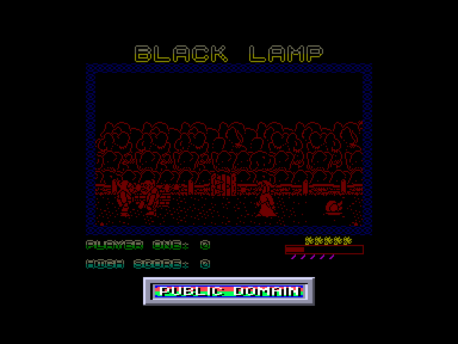
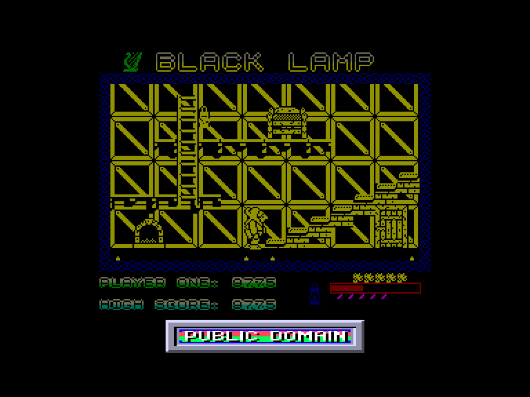

[0-9](../0/games-0.md) - [A](../a/games-a.md) - [B](../b/games-b.md) - [C](../c/games-c.md) - [D](../d/games-d.md) - [E](../e/games-e.md) - [F](../f/games-f.md) - [G](../g/games-g.md) - [H](../h/games-h.md) - [I](../i/games-i.md) - [J](../j/games-j.md) - [K](../k/games-k.md) - [L](../l/games-l.md) - [M](../m/games-m.md) - [N](../n/games-n.md) - [O](../o/games-o.md) - [P](../p/games-p.md) - [Q](../q/games-q.md) - [R](../r/games-r.md) - [S](../s/games-s.md) - [T](../t/games-t.md) - [U](../u/games-u.md) - [V](../v/games-v.md) - [W](../w/games-w.md) - [X](../x/games-x.md) - [Y](../y/games-y.md) - [Z](../z/games-z.md)

Ігри для [Enterprise 64k](../games-ep64.md) - [Enterprise 128k+RAMexp](../games-epramexp.md)

Ігри для систем [IS-DOS](../games-is-dos.md) - [SymbOS](../games-symbos.md) - [EDC Windows](../games-edcw.md)

Ігри для емуляторів [ZX Spectrum 48k/128k](../zxemu/games-zxemu.md) - [Amstrad CPC](../cpcemu/games-cpc.md) - [Sinclair ZX81](../zx81emu/games-zx81.md) - [Videoton TVC](../tvcemu/games-tvc.md) - [Commodore VIC-20](../vic20emu/games-vic20.md)

----------

# Black Lamp

**ID:** black-lamp-zx

## Примітка

ℹ Стара неофіційна конверсія з платформи ZX Spectrum.

## Скріншоти

## Опис

(temporary description generated by AI [ChatGPT])  

**Опис гри "Чорна лампа"**  

"Чорна лампа" — це захоплююча гра, випущена в 1988 році компанією Firebird для платформ Spectrum (48k) та Enterprise. Гравець бере на себе роль Джекa, придворного блазня короля Максимa, який закохався в принцесу Грізельду. Король, дізнавшись про наміри Джека, спочатку не хоче їх слухати, але врешті-решт вирішує дати йому шанс. Він пропонує Джеку звільнення з ролі блазня та руку своєї дочки в обмін на виконання небезпечного завдання.  

**Мета гри:**   

Джеку потрібно провести хрестовий похід, щоб повернути дев'ять магічних ламп, зокрема й чорну лампу, до королівства Аллегорія. На цьому шляху його чекають численні перешкоди, такі як відьми, ворони, вовки та дракони.  

**Особливості гри:**  

- Джек отримує дві магічні сили від свого друга, чарівника Пратвізла:   
  1. Відродження — можливість кілька разів повертатися до життя після смерті.  
  2. Енергетичні стріли — для ведення бою з ворогами.  

- Гравець повинен переносити лампи до відповідних ящиків, причому лише одну лампу за раз.   

- Гра має повільну анімацію, але приємну музику, яка супроводжує процес гри.  

**Правила гри:**  

1. Гравець керує Джеком, використовуючи клавіатуру для переміщення.  
2. Джек може взаємодіяти з об'єктами, збирати лампи та боротися з ворогами.  
3. Лампи потрібно переносити до спеціально позначених ящиків.  
4. Гравець має обмежену кількість життів, але може відроджуватися за допомогою магічної сили.  
5. Вороги можуть завдати шкоди Джеку, тому потрібно бути обережним під час переміщення по карті.  

**Додаткові ресурси:**  

- [Слухати музику (mp3)](../Mp3/Black_Lamp.mp3)  
- [Переглянути карту гри](pic/!Map/BlackLamp.png)  

Гра "Чорна лампа" пропонує унікальне поєднання пригод, стратегії та магії, що робить її цікавою для любителів ретро-ігор.

## Основна інформація
- **Оригінальна платформа:** ZX Spectrum

## Посилання
- [Опис гри на ep128.hu (угорською)](http://www.ep128.hu/Games/Black_Lamp.htm)
- [Інформація про оригінальну версію](https://spectrumcomputing.co.uk/entry/551/ZX-Spectrum/Black_Lamp)
- [Завантажити гру](http://www.ep128.hu/Ep_Games/Prg/Black_Lamp.rar)

