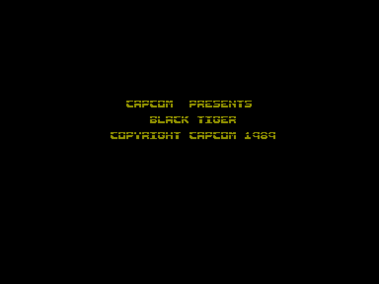
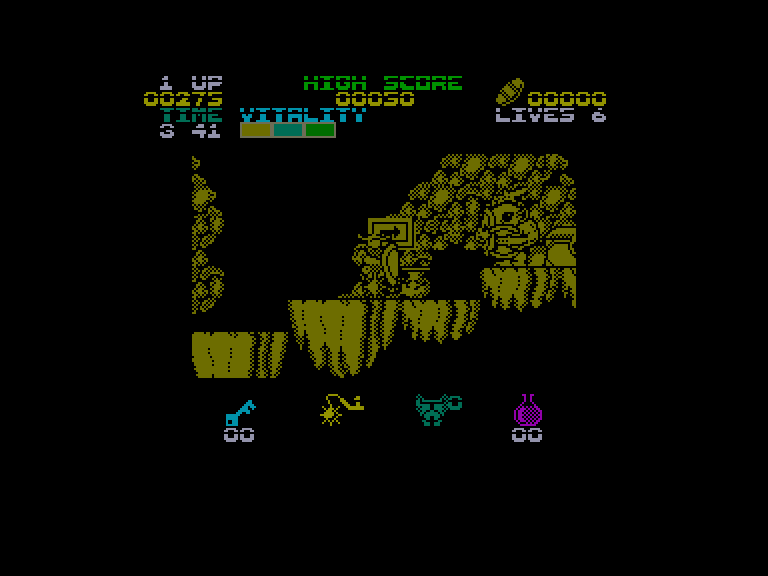
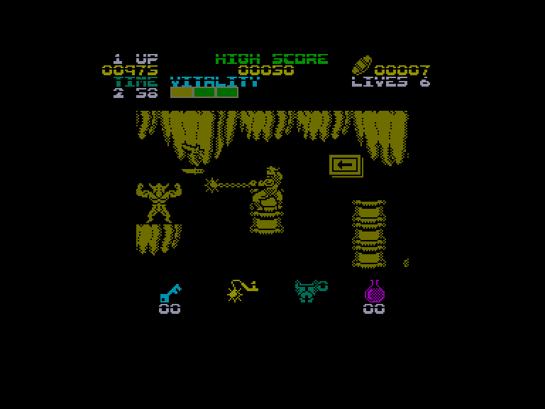
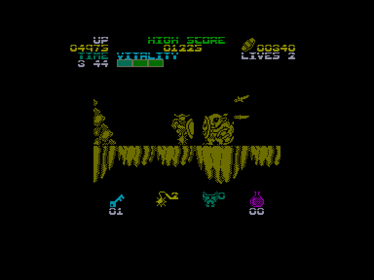

[0-9](../0/games-0.md) - [A](../a/games-a.md) - [B](../b/games-b.md) - [C](../c/games-c.md) - [D](../d/games-d.md) - [E](../e/games-e.md) - [F](../f/games-f.md) - [G](../g/games-g.md) - [H](../h/games-h.md) - [I](../i/games-i.md) - [J](../j/games-j.md) - [K](../k/games-k.md) - [L](../l/games-l.md) - [M](../m/games-m.md) - [N](../n/games-n.md) - [O](../o/games-o.md) - [P](../p/games-p.md) - [Q](../q/games-q.md) - [R](../r/games-r.md) - [S](../s/games-s.md) - [T](../t/games-t.md) - [U](../u/games-u.md) - [V](../v/games-v.md) - [W](../w/games-w.md) - [X](../x/games-x.md) - [Y](../y/games-y.md) - [Z](../z/games-z.md)

Ігри для [Enterprise 64k](../games-ep64.md) - [Enterprise 128k+RAMexp](../games-epramexp.md) - [2dfx](../games-2dfx.md)

Ігри для систем [IS-DOS](../games-is-dos.md) - [SymbOS](../games-symbos.md) - [EDC Windows](../games-edcw.md)

Ігри для емуляторів [ZX Spectrum 48k/128k](../zxemu/games-zxemu.md) - [Amstrad CPC](../cpcemu/games-cpc.md) - [Sinclair ZX81](../zx81emu/games-zx81.md) - [Videoton TVC](../tvcemu/games-tvc.md) - [Commodore VIC-20](../vic20emu/games-vic20.md)

----------

# Black Tiger

**ID:** black-tiger-zx

## Примітка

ℹ Стара неофіційна конверсія з платформи ZX Spectrum.

## Скріншоти

## Опис

(temporary description generated by AI [Assistant])  

# Опис гри: Чорний Тигр  

**Жанр:** Акція  
**Розробник:** Enterprise  
**Рік випуску:** 1989  
**Платформа:** Spectrum (128k)  

## Опис гри  

Давним-давно три злі дракони спустилися з небес і принесли темряву та руйнування в колись мирне королівство. Після багатьох років, один сміливий воїн, якого всі знають як Чорний Тигр, вирушає в подорож, щоб перемогти драконів і демонів. Гравцеві потрібно пройти п’ять рівнів складності, щоб зіткнутися з драконами та боротися з ними.  

### Геймплей  

У цій казковій грі на вас чекає безліч ворогів, які прагнуть забрати ваше життя. Навіть з-під землі можуть вистрибувати монстри, тому важливо знати рівень напам’ять! Ваш герой одягнений у важкі обладунки та озброєний, і натискаючи кнопку вогню, ви можете розмахувати величезним булавою та кидати ножі.  

Проте, ваші обладунки не надто міцні, і отримані ушкодження знижують вашу життєву силу (VITALITY). Протягом гри вам доведеться підніматися по сходах, але робити це потрібно обережно, адже під сходами можуть бути прірви, колоди або вода. Якщо ви пропустите стрибок, це може призвести до втрати життя.  

Важливо також пройти рівні в межах відведеного часу, оскільки таймер досить жорсткий. На вашому шляху ви можете знайти допомогу: розбиваючи контейнери або перемігши ворогів, ви отримаєте монети різної вартості. Ви також можете отримати бонуси у вигляді ключів або балів. У правому верхньому куті екрана ви можете бачити вміст вашого "гаманця".  

### Магазин  

Ваші гроші можна витратити у торговців, які з’являються на різних рівнях:  

- **Булава:** Купуючи «пакети» для зброї, ви можете покращити свою зброю (шкода, яку вона завдає). Зброю потрібно постійно покращувати, оскільки вороги стають сильнішими.  
  
- **Обладунки:** Купуючи «пакети» для обладунків, ви можете покращити свою броню. Ушкодження спочатку знижують вашу броню.  
  
- **Скляні банки:** Вони захищають вас від небезпечних вогняних язиків (вміст однієї банки може захистити вас від одного ушкодження).  
  
- **Ключі:** За допомогою ключів ви можете відкривати скрині з нагородами (для цього потрібно просто підійти до скрині). Ключі одноразові, тому краще купити кілька.  

### Вороги  

Серед ворогів є магічні вогняні язики, м’ясоїдні квіти, які не переміщуються, але можуть завдати шкоди, якщо ви не знаєте, де вони перебувають. Gobblins не є небезпечними, якщо ви не підпустите їх до себе. Швидкі птахи можуть бути дуже дратівливими. Наприкінці перших двох рівнів ви зіткнетеся з кам’яними головами, які стрибають, але їх можна уникнути, якщо ви будете правильно позиціонуватися. Вогняні демони стоять на місці і кидають вогняні кулі, якщо ви підходите занадто близько. Обертові черепи не можуть бути знищені, їх потрібно уникати!  

Наприкінці кожного рівня вам доведеться битися з більш потужними ворогами. Наприкінці останнього рівня ви зустрінете золотого дракона, де одна життя може бути недостатньо для перемоги у фінальному бою.  

### Управління  

Гра підтримує управління через KEMPSTON, SINCLAIR джойстики або клавіатуру. Клавіатуру можна налаштувати на свій смак.  

### Код на безсмертя  

Введіть: POKE 46065,0  

[Карта гри](pic/!Map/Black_Tiger.png)  

---  

Гра "Чорний Тигр" може бути не такою привабливою в графічному плані на платформі Spectrum, але для шанувальників аркадних ігор, таких як Rastan, вона обов’язково принесе задоволення!

## Основна інформація
- **Оригінальна платформа:** ZX Spectrum

## Посилання
- [Опис на ep128.hu (угорською)](http://www.ep128.hu/Games/Black_Tiger.htm)
- [Інформація про оригінальну версію](https://spectrumcomputing.co.uk/entry/9310/ZX-Spectrum/Black_Tiger)
- [Завантажити](http://www.ep128.hu/Ep_Games/Prg/Black_Tiger.rar)

