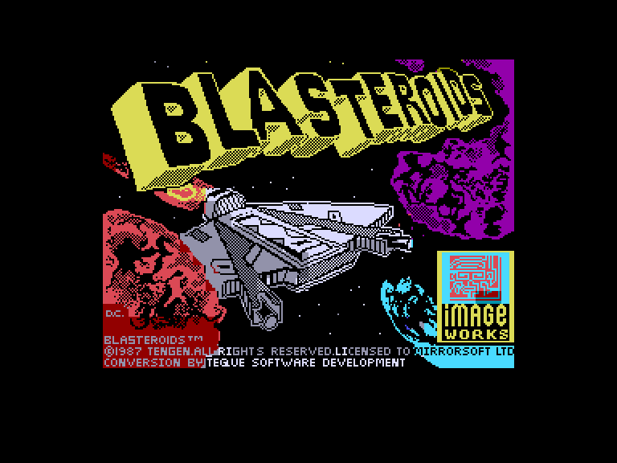
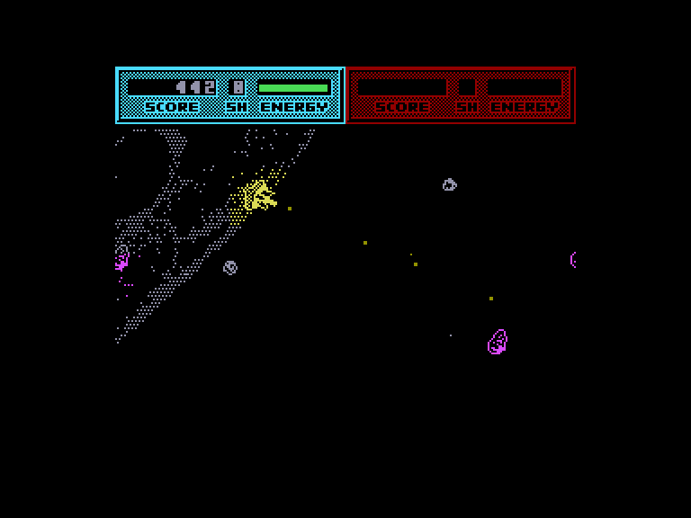
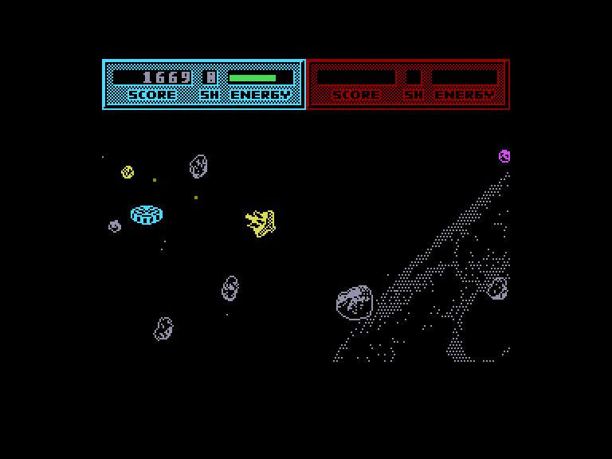
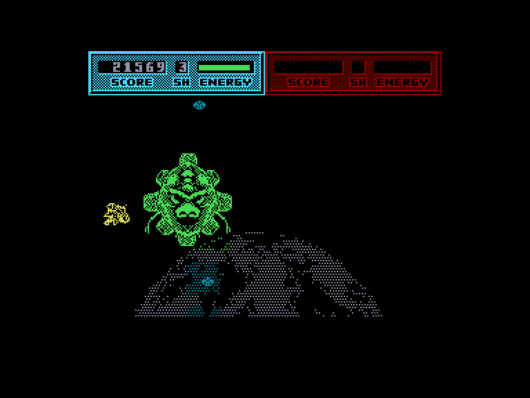

[0-9](../0/games-0.md) - [A](../a/games-a.md) - [B](../b/games-b.md) - [C](../c/games-c.md) - [D](../d/games-d.md) - [E](../e/games-e.md) - [F](../f/games-f.md) - [G](../g/games-g.md) - [H](../h/games-h.md) - [I](../i/games-i.md) - [J](../j/games-j.md) - [K](../k/games-k.md) - [L](../l/games-l.md) - [M](../m/games-m.md) - [N](../n/games-n.md) - [O](../o/games-o.md) - [P](../p/games-p.md) - [Q](../q/games-q.md) - [R](../r/games-r.md) - [S](../s/games-s.md) - [T](../t/games-t.md) - [U](../u/games-u.md) - [V](../v/games-v.md) - [W](../w/games-w.md) - [X](../x/games-x.md) - [Y](../y/games-y.md) - [Z](../z/games-z.md)

Ігри для [Enterprise 64k](../games-ep64.md) - [Enterprise 128k+RAMexp](../games-epramexp.md)

Ігри для систем [IS-DOS](../games-is-dos.md) - [SymbOS](../games-symbos.md) - [EDC Windows](../games-edcw.md)

Ігри для емуляторів [ZX Spectrum 48k/128k](../zxemu/games-zxemu.md) - [Amstrad CPC](../cpcemu/games-cpc.md) - [Sinclair ZX81](../zx81emu/games-zx81.md) - [Videoton TVC](../tvcemu/games-tvc.md) - [Commodore VIC-20](../vic20emu/games-vic20.md)

----------

# Blasteroids

**ID:** blasteroids-zx

## Примітка

ℹ Стара неофіційна конверсія з платформи ZX Spectrum.

## Скріншоти

## Опис

(temporary description generated by AI [ChatGPT])  

**Опис гри: Blasteroids**  

Blasteroids — це захоплююча аркадна гра, розроблена компанією Image Works у 1987 році. Гра перенесе вас у 2373 рік, коли людство вже освоїло Сонячну систему і веде боротьбу з таємничими істотами з планети Плутон. Ви граєте за співробітника Земної метеоритної очищувальної компанії, ваше завдання полягає в знищенні небезпечних метеоритів, які наближаються до Землі, перетворюючи їх на дрібні частинки, що не загрожують безпеці планети. Після очищення всіх секторів вам потрібно буде перемогти злого лідера Муркота.  

**Правила гри:**  

1. **Вибір управління:** Після завантаження гри необхідно вибрати зручну для вас систему управління. Зверніть увагу, що змінити управління пізніше не вдасться.  

2. **Початок гри:** Натисніть клавішу SPACE, щоб почати гру на першому рівні складності.  

3. **Інтерфейс:** У верхній частині екрану відображається ваш рахунок, сила щита та кількість енергії.  

4. **Управління:**   
   - Уперед: прискорення  
   - Праворуч: поворот праворуч  
   - Ліворуч: поворот ліворуч  
   - Низ: зміна розміру  

5. **Розміри корабля:**  
   - **WARRIOR:** найбільший корабель з сильним щитом, але повільний.  
   - **FIGHTER:** середній корабель з потужнішим озброєнням.  
   - **SPEEDER:** найменший корабель з слабким щитом, але дуже швидкий.  

6. **Збирання бонусів:** Після знищення астероїдів та ворогів на полі залишаються ліхтарі, які підвищують вашу енергію, зміцнюють щит або покращують вогневу потужність.  

7. **Часові обмеження:** Бонуси мають обмежений час дії, тому їх потрібно використовувати стратегічно.  

8. **Очистка секторів:** Після повного очищення сектора гра повідомить вам, скільки секторів залишилося на даному рівні, або попередить про появу головного ворога.  

9. **Битва з ворогом:** Головного ворога можна знищити, вразивши його в уразливі місця.  

10. **Збирання бонусів після перемоги:** Після перемоги над ворогом не забудьте зібрати всі бонуси, адже гра швидко переходить до наступного рівня складності.  

Blasteroids — це весела гра, яка забезпечить вам години розваг і викликів у боротьбі з космічними небезпеками!

## Основна інформація
- **Оригінальна платформа:** ZX Spectrum

## Посилання
- [Опис гри на ep128.hu (угорською)](http://www.ep128.hu/Games/Blasteroids.htm)
- [Інформація про оригінальну версію](https://spectrumcomputing.co.uk/entry/563/ZX-Spectrum/Blasteroids)
- [Завантажити гру](http://www.ep128.hu/Ep_Games/Prg/Blasteroids.rar)

