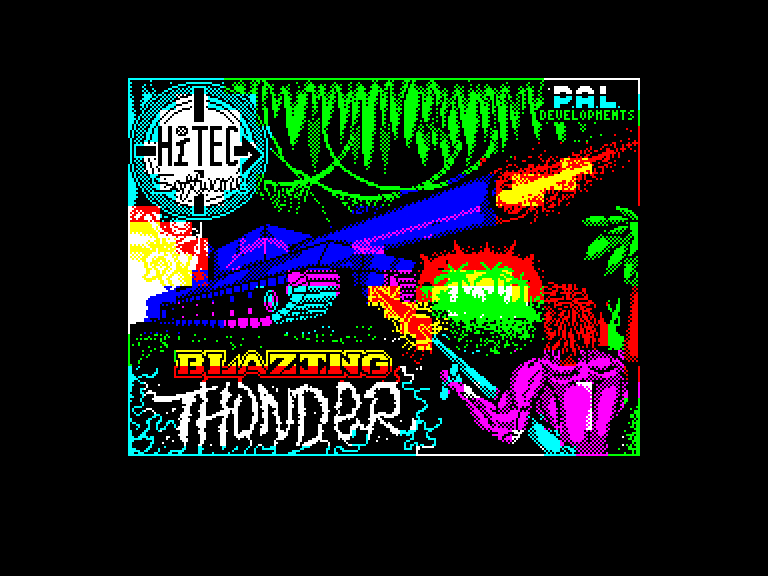
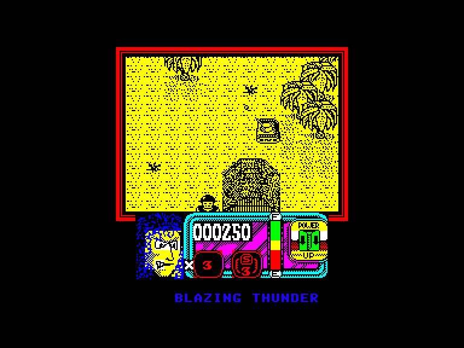
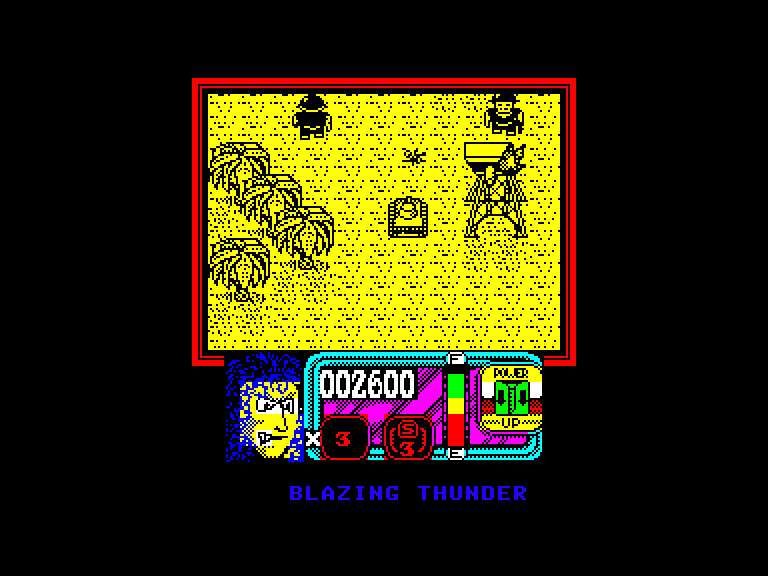
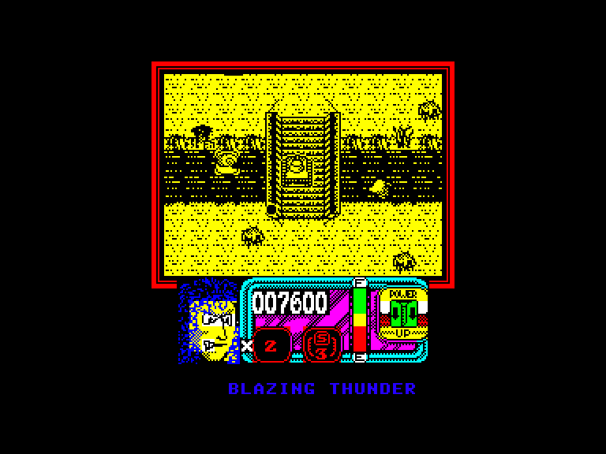

[0-9](../0/games-0.md) - [A](../a/games-a.md) - [B](../b/games-b.md) - [C](../c/games-c.md) - [D](../d/games-d.md) - [E](../e/games-e.md) - [F](../f/games-f.md) - [G](../g/games-g.md) - [H](../h/games-h.md) - [I](../i/games-i.md) - [J](../j/games-j.md) - [K](../k/games-k.md) - [L](../l/games-l.md) - [M](../m/games-m.md) - [N](../n/games-n.md) - [O](../o/games-o.md) - [P](../p/games-p.md) - [Q](../q/games-q.md) - [R](../r/games-r.md) - [S](../s/games-s.md) - [T](../t/games-t.md) - [U](../u/games-u.md) - [V](../v/games-v.md) - [W](../w/games-w.md) - [X](../x/games-x.md) - [Y](../y/games-y.md) - [Z](../z/games-z.md)

Ігри для [Enterprise 64k](../games-ep64.md) - [Enterprise 128k+RAMexp](../games-epramexp.md)

Ігри для систем [IS-DOS](../games-is-dos.md) - [SymbOS](../games-symbos.md) - [EDC Windows](../games-edcw.md)

Ігри для емуляторів [ZX Spectrum 48k/128k](../zxemu/games-zxemu.md) - [Amstrad CPC](../cpcemu/games-cpc.md) - [Sinclair ZX81](../zx81emu/games-zx81.md) - [Videoton TVC](../tvcemu/games-tvc.md) - [Commodore VIC-20](../vic20emu/games-vic20.md)

----------

# Blazing Thunder

**ID:** blazing-thunder-zx

## Примітка

ℹ Стара неофіційна конверсія з платформи ZX Spectrum.

## Скріншоти

## Опис

(temporary description generated by AI [your name])  

**Опис гри: Blazing Thunder**  

**Blazing Thunder** - це захоплююча аркадна гра, розроблена компанією Hi-Tec Software Ltd. у 1990 році для платформи Spectrum (48k). У грі ви берете на себе управління танком, з яким потрібно подолати численні ворогів, проходячи через п'ять різних рівнів складності. Гра слідує традиціям знаменитої гри **Commando**, але з новим поворотом - ви керуєте танком, а не солдатом.  

**Основні правила гри:**  

1. **Управління:**   
   - Гравець керує танком, який постійно рухається вперед, і може стріляти, щоб знищити ворогів.  
   - Гравець може також рухатися назад, що може бути корисно для уникнення пасток або повернення в безпечні зони.  

2. **Вороги:**  
   - Вороги з'являються з верхньої частини екрану, і їх кількість постійно зростає.   
   - Кожен ворог вимагає певної кількості влучень, щоб бути знищеним.  
   - Деякі вороги можуть завдавати більше шкоди, ніж інші.  

3. **Енергія та життя:**  
   - Танки мають обмежену кількість енергії, яка зменшується при отриманні ударів або зіткненнях.  
   - Якщо енергія досягає нуля, гравець втрачає одне життя.  
   - Влучення від кулеметів завдають менше шкоди, ніж удари від танків.  

4. **Потужності та бонуси:**  
   - На рівні можна знайти різні предмети, які допомагають у грі:  
     - **Нові види зброї:** Наприклад, вогнемети або снаряди з більшим радіусом дії.  
     - **1 UP:** Додаткове життя.  
     - **E:** Повне відновлення енергії.  
     - **B:** Бомба, яка знищує всіх ворогів на екрані.  
     - **P:** Бонусні очки.  

5. **Графіка та інтерфейс:**  
   - На екрані гри праворуч відображається іконка активної зброї, а також індикатор енергії, кількість бомб та життя.  
   - Гравець може використовувати джойстик Kempston, Sinclair або клавіатуру для управління.  

6. **Чит-коди:**  
   - Для отримання безсмертя: POKE 33350,0  
   - Для отримання безмежної бомби: POKE 34835,0  
   - Для безкоштовної енергії: POKE 34780,0; POKE 34810,0; 35630,0  

**Загальні зауваження:**  
Blazing Thunder - це динамічна гра, яка вимагає швидкої реакції та стратегічного мислення. Хоча гра може бути складною, вона пропонує захоплюючий ігровий процес, який залишить вас у напрузі.  

(temporary description generated by AI [your name])

## Основна інформація
- **Оригінальна платформа:** ZX Spectrum

## Посилання
- [Опис гри на ep128.hu (угорською)](http://www.ep128.hu/Games/Blazing_Thunder.htm)
- [Інформація про оригінальну версію](https://spectrumcomputing.co.uk/entry/564/ZX-Spectrum/Blazing_Thunder)
- [Завантажити гру](http://www.ep128.hu/Ep_Games/Prg/Blazing_Thunder.rar)

