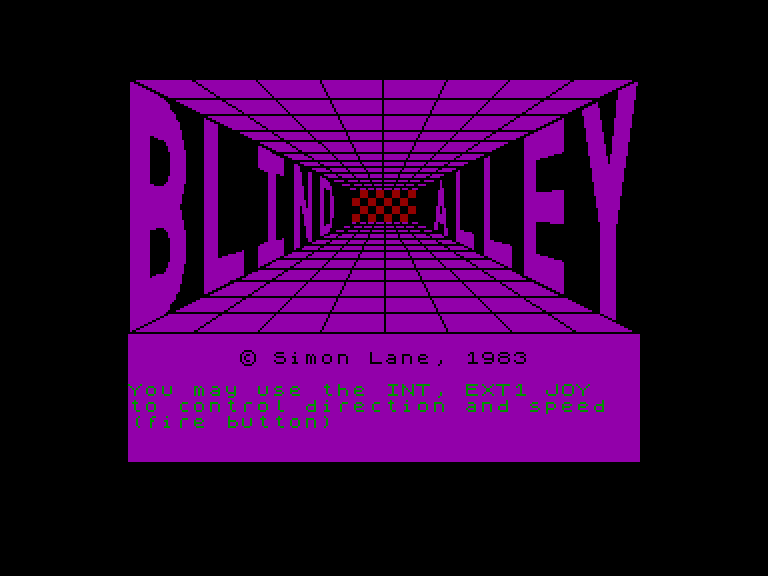
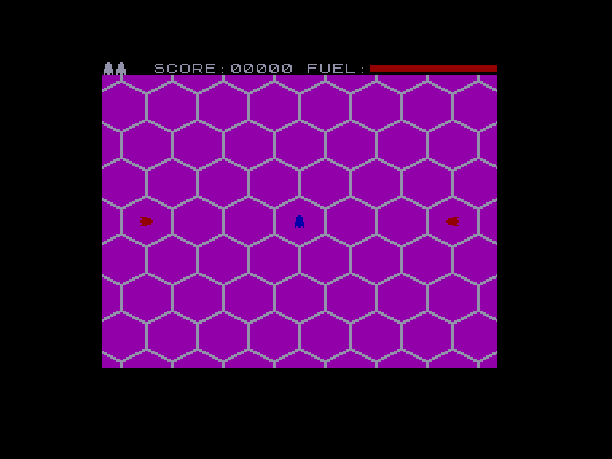
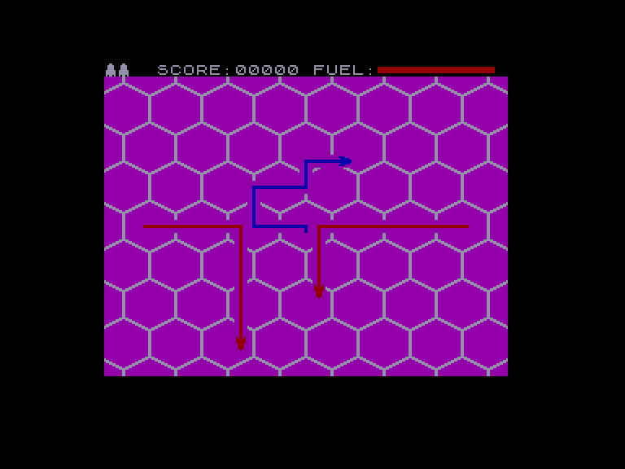
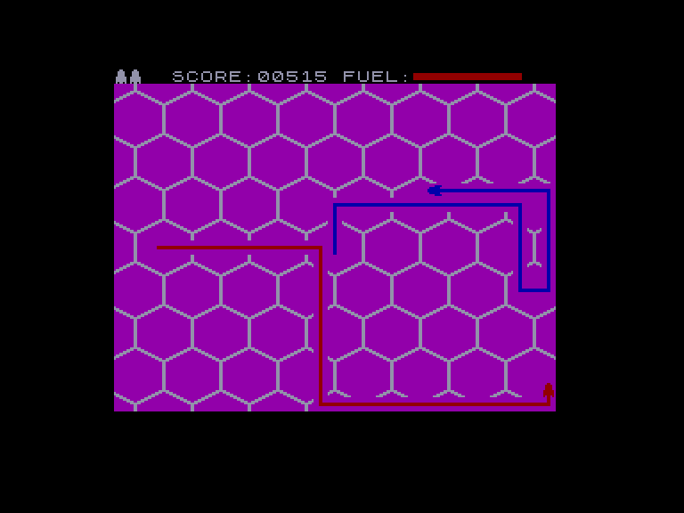

[0-9](../0/games-0.md) - [A](../a/games-a.md) - [B](../b/games-b.md) - [C](../c/games-c.md) - [D](../d/games-d.md) - [E](../e/games-e.md) - [F](../f/games-f.md) - [G](../g/games-g.md) - [H](../h/games-h.md) - [I](../i/games-i.md) - [J](../j/games-j.md) - [K](../k/games-k.md) - [L](../l/games-l.md) - [M](../m/games-m.md) - [N](../n/games-n.md) - [O](../o/games-o.md) - [P](../p/games-p.md) - [Q](../q/games-q.md) - [R](../r/games-r.md) - [S](../s/games-s.md) - [T](../t/games-t.md) - [U](../u/games-u.md) - [V](../v/games-v.md) - [W](../w/games-w.md) - [X](../x/games-x.md) - [Y](../y/games-y.md) - [Z](../z/games-z.md)

Ігри для [Enterprise 64k](../games-ep64.md) - [Enterprise 128k+RAMexp](../games-epramexp.md)

Ігри для систем [IS-DOS](../games-is-dos.md) - [SymbOS](../games-symbos.md) - [EDC Windows](../games-edcw.md)

Ігри для емуляторів [ZX Spectrum 48k/128k](../zxemu/games-zxemu.md) - [Amstrad CPC](../cpcemu/games-cpc.md) - [Sinclair ZX81](../zx81emu/games-zx81.md) - [Videoton TVC](../tvcemu/games-tvc.md) - [Commodore VIC-20](../vic20emu/games-vic20.md)

----------

# Blind Alley

**ID:** blind-alley-zx

## Примітка

ℹ Стара неофіційна конверсія з платформи ZX Spectrum.

## Скріншоти

## Опис

(temporary description generated by AI [Assistant])  

**Опис гри: Blind Alley**  

**Blind Alley** - це аркадна гра, яка була випущена у 1983 році компанією Sunshine Books для платформи Spectrum (16k). Гравці беруть участь у захоплюючих гонках, де вони керують транспортними засобами, що залишають за собою слід, подібно до гри "Трон".  

**Мета гри:**  
Ваша мета - стати останнім гравцем, який залишився в грі. Ви повинні уникати зіткнень з власним слідом, слідом суперників або краями ігрового поля. Кожен раз, коли ви або ваш суперник стикається з перешкодою, ви вибуваєте з гри.  

**Правила гри:**  
1. **Керування:**   
   - Ви можете обрати між управлінням за допомогою джойстика Kempston або клавіатури.  
   - Для вибору типу управління натисніть 1 для джойстика або 2 для клавіатури на екрані входу.  
   
2. **Управління клавішами (для клавіатури):**  
   - **Вліво:** CAPS SHIFT, Z  
   - **Вправо:** X, C, V  
   - **Вниз:** B, N, M, SYMBOL SHIFT, SPACE  
   - **Вгору:** H, J, K, L, ENTER  
   - **Прискорення:** Y, U, I, O, P  
   - **Початок гри:** S  
   - **Пауза:** A  

3. **Гра складається з декількох рівнів:**  
   - Спочатку ви змагаєтеся з двома, чотирма, а потім шістьма суперниками.  
   - З кожним новим рівнем темп гри зростає, що ускладнює завдання.  

4. **Управління паливом:**  
   - Ви повинні стежити за рівнем пального. Якщо ви утримуєте кнопку прискорення, ви будете рухатися швидше, але ваше паливо буде витрачатися швидше.  
   - За кожного вибулого суперника ви отримуєте очки, а також бонусні очки в залежності від залишку пального після перемоги в гонці.  

5. **Життя та бали:**  
   - У вас є три життя, і ви повинні виграти якомога більше гонок.  
   - За кожні 2000 очок ви отримуєте додаткове життя.  

6. **Початок гри:**  
   - Після вибору управління, ви можете прочитати короткі інструкції, але їх не обов'язково завершувати. Гру можна почати в будь-який момент, натиснувши 'S'.  

7. **Код для вічного життя:**   
   - POKE 25284,0  

Гра Blind Alley пропонує захоплюючий і динамічний ігровий процес, який сподобається шанувальникам аркадних ігор та гонок. Насолоджуйтеся грою та намагайтеся стати останнім, хто залишився на полі!  

(temporary description generated by AI [Assistant])

## Основна інформація
- **Оригінальна платформа:** ZX Spectrum

## Посилання
- [Опис гри на ep128.hu (угорською)](http://www.ep128.hu/Games/Blind_Alley.htm)
- [Інформація про оригінальну версію](https://spectrumcomputing.co.uk/entry/566/ZX-Spectrum/Blind_Alley)
- [Завантажити гру](http://www.ep128.hu/Ep_Games/Prg/Blind_Alley.rar)

