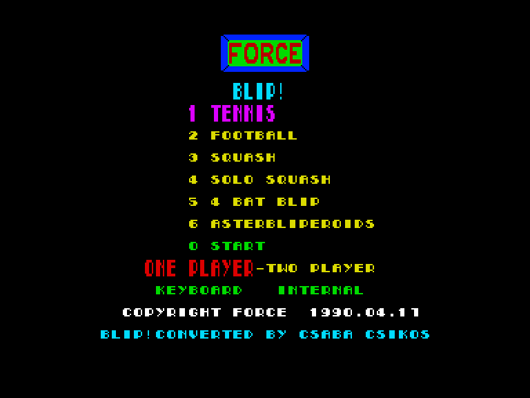
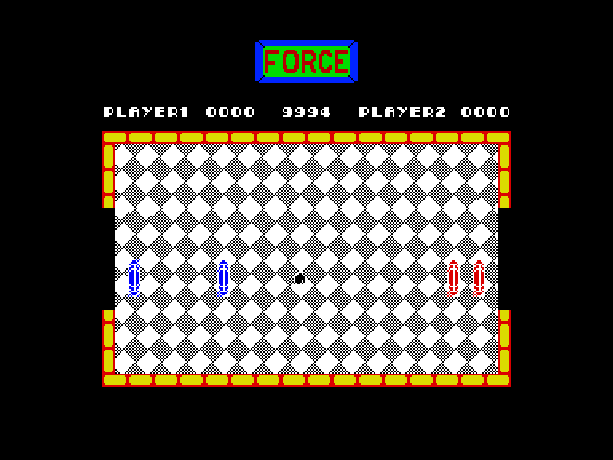
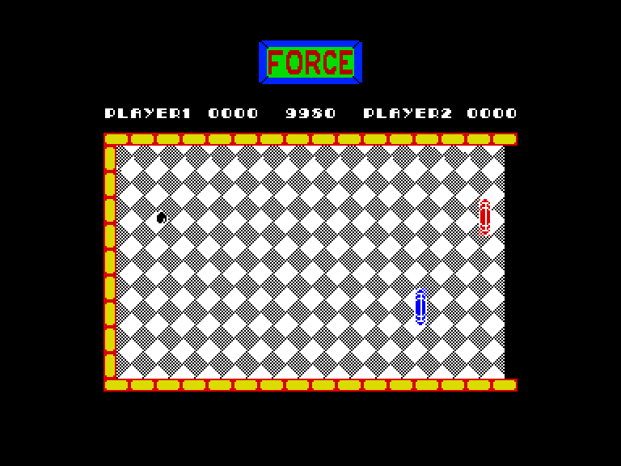
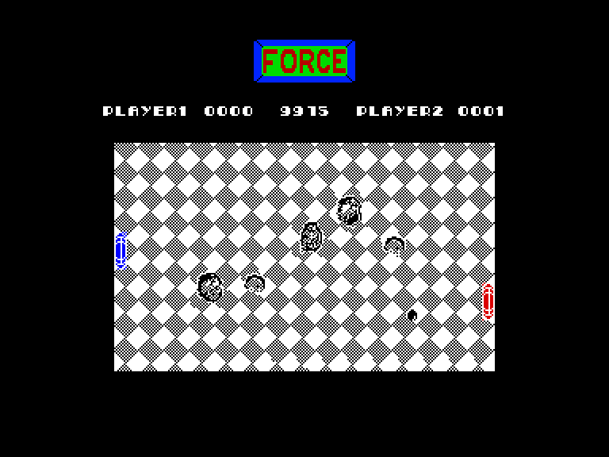

[0-9](../0/games-0.md) - [A](../a/games-a.md) - [B](../b/games-b.md) - [C](../c/games-c.md) - [D](../d/games-d.md) - [E](../e/games-e.md) - [F](../f/games-f.md) - [G](../g/games-g.md) - [H](../h/games-h.md) - [I](../i/games-i.md) - [J](../j/games-j.md) - [K](../k/games-k.md) - [L](../l/games-l.md) - [M](../m/games-m.md) - [N](../n/games-n.md) - [O](../o/games-o.md) - [P](../p/games-p.md) - [Q](../q/games-q.md) - [R](../r/games-r.md) - [S](../s/games-s.md) - [T](../t/games-t.md) - [U](../u/games-u.md) - [V](../v/games-v.md) - [W](../w/games-w.md) - [X](../x/games-x.md) - [Y](../y/games-y.md) - [Z](../z/games-z.md)

Ігри для [Enterprise 64k](../games-ep64.md) - [Enterprise 128k+RAMexp](../games-epramexp.md)

Ігри для систем [IS-DOS](../games-is-dos.md) - [SymbOS](../games-symbos.md) - [EDC Windows](../games-edcw.md)

Ігри для емуляторів [ZX Spectrum 48k/128k](../zxemu/games-zxemu.md) - [Amstrad CPC](../cpcemu/games-cpc.md) - [Sinclair ZX81](../zx81emu/games-zx81.md) - [Videoton TVC](../tvcemu/games-tvc.md) - [Commodore VIC-20](../vic20emu/games-vic20.md)

----------

# Blip!

**ID:** blip-zx

## Примітка

ℹ Стара неофіційна конверсія з платформи ZX Spectrum.

## Скріншоти

## Опис

(temporary description generated by AI [your name])  

**Опис гри: Blip!**  

Blip! - це захоплююча гра, яка представляє собою варіацію на тему настільного тенісу. У цій грі ви маєте можливість змагатися з комп'ютером або з другом у шести різних спортивних режимах. Гра була випущена у 1989 році компанією Silverbird Software для платформ Spectrum (48k) та Enterprise.  

**Правила гри:**  

1. **Вибір спортивного режиму**:   
   Ви можете вибрати один з шести режимів гри, натискаючи клавіші від 1 до 6 на клавіатурі:  

   - **ТЕНІС**: Два гравці (ракетки) обмінюються м'ячем, який відскакує від бічних стін. Якщо м'яч вилітає за спину одного з гравців, він програє очко. Гравці можуть рухатися не тільки вздовж базової лінії, а й на половину поля.  

   - **ФУТБОЛ**: Два "команди" складаються з гравця і воротаря. М'яч може виходити тільки через ворота. Гравець може рухати свою ракетку вгору і вниз, тоді як воротар рухається лише вздовж базової лінії.  

   - **СКВОш**: Дві ракетки знаходяться з одного боку, і гравці по черзі намагаються вдарити м'яч у стіну. Тільки той, хто має чергу, може торкатися м'яча.  

   - **СОЛО КВАШ**: Це аналог попереднього режиму, але ви граєте наодинці. Мета цього режиму ще досліджується.  

   - **ДВОЙНИЙ ТЕНІС**: На полі чотири ракетки: дві для кожної команди (одна вертикальна, одна горизонтальна). Немає стін, тому м'яч може виходити за межі ігрового поля.  

   - **АСТЕРБЛІПЕРОЇДИ**: Схоже на теніс, але на полі літають астероїди, від яких м'яч може відскакувати.  

2. **Налаштування гри**:   
   Після вибору режиму гри, натисніть клавішу '7', щоб вибрати, чи грає один або два гравці. Клавіша '8' дозволяє налаштувати управління для поточного гравця. Доступні варіанти управління включають:  
   - Spectrum: Sinclair, Kempston, клавіатура (Q, A, O, P, M)  
   - Enterprise: вбудований джойстик (ALT - кнопка вогню), EXTERNAL II, клавіатура (Q, A, O, P, M)  

3. **Початок гри**:   
   Натисніть '0', щоб розпочати гру. Під час гри ви можете призупинити гру натисканням ENTER, а для виходу з гри - натисніть SPACE. М'яч запускається натисканням кнопки вогню, навіть якщо м'яч запускає суперник.  

4. **Система рахунку**:   
   У верхній частині екрану відображаються бали гравців, а в центрі - залишок часу гри. Гра триває лише чистий ігровий час, без затримок.  

Гра Blip! обіцяє бути веселою, особливо у режимі з двома гравцями, адже грати проти комп'ютера може бути досить нудно.   

Спробуйте свої сили в цій захоплюючій грі та насолоджуйтесь змаганнями!

## Основна інформація
- **Оригінальна платформа:** ZX Spectrum

## Посилання
- [Опис гри на ep128.hu (угорською)](http://www.ep128.hu/Games/Blip!.htm)
- [Інформація про оригінальну версію](https://spectrumcomputing.co.uk/entry/11434/ZX-Spectrum/Video_Classics)
- [Завантажити гру](http://www.ep128.hu/Ep_Games/Prg/Blip!.rar)

