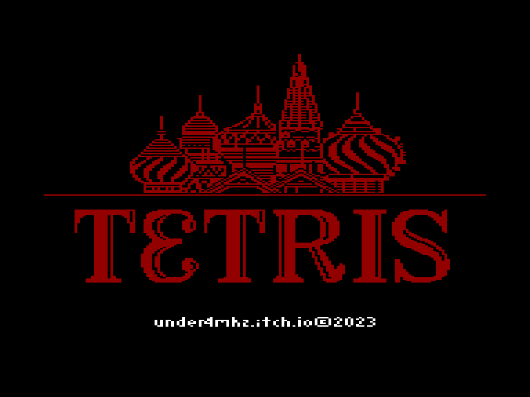
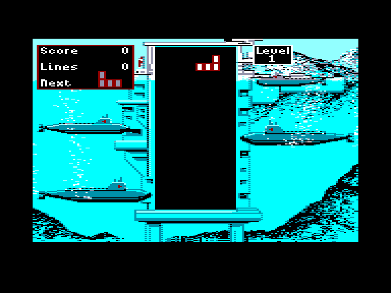
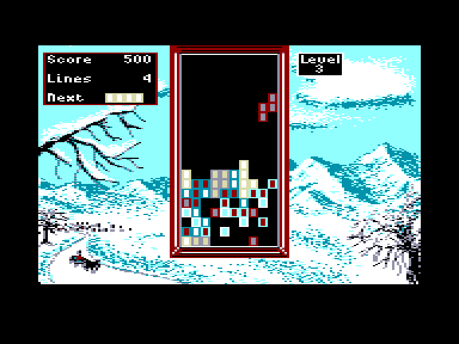
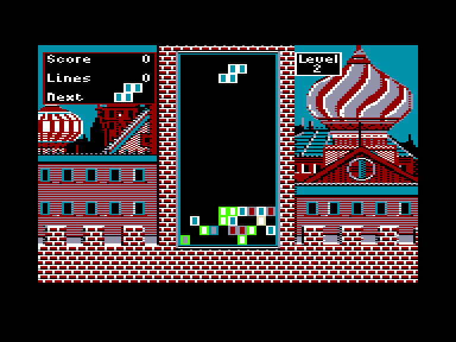

[0-9](../0/games-0.md) - [A](../a/games-a.md) - [B](../b/games-b.md) - [C](../c/games-c.md) - [D](../d/games-d.md) - [E](../e/games-e.md) - [F](../f/games-f.md) - [G](../g/games-g.md) - [H](../h/games-h.md) - [I](../i/games-i.md) - [J](../j/games-j.md) - [K](../k/games-k.md) - [L](../l/games-l.md) - [M](../m/games-m.md) - [N](../n/games-n.md) - [O](../o/games-o.md) - [P](../p/games-p.md) - [Q](../q/games-q.md) - [R](../r/games-r.md) - [S](../s/games-s.md) - [T](../t/games-t.md) - [U](../u/games-u.md) - [V](../v/games-v.md) - [W](../w/games-w.md) - [X](../x/games-x.md) - [Y](../y/games-y.md) - [Z](../z/games-z.md)

Ігри для [Enterprise 64k](../games-ep64.md) - [Enterprise 128k+RAMexp](../games-epramexp.md)

Ігри для систем [IS-DOS](../games-is-dos.md) - [SymbOS](../games-symbos.md) - [EDC Windows](../games-edcw.md)

Ігри для емуляторів [ZX Spectrum 48k/128k](../zxemu/games-zxemu.md) - [Amstrad CPC](../cpcemu/games-cpc.md) - [Sinclair ZX81](../zx81emu/games-zx81.md) - [Videoton TVC](../tvcemu/games-tvc.md) - [Commodore VIC-20](../vic20emu/games-vic20.md)

----------

# Bloktris

**ID:** bloktris

## Примітка

ℹ Хоумбрю-гра.

## Скріншоти

## Опис

(temporary description generated by AI [Assistant])  

# Опис та правила гри "Bloktris"  

"Bloktris" — це гра, що намагається відтворити оригінальний "Tetris" 1987 року, розроблений компанією Andromeda Software. Гра має просту графіку, яка нагадує версію 1987 року, але з деякими компромісами через мультиплатформену розробку. У грі немає великих чудес, але вона все ще може бути цікавою для шанувальників класики.  

## Графіка та рівні  
У оригінальній версії "Tetris" 1987 року було дев'ять зображень, по одному для кожного рівня складності. У "Bloktris" є лише три зображення (версія для Sinclair 128K має чотири), і гра не змінює зображення при переході на новий рівень — при старті гри одне зображення вибирається випадковим чином. У версії для Spectrum одна зі сторін зображення обрізана, і є окремі версії для 48K та 128K.  

## Особливості гри  
- **М'яке падіння (soft drop)**: Фігура падає швидше, поки ви тримаєте натиснутою клавішу, що не було в оригінальній грі 1987 року.  
- **Вибір рівня складності**: Перед початком гри ви можете вибрати початковий рівень складності (LEVEL) і запитати випадкові заповнені рядки (HEIGHT).  
- **Музика**: У версії для Sinclair 128K та Enterprise є фоновий звук, який не можна вимкнути.  

## Управління  
- **Для Spectrum**:  
  - Використовуйте джойстик Sinclair або клавіатуру:  
    - O, I — вліво  
    - P, L — вправо  
    - Q, I — вгору  
    - A, K — вниз  
    - SPACE, Z або M — вогонь (обертання фігури).  
  - Кнопка "вниз" виконує м'яке падіння, а кнопка "вгору" скидає фігуру вниз.  

- **Для Enterprise**:  
  - Використовуйте вбудований або зовнішній джойстик або клавіатуру:  
    - O, I — вліво  
    - P, L — вправо  
    - Q, I — вгору  
    - A, K — вниз  
    - SPACE, Z або M — вогонь (обертання фігури).  

Запобігайте натисканню кнопки "B", оскільки це може призвести до збоїв у програмі.  

Насолоджуйтеся грою "Bloktris" та спробуйте набрати якомога більше очок!

## Основна інформація
### Загальні системні вимоги
- **Апаратні:** EP64, EP128

## Посилання
- [Домашня сторінка гри](https://under4mhz.itch.io/bloktris)
- [Опис гри на ep128.hu (угорською)](http://www.ep128.hu/Games/Bloktris.htm)
- [Завантажити гру](http://www.ep128.hu/Ep_Games/Prg/Bloktris.rar)

## Відео

<iframe src="https://www.youtube.com/embed/xdjOF-0AMag"  
style="width:75%; aspect-ratio:16/9;" allowfullscreen></iframe>

