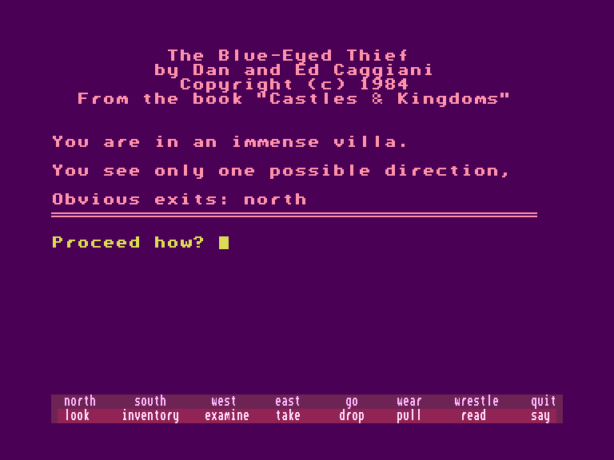
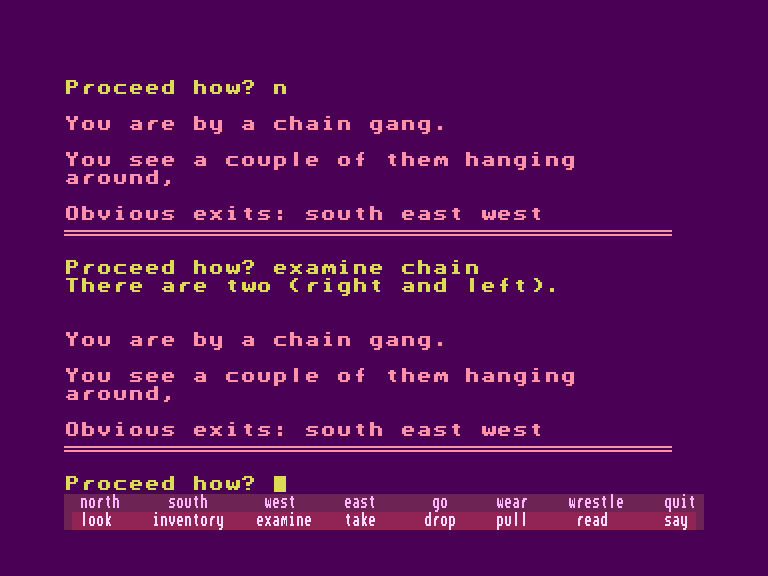

[0-9](../0/games-0.md) - [A](../a/games-a.md) - [B](../b/games-b.md) - [C](../c/games-c.md) - [D](../d/games-d.md) - [E](../e/games-e.md) - [F](../f/games-f.md) - [G](../g/games-g.md) - [H](../h/games-h.md) - [I](../i/games-i.md) - [J](../j/games-j.md) - [K](../k/games-k.md) - [L](../l/games-l.md) - [M](../m/games-m.md) - [N](../n/games-n.md) - [O](../o/games-o.md) - [P](../p/games-p.md) - [Q](../q/games-q.md) - [R](../r/games-r.md) - [S](../s/games-s.md) - [T](../t/games-t.md) - [U](../u/games-u.md) - [V](../v/games-v.md) - [W](../w/games-w.md) - [X](../x/games-x.md) - [Y](../y/games-y.md) - [Z](../z/games-z.md)

Ігри для [Enterprise 64k](../games-ep64.md) - [Enterprise 128k+RAMexp](../games-epramexp.md)

Ігри для систем [IS-DOS](../games-is-dos.md) - [SymbOS](../games-symbos.md) - [EDC Windows](../games-edcw.md)

Ігри для емуляторів [ZX Spectrum 48k/128k](../zxemu/games-zxemu.md) - [Amstrad CPC](../cpcemu/games-cpc.md) - [Sinclair ZX81](../zx81emu/games-zx81.md) - [Videoton TVC](../tvcemu/games-tvc.md) - [Commodore VIC-20](../vic20emu/games-vic20.md)

----------

# The Blue-Eyed Thief

**ID:** blueeyed-thief-bas

**Жанри:** Текстова пригода

## Примітка

ℹ Сучасна неофіційна конверсія.

## Скріншоти

## Опис

Вартові біля брами — це чоловіки-гори. На їхніх поясах висять вигнуті сталеві шаблі, і вони пильно оглядають кожного перехожого, ніби той — злодій чи жебрак (якими, звісно ж, багато хто й є). Раз у раз вони зупиняють вози й штрикають своїми тризубами у сіно. Іноді вискочить завиваючий, поранений зловмисник, якого тягнуть до королівського підземелля для знайомства з дибою та розпеченим залізом.  

А я — злодій, низькородний блукач, породжений жалюгідним союзом батька-людини та дівчини-ґрейлок, — проходжу повз вартових брами, ігноруючи їхні коментарі про блакитні очі, витаврувані на моєму обличчі. Хоча у мене немає справ у місті до зачинення брами, я йду так, ніби сам король витрачає золото біля моєї ятки на ринку. Справді, мій гаманець задзвенить до закриття брами. Корчмар на площі підтвердить мою особисту цінність. Але саме товстий купець наповнить мій шлунок вишуканим людським вином із заходу, і він не помітить нестачі монет, поки я не зникну ген-далеко.  

Я — Вахід, кишеньковий злодій, напіврослик. Жодна звичайна брама не вбереже від мене гладкі гаманці цього міста. Посмішка з'являється на моєму обличчі, коли я ступаю на ринкову площу.  

Піски пустелі суворі, але закони міста ще нещадніші. Другого сина моєї матері стратили на площі два роки тому за крадіжку гаманця якогось шляхтича. Пхе, правителі смердять! Солдати носяться туди-сюди країною, спалюючи села. Я теж нещадний. Вони вбили мою матір. Мій батько був одним із них — смердючим західним найманцем! Людські очі, які він мені дав, прирекли мене від самого народження. Я пробиваю собі шлях сам! І товсті купці платять за гріхи своїх захисників.  

Темніє. Вогні у великому будинку згасли. І я, майстер нічної ходи, безшумно крадуся в дім під покровом крил великого крука. Я знаю такі місця. Усі багатії живуть однаково — у місті за мурами, на пагорбах з видом на море. Це не має значення, бо я — майстер котячих кроків. Вони не можуть мене ані почути, ані побачити. Те, що належить їм, стає моїм, і я беру все, що можу. Трішки перекусити — мій шлунок бурчить. Беру кілька фініків, шматок хліба. Я йду.  

Сонце — мій ворог. Блакитні очі можуть зрадити мене лише при денному світлі. Вони ніби кричать моє ім'я беззвучними губами. «Це Вахід-байстрюк, — кажуть вони, — бо яка ж жінка-ґрейлок вийде за людину?» Вахід-злодій? Ні, цього вони не кажуть варті біля брами, коли я йду з гордо піднятою головою. «У мене справи в пісках, — говорить моя хода. — Не турбуйте мене!»  

— Зачекай-но, мій другу, — лунає витончений голос. — Чим я тебе образив, що ти йдеш, навіть не попрощавшись?  

Я мовчу й лише витріщаюся, а мої коліна тремтять від страху. Це господар будинку; у моїх кишенях заховане його золото та коштовності.  

— Безперечно, — продовжує він, — ти дозволиш мені спокутувати провину й запросити тебе на полуденок. Будь ласка, скажи, що я можу все залагодити.  

Він благає таким тоном, що перехожі починають звертати увагу. Мої блакитні очі починають закарбовуватися в пам'яті вартових біля брами. Скоро моє обличчя стане тим, яке всі запам'ятають.  

— Звісно, — чую я власний голос, — як нерозумно з мого боку дозволити вам жити з таким тягарем провини. Я піду з вами, щоб ми дійшли згоди й розійшлися по-дружньому.  

Я — Вахід, шановний гість у будинку. Мій господар подав найсоковитіші фініки та найвишуканіше вино. До мене ставляться з повагою, яка значно перевищує те, що можна купити за вкрадене золото. Я спостерігав, як гнучкі танцівниці, прикрашені золотими браслетами й коштовним шовком, посміхалися у своєму танку. Я розділив саме те багатство, яке зазвичай крав — безкоштовно віддане від жертви до злодія. Я — Вахід, який втратив повагу до самого себе.  

У мені немає каяття за те життя, яке я веду. І все ж я благаю про прощення й прошу, щоб був край цій незаслуженій доброті.  

— Я вкрав ці речі у вас, — чую я слова цього незнайомого Вахіда, — і мені шкода, що я це зробив. Ніколи раніше у своєму житті я не зустрічав нікого, хто б дбав не лише про себе. Але ви, я гадаю, володієте тими якостями, які я хотів би бачити в собі. Мені стало краще від зізнання, і я більше не крастиму!  

Мовивши це, я віддаю своє життя в його руки, не бажаючи більше залишатися Вахідом-злодієм. Я повертаю монети та коштовності, які він, мабуть, і так бачив, як я брав. Він від самого початку бачив мене наскрізь, просто бажаючи, щоб я зрозумів: я можу бути кращим, ніж є.  

Пройшов час. Тепер я знавець золота та коштовностей — Вахід-купець, який давно покинув свого благодійника. Я широко відомий своєю чесністю та проникливим чуттям у торгах. Усім добре відомо, що свою майстерність у дорогоцінному камінні я здобув, коли був злодієм. Але хіба не всі купці в душі злодії? Якщо вірити бідканням покупців на ринку — то так і є.  

Я — ґрейлок, це правда, хоча очі й зраджують мою людську кров. Жоден злодій не вдирається до мого дому вночі. Жоден жебрак не йде від мене з порожніми руками.  

І коли я поважно проходжу повз вартових біля брами — я Вахід! Вони знають мене! Мені немає потреби щось ховати. Коли я йду вулицями Белестріалу — мене знають. Більше не Вахід-злодій! Більше не Вахід-байстрюк! У цьому місці я — Вахід. Посмішка з'являється на моїх губах. Я — Вахід: громадянин, купець. Не товстий, зауважте. Але й цього цілком достатньо…

## Основна інформація
- **Мови:** Англійська
### Загальні системні вимоги
- **Програмні:** IS-Basic
### Геймплей
- **Керування:** Keyboard
- **Кількість гравців:** 1 player
- **Додаткові теги:** Text40 mode
### Розробка
- **Рік випуску:** 1984
- **Автор:** Dan Caggiani, Ed Caggiani

## Посилання
- [Опис гри на ep128.hu (угорською)](http://www.ep128.hu/Ep_Games/Leiras/Castles_and_Kingdoms.htm)
- [Інформація про гру (SolutionArchive.com)](https://solutionarchive.com/game/id%2C5260/Blue-Eyed+Thief.html)
- [Завантажити гру](http://www.ep128.hu/Ep_Games/Prg/Castles_and_Kingdoms.rar)

## [Керування](../controllers.md)

`Keyboard`  

`F1`-`F8`, `Shift`+`F1`-`Shift`+`F8`: швидке введення команд (підказка на стрічці знизу екрану).

