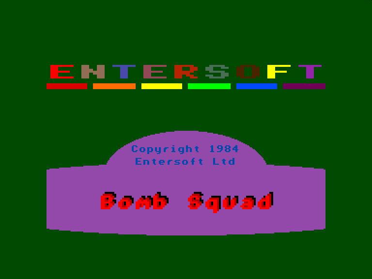
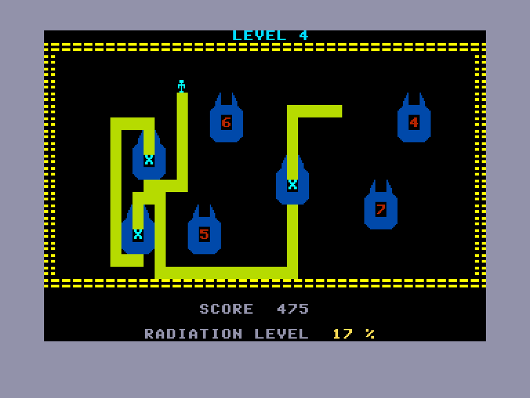
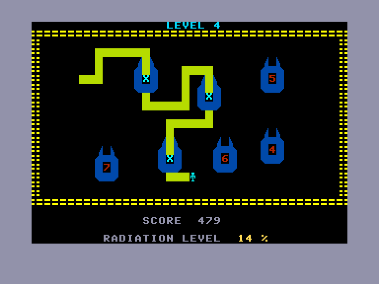
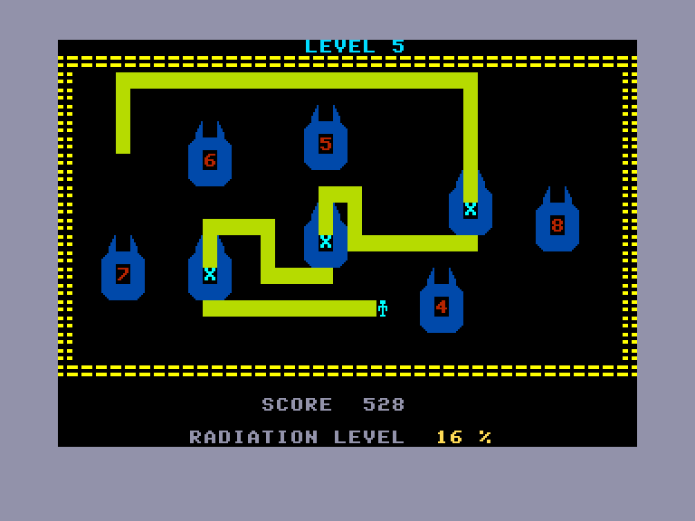

[0-9](../0/games-0.md) - [A](../a/games-a.md) - [B](../b/games-b.md) - [C](../c/games-c.md) - [D](../d/games-d.md) - [E](../e/games-e.md) - [F](../f/games-f.md) - [G](../g/games-g.md) - [H](../h/games-h.md) - [I](../i/games-i.md) - [J](../j/games-j.md) - [K](../k/games-k.md) - [L](../l/games-l.md) - [M](../m/games-m.md) - [N](../n/games-n.md) - [O](../o/games-o.md) - [P](../p/games-p.md) - [Q](../q/games-q.md) - [R](../r/games-r.md) - [S](../s/games-s.md) - [T](../t/games-t.md) - [U](../u/games-u.md) - [V](../v/games-v.md) - [W](../w/games-w.md) - [X](../x/games-x.md) - [Y](../y/games-y.md) - [Z](../z/games-z.md)

Ігри для [Enterprise 64k](../games-ep64.md) - [Enterprise 128k+RAMexp](../games-epramexp.md) - [2dfx](games-2dfx.md)

Ігри для систем [IS-DOS](../games-is-dos.md) - [SymbOS](../games-symbos.md) - [EDC Windows](../games-edcw.md)

Ігри для емуляторів [ZX Spectrum 48k/128k](../zxemu/games-zxemu.md) - [Amstrad CPC](../cpcemu/games-cpc.md) - [Sinclair ZX81](../zx81emu/games-zx81.md) - [Videoton TVC](../tvcemu/games-tvc.md) - [Commodore VIC-20](../vic20emu/games-vic20.md)

----------

# Bomb Squad

**ID:** bomb-squad-bas

**Жанри:** Логічна

## Примітка

ℹ Офіційний реліз.

## Скріншоти

## Опис

На дворі 2885 рік. Ми — члени космічної експедиції, яка висадилася на придатну для колонізації планету. Однак на цій планеті в надійних схованках лежать величезні нерозірвані ядерні бомби. Наше завдання — знешкодити ці бомби. Приміщення, у яких вони сховані, протягом століть зазнали сильного радіаційного забруднення, тому для їх знищення ми мусимо використовувати робота. Слід бути уважними: під час керування робот не повинен перетинати власний кабель, інакше його складна система керування вимкнеться. Крім того, у кімнатах розставлено пастки, тож на знешкодження відведено зовсім трохи часу — в іншому разі кімната автоматично вибухне.

## Основна інформація
- **Мови:** Англійська
- **Оригінальна платформа:** Enterprise
### Загальні системні вимоги
- **Програмні:** IS-Basic
### Геймплей
- **Керування:** Keyboard, Internal Joy, External Joy 1, External Joy 2
- **Кількість гравців:** 1 player
- **Додаткові теги:** Attribute mode, Text40 mode
### Розробка
- **Рік випуску:** 1984
- **Компанія:** Entersoft

## Посилання
- [Опис на ep128.hu (угорською)](http://www.ep128.hu/Ep_Games/Leiras/Bomb_Squad.htm)
- [Завантажити](http://www.ep128.hu/Ep_Games/Prg/Bomb_Squad.rar)

## [Керування](../controllers.md)

`Keyboard` (можливість перепризначення)  
`Internal Joystick`  
`External Joystick 1`  
`External Joystick 2`

## Детальна інформація

### Геймплей  

Бомби пронумеровані, і знешкоджувати їх можна лише суворо за порядком, починаючи з бомби № 1. Якщо порядок буде порушено, кімната вибухне. За шляхом робота слід уважно стежити, щоб уникнути перетину кабелю.