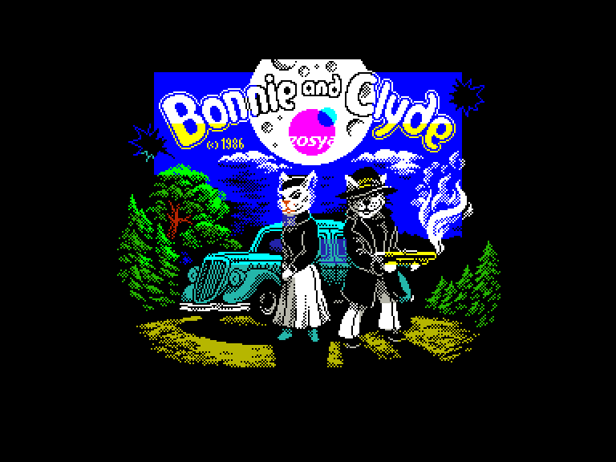
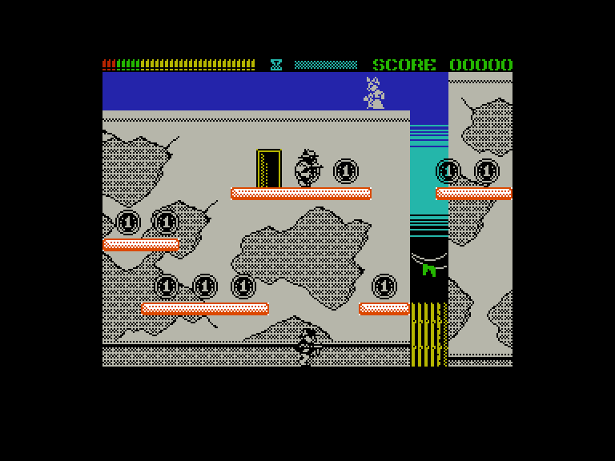
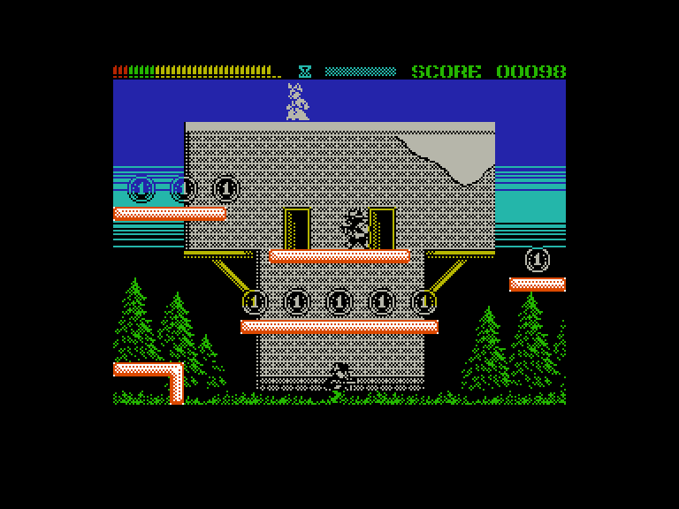
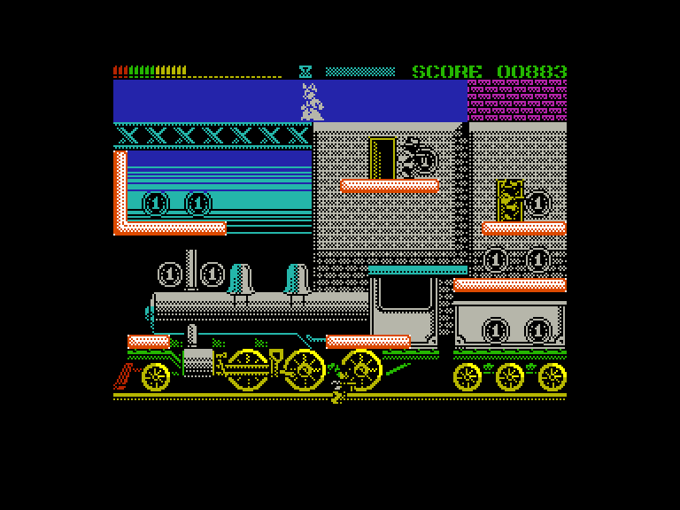

[0-9](../0/games-0.md) - [A](../a/games-a.md) - [B](../b/games-b.md) - [C](../c/games-c.md) - [D](../d/games-d.md) - [E](../e/games-e.md) - [F](../f/games-f.md) - [G](../g/games-g.md) - [H](../h/games-h.md) - [I](../i/games-i.md) - [J](../j/games-j.md) - [K](../k/games-k.md) - [L](../l/games-l.md) - [M](../m/games-m.md) - [N](../n/games-n.md) - [O](../o/games-o.md) - [P](../p/games-p.md) - [Q](../q/games-q.md) - [R](../r/games-r.md) - [S](../s/games-s.md) - [T](../t/games-t.md) - [U](../u/games-u.md) - [V](../v/games-v.md) - [W](../w/games-w.md) - [X](../x/games-x.md) - [Y](../y/games-y.md) - [Z](../z/games-z.md)

Ігри для [Enterprise 64k](../games-ep64.md) - [Enterprise 128k+RAMexp](../games-epramexp.md) - [2dfx](games-2dfx.md)

Ігри для систем [IS-DOS](../games-is-dos.md) - [SymbOS](../games-symbos.md) - [EDC Windows](../games-edcw.md)

Ігри для емуляторів [ZX Spectrum 48k/128k](../zxemu/games-zxemu.md) - [Amstrad CPC](../cpcemu/games-cpc.md) - [Sinclair ZX81](../zx81emu/games-zx81.md) - [Videoton TVC](../tvcemu/games-tvc.md) - [Commodore VIC-20](../vic20emu/games-vic20.md)

----------

# Bonnie and Clyde

**ID:** bonnie-and-clyde-zx

**Жанри:** Екшн, Платформер

## Примітка

ℹ Сучасна неофіційна конверсія з платформи ZX Spectrum.

## Скріншоти

## Опис

У грі відображено пригоди двох котиків Бонні та Клайда, які вирішили навести шороху, влаштовуючи пограбування в різних локаціях. На кожному рівні Клайд повинен зібрати всі монети, підірвати сейф і змотатися з награбованим. А напарниця Бонні всіляко йому допомагає, скидаючи різні бонуси, які спрощують боротьбу з противниками.

## Основна інформація
- **Мови:** Англійська
- **Оригінальна платформа:** ZX Spectrum
### Загальні системні вимоги
- **Апаратні:** EP128
### Геймплей
- **Керування:** Keyboard, Internal Joy, External Joy 1, External Joy 2
- **Кількість гравців:** 1 player
- **Додаткові теги:** Attribute mode, HiScore saving
### Розробка
- **Рік випуску:** 2020
- **Компанія:** Zosya Entertainment

## Посилання
- [Домашня сторінка](https://web.archive.org/web/20240719144217/https://www.zosya.net/product/bonnie-and-clyde/)
- [Домашня сторінка](http://mkzx.ru)
- [Опис на ep128.hu (угорською)](http://ep128.hu/Games/Bonnie_and_Clyde.htm)
- [Тема на форумі enterpriseforever](https://enterpriseforever.com/spectrum-rol/bonnie-clyde/)
- [Інформація про оригінальну версію](https://spectrumcomputing.co.uk/entry/35809/ZX-Spectrum/Bonnie_and_Clyde)
- [Завантажити](http://www.ep128.hu/Ep_Games/Prg/Bonnie_and_Clyde.rar)
- [Easy Load&Play](https://t.me/EP128k_Load_n_Play/93) *(Telegram-канал Vibrant Waves)*

## Відео

<iframe src="https://www.youtube.com/embed/n_XpOLS7YUc"  
style="width:75%; aspect-ratio:16/9;" allowfullscreen></iframe>

## [Керування](../controllers.md)

`Keyboard`: `Q`, `O`, `P`, `Space` (можна перевизначити)  
`Internal Joystick`  
`External Joystick 1`  
`External Joystick 2`  

Між двома вертикальними стінками можна підніматись підстрибнувши та швидко натискаючи вправо-вліво (`Jump`+`Left`,`Right`,`Left`,`Right`).

## Детальна інформація

### Системні вимоги  

#### Мінімальні системні вимоги  

Оперативна пам'ять: **128 КБ (або більше)**  

### Геймплей  

Ви маєте зібрати всі монетки на кожному рівні, уникаючи ворогів та їхніх пострілів. Після цього десь з'явиться сейф, а Бонні, яка стоїть на чатах на даху, скине вниз динаміт. Підбирайте динаміт і кладіть його під сейф, щоб підірвати його. Але не забудьте вчасно відбігти! Далі з'явиться драбина, що веде на наступний рівень. Якщо обставини дозволяють, ви також можете забрати мішок із грошима із сейфа — це дасть вам додаткові 50 очок.  

Під час гри Бонні скидатиме вам не лише динаміт а й інші корисні предмети:  

- **пісочний годинник**: додатковий час  
- **коробка с патронами**: патрони  
- **банка**: бонусні очки  
- **зірка**: тимчасова заморозка супротивників (під час якої можна їх спіймати)  
- **плічка/тре́мпель**: маскування - тимчасова невразливість  

Нарахування очок здійснюється за вбивство противників та підбір предметів:  

- **монета**: 1  
- **вбивство ворога**: 5  
- **упіймати ворога**: 10  
- **банка**: 25  
- **мішок з грошима**: 50  
- **підірвати ворога**: 100  

також бонусні очки нараховуються за час що лишився.  

За кожні 1000 очків дається додаткове життя (але не більше 9)  

Гра складається з 90 рівнів на 13 локаціях.  

### Допомога у проходженні  

Коди рівней:  
**Рівень 6**  
XM AB XM  
AB AF AJ  
BN KK IB  

**Рівень 11**  
CF AE BX  
AA AK AJ  
BJ NF IN  

**Рівень 21**  
AD AJ BE  
AB BE AJ  
BE XN MI  

**Рівень 41**  
FI BC JG  
AC CI AJ  
BG PI FP  

**Рівень 61**  
CG BM IX  
AA DM AH  
BP AI IP