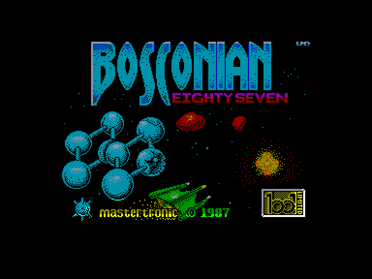
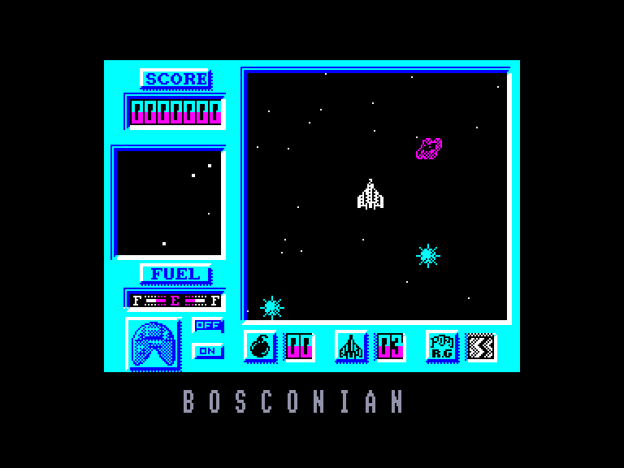
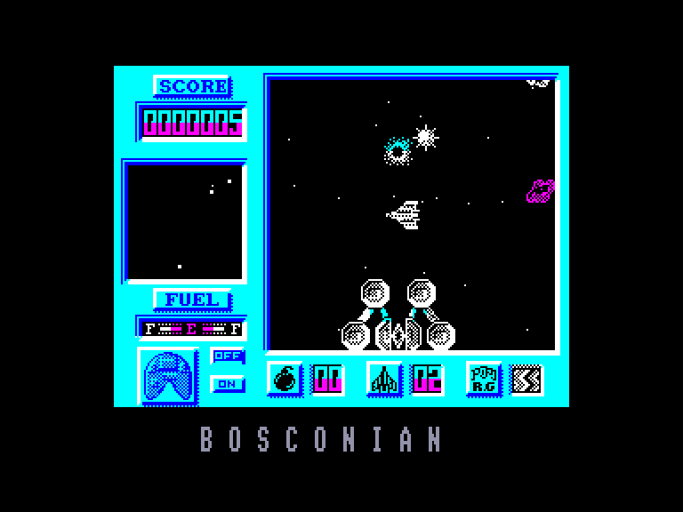
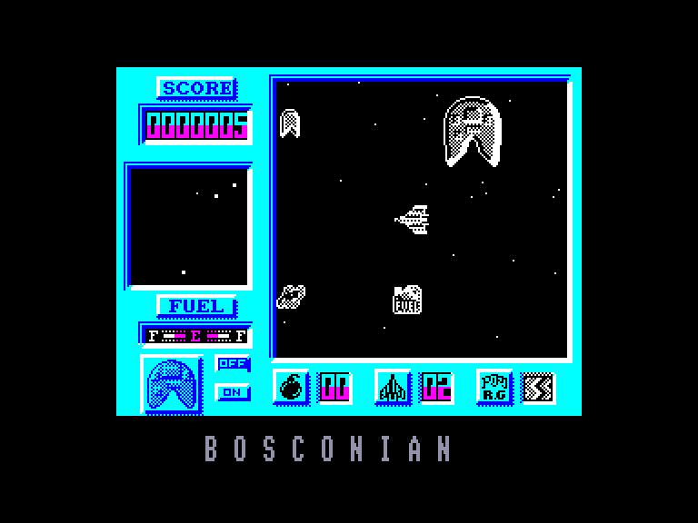

[0-9](../0/games-0.md) - [A](../a/games-a.md) - [B](../b/games-b.md) - [C](../c/games-c.md) - [D](../d/games-d.md) - [E](../e/games-e.md) - [F](../f/games-f.md) - [G](../g/games-g.md) - [H](../h/games-h.md) - [I](../i/games-i.md) - [J](../j/games-j.md) - [K](../k/games-k.md) - [L](../l/games-l.md) - [M](../m/games-m.md) - [N](../n/games-n.md) - [O](../o/games-o.md) - [P](../p/games-p.md) - [Q](../q/games-q.md) - [R](../r/games-r.md) - [S](../s/games-s.md) - [T](../t/games-t.md) - [U](../u/games-u.md) - [V](../v/games-v.md) - [W](../w/games-w.md) - [X](../x/games-x.md) - [Y](../y/games-y.md) - [Z](../z/games-z.md)

Ігри для [Enterprise 64k](../games-ep64.md) - [Enterprise 128k+RAMexp](../games-epramexp.md)

Ігри для систем [IS-DOS](../games-is-dos.md) - [SymbOS](../games-symbos.md) - [EDC Windows](../games-edcw.md)

Ігри для емуляторів [ZX Spectrum 48k/128k](../zxemu/games-zxemu.md) - [Amstrad CPC](../cpcemu/games-cpc.md) - [Sinclair ZX81](../zx81emu/games-zx81.md) - [Videoton TVC](../tvcemu/games-tvc.md) - [Commodore VIC-20](../vic20emu/games-vic20.md)

----------

# Bosconian '87

**Альтернативні назви:**
 - Bosconian Eighty Seven

**ID:** bosconian87-zx

## Примітка

ℹ Стара неофіційна конверсія з платформи ZX Spectrum.

## Скріншоти

## Опис

Ваша місія — пілотувати єдиний доступний космічний корабель і знищити орбітальні космічні станції. Це останній шанс для жителів Землі, адже їхні володарі з орбіти більше ніколи не дадуть їм змоги вибороти свободу. Ви не маєте права на помилку!

## Основна інформація
- **Мови:** Англійська
- **Оригінальна платформа:** ZX Spectrum
### Розробка
- **Рік випуску:** 1987

## Посилання
- [Опис гри на ep128.hu (угорською)](http://www.ep128.hu/Games/Bosconian87.htm)
- [Інформація про оригінальну версію](https://spectrumcomputing.co.uk/entry/637/ZX-Spectrum/Bosconian_87)
- [Завантажити гру](http://www.ep128.hu/Ep_Games/Prg/Bosconian87.rar)

## Детальна інформація

### Геймплей  

Збирайте бочки, щоб поповнити запас пального (відображається праворуч на екрані).  
Збирайте дельта-крила, щоб отримати додаткові життя (відображаються внизу екрана).  
Збирайте бомби й використовуйте їх для знищення ворожих винищувачів та ракет (кількість бомб вказана внизу екрана).  
Підбирайте двокрилий модуль, щоб отримати додатковий задній лазер (позначається дверима внизу ліворуч).  
Уникайте астероїдів, вибухів, інших кораблів та мін. Стріляйте по бочках, кораблях і бомбах, щоб знищувати їх.  
Використовуйте сканер у правому верхньому кутку, щоб визначати розташування станцій.  
Цільтеся в центр космічних станцій, щоб підірвати їх. Знищення зовнішніх відсіків (pods) не виведе станцію з ладу — остерігайтеся їхніх ракет. Знищте всі космічні станції, щоб завершити хвилю.  
Індикатор стану (Condition) попереджає про появу ворожих винищувачів — вони також з'являються на сканері. Індикатор шикування (Formation) показує точний стрій ворожих кораблів. Використовуйте ці прилади для планування тактики.  
Коли світиться індикатор стикування (Docking) (як на початку гри), ви можете стикуватися з материнськими кораблями для захисту. Підбір мініатюрних материнських кораблів вимикає цей індикатор. Якщо спробувати зістикуватися з вимкненим індикатором, вас перемістить у іншу частину екрана.