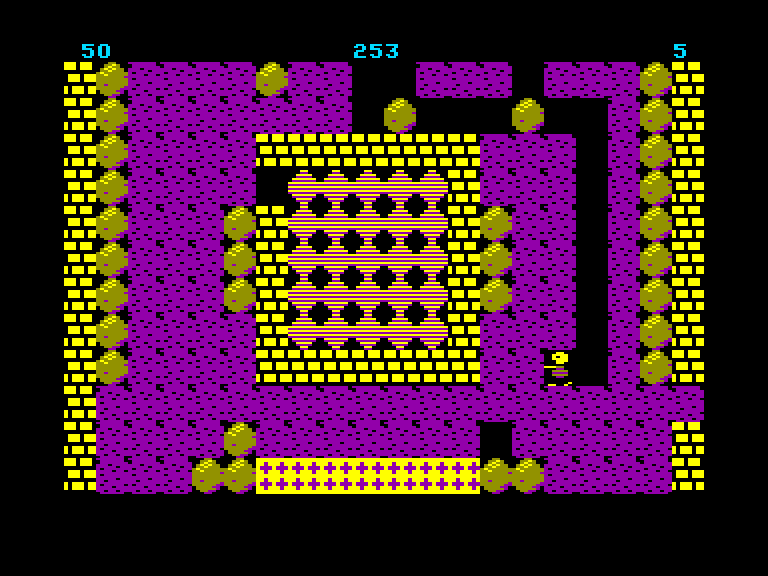
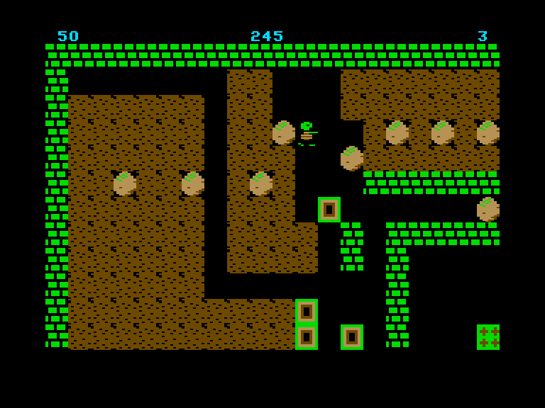
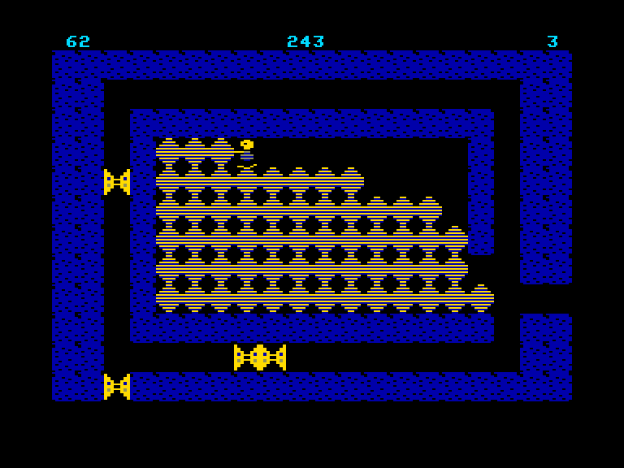
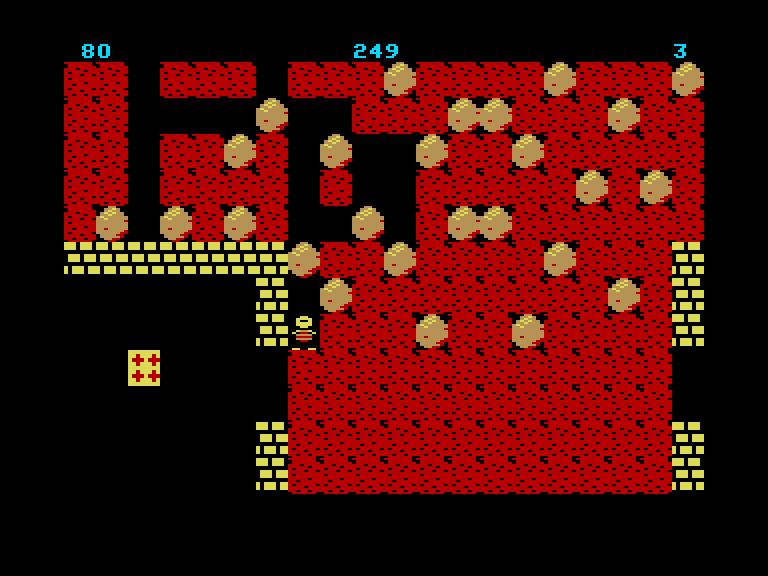

[0-9](../0/games-0.md) - [A](../a/games-a.md) - [B](../b/games-b.md) - [C](../c/games-c.md) - [D](../d/games-d.md) - [E](../e/games-e.md) - [F](../f/games-f.md) - [G](../g/games-g.md) - [H](../h/games-h.md) - [I](../i/games-i.md) - [J](../j/games-j.md) - [K](../k/games-k.md) - [L](../l/games-l.md) - [M](../m/games-m.md) - [N](../n/games-n.md) - [O](../o/games-o.md) - [P](../p/games-p.md) - [Q](../q/games-q.md) - [R](../r/games-r.md) - [S](../s/games-s.md) - [T](../t/games-t.md) - [U](../u/games-u.md) - [V](../v/games-v.md) - [W](../w/games-w.md) - [X](../x/games-x.md) - [Y](../y/games-y.md) - [Z](../z/games-z.md)

Ігри для [Enterprise 64k](../games-ep64.md) - [Enterprise 128k+RAMexp](../games-epramexp.md)

Ігри для систем [IS-DOS](../games-is-dos.md) - [SymbOS](../games-symbos.md) - [EDC Windows](../games-edcw.md)

Ігри для емуляторів [ZX Spectrum 48k/128k](../zxemu/games-zxemu.md) - [Amstrad CPC](../cpcemu/games-cpc.md) - [Sinclair ZX81](../zx81emu/games-zx81.md) - [Videoton TVC](../tvcemu/games-tvc.md) - [Commodore VIC-20](../vic20emu/games-vic20.md)

----------

# Boulder Dash

**ID:** boulder-dash-ep

**Жанри:** BoulderDash-подібна

## Примітка

ℹ Не завершена хоумбрю-гра.  
⚠ Може містити критичні помилки.

## Скріншоти

## Опис

Клон Boulder Dash.

## Основна інформація
- **Оригінальна платформа:** Enterprise
### Загальні системні вимоги
- **Апаратні:** EP64, EP128
- **Програмні:** IS-Basic
### Геймплей
- **Керування:** Internal Joy
- **Кількість гравців:** 1 player
- **Додаткові теги:** 16-color mode

## Посилання
- [Завантажити гру](http://www.ep128.hu/Ep_Games/Prg/Boulder_Dash_Ep.rar)
- [Easy Load&Play](https://t.me/EP128k_Load_n_Play/106) *(Telegram-канал Vibrant Waves)*

## Відео

<iframe src="https://www.youtube.com/embed/-ctNCO-57kk"  
style="width:75%; aspect-ratio:16/9;" allowfullscreen></iframe>

## [Керування](../controllers.md)

`Internal Joystick`  

`Hold`/`Pause`: Пауза

## Детальна інформація

### Геймплей  

Мета гри — дослідити кожну ПЕЧЕРУ та зібрати якнайбільше самоцвітів за найкоротший час. Щойно ви зберете необхідну кількість самоцвітів, відкриється вихід, і ви зможете перейти на наступний рівень.  

Тактика та планування допоможуть опанувати місцеву «фізику». Валуни падають цілком передбачувано, проте вам доведеться стримувати розростання амеб, перетворювати ворогів на корисні предмети та долати безліч інших перешкод.