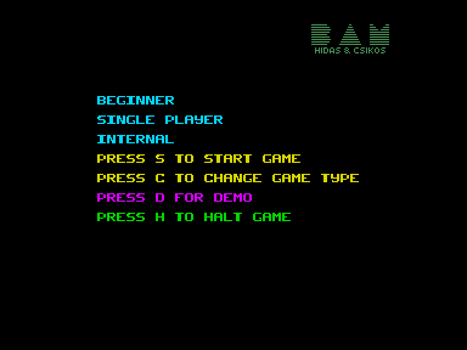
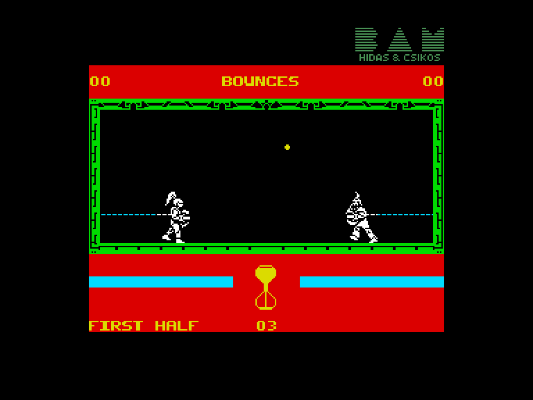
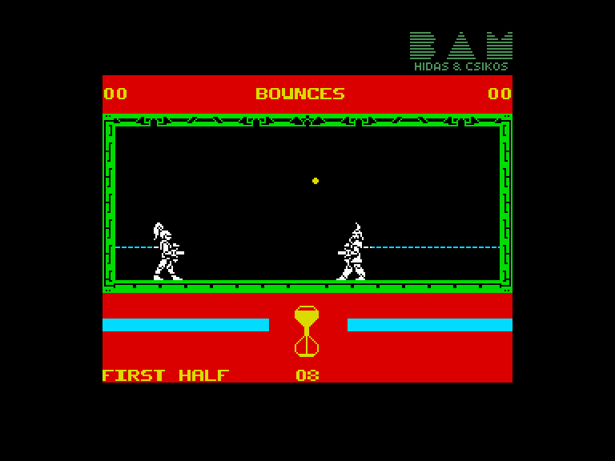
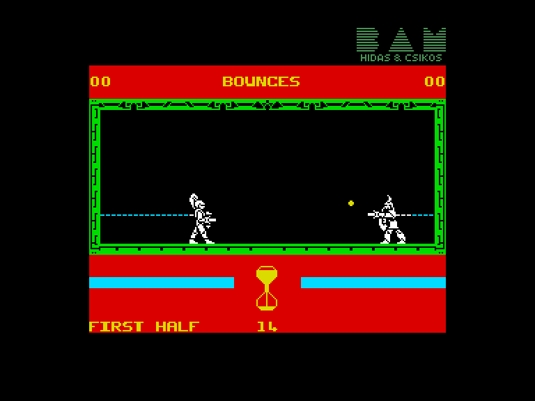

[0-9](../0/games-0.md) - [A](../a/games-a.md) - [B](../b/games-b.md) - [C](../c/games-c.md) - [D](../d/games-d.md) - [E](../e/games-e.md) - [F](../f/games-f.md) - [G](../g/games-g.md) - [H](../h/games-h.md) - [I](../i/games-i.md) - [J](../j/games-j.md) - [K](../k/games-k.md) - [L](../l/games-l.md) - [M](../m/games-m.md) - [N](../n/games-n.md) - [O](../o/games-o.md) - [P](../p/games-p.md) - [Q](../q/games-q.md) - [R](../r/games-r.md) - [S](../s/games-s.md) - [T](../t/games-t.md) - [U](../u/games-u.md) - [V](../v/games-v.md) - [W](../w/games-w.md) - [X](../x/games-x.md) - [Y](../y/games-y.md) - [Z](../z/games-z.md)

Ігри для [Enterprise 64k](../games-ep64.md) - [Enterprise 128k+RAMexp](../games-epramexp.md) - [2dfx](../games-2dfx.md)

Ігри для систем [IS-DOS](../games-is-dos.md) - [SymbOS](../games-symbos.md) - [EDC Windows](../games-edcw.md)

Ігри для емуляторів [ZX Spectrum 48k/128k](../zxemu/games-zxemu.md) - [Amstrad CPC](../cpcemu/games-cpc.md) - [Sinclair ZX81](../zx81emu/games-zx81.md) - [Videoton TVC](../tvcemu/games-tvc.md) - [Commodore VIC-20](../vic20emu/games-vic20.md)

----------

# Bounces

**ID:** bounces-zx

## Примітка

ℹ Стара неофіційна конверсія з платформи ZX Spectrum.

## Скріншоти

## Опис

Bounces — це спорт майбутнього! І дарма що виглядає він дещо кумедно: двоє здорованів, прив'язаних до гумових джгутів, намагаються закинути м'яч у ворота під стелею...

## Основна інформація
- **Оригінальна платформа:** ZX Spectrum

## Посилання
- [Опис на ep128.hu (угорською)](http://www.ep128.hu/Games/Bounces.htm)
- [Інформація про оригінальну версію](https://spectrumcomputing.co.uk/entry/653/ZX-Spectrum/Bounces)
- [Завантажити](http://www.ep128.hu/Ep_Games/Prg/Bounces.rar)

## Детальна інформація

### Геймплей  

М'яч вилітає з труби нагорі, і кожен гравець мусить закинути його у стельові ворота. М'яч із величезною швидкістю відскочує від стін і підлоги й цілком здатен збити гравця з ніг. Обох суперників стримують гумові джгути, які постійно тягнуть їх назад. У кожній руці гравець тримає по вловлювачу — упіймати м'яч можна натисканням кнопки пострілу. Повторне натискання вистрілює м'яч назад у гру. Також вловлювачем можна просто затопити супернику в обличчя!  

Шкали стану відстежують рівень енергії обох гравців: зіткнення зі стіною, м'ячем або опонентом відбирають сили, проте їх можна відновити, трохи відпочивши прямо на майданчику. Якщо витратити забагато енергії, гравець тимчасово паралізується. Крім того, є обмеження за часом — два тайми по 90 секунд, які відраховує пісочний годинник у центрі внизу екрана.