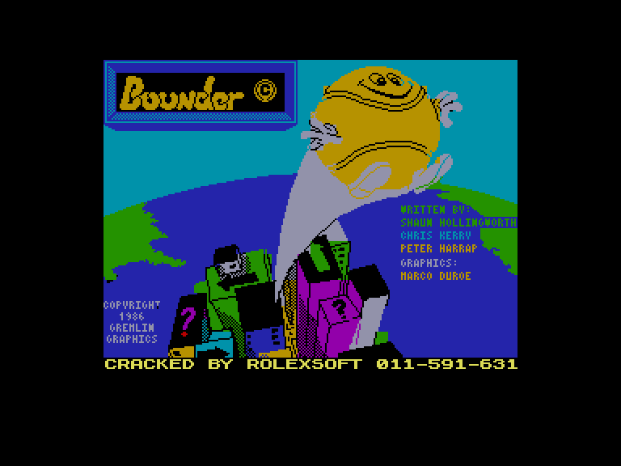
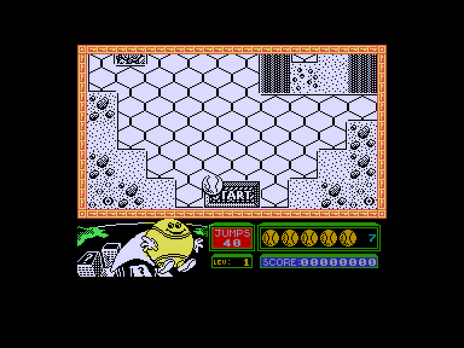
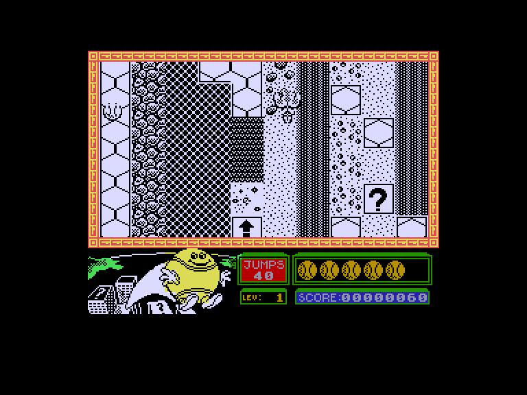
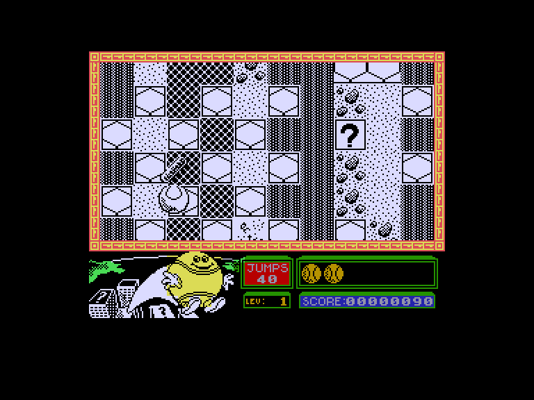

[0-9](../0/games-0.md) - [A](../a/games-a.md) - [B](../b/games-b.md) - [C](../c/games-c.md) - [D](../d/games-d.md) - [E](../e/games-e.md) - [F](../f/games-f.md) - [G](../g/games-g.md) - [H](../h/games-h.md) - [I](../i/games-i.md) - [J](../j/games-j.md) - [K](../k/games-k.md) - [L](../l/games-l.md) - [M](../m/games-m.md) - [N](../n/games-n.md) - [O](../o/games-o.md) - [P](../p/games-p.md) - [Q](../q/games-q.md) - [R](../r/games-r.md) - [S](../s/games-s.md) - [T](../t/games-t.md) - [U](../u/games-u.md) - [V](../v/games-v.md) - [W](../w/games-w.md) - [X](../x/games-x.md) - [Y](../y/games-y.md) - [Z](../z/games-z.md)

Ігри для [Enterprise 64k](../games-ep64.md) - [Enterprise 128k+RAMexp](../games-epramexp.md)

Ігри для систем [IS-DOS](../games-is-dos.md) - [SymbOS](../games-symbos.md) - [EDC Windows](../games-edcw.md)

Ігри для емуляторів [ZX Spectrum 48k/128k](../zxemu/games-zxemu.md) - [Amstrad CPC](../cpcemu/games-cpc.md) - [Sinclair ZX81](../zx81emu/games-zx81.md) - [Videoton TVC](../tvcemu/games-tvc.md) - [Commodore VIC-20](../vic20emu/games-vic20.md)

----------

# Bounder

**ID:** bounder-zx

## Примітка

ℹ Стара неофіційна конверсія з платформи ZX Spectrum.

## Скріншоти

## Опис

Проведіть м'яч крізь 174 екрани з перешкодами, стрибаючи по доріжці з шестикутних плиток, що рухається зверху вгору...

## Основна інформація
- **Оригінальна платформа:** ZX Spectrum

## Посилання
- [Опис гри на ep128.hu (угорською)](http://www.ep128.hu/Games/Bounder.htm)
- [Інформація про оригінальну версію](https://spectrumcomputing.co.uk/entry/657/ZX-Spectrum/Bounder)
- [Завантажити гру](http://www.ep128.hu/Ep_Games/Prg/Bounder.rar)

## Детальна інформація

### Геймплей  

На 10 рівнях динамічного екшену з виглядом зверху вам слід бути вкрай обережними й оминати різноманітні перешкоди: гострі скелі, кам'яні стіни, бите скло тощо — усе це миттєво проткне ваш м'яч. Крім того, на шляху трапляються й рухомі загрози, які роблять усякі неприємні речі: збивають із курсу, пробивають м'яч чи взагалі з'їдають його.  

Сім життів можуть здатися не надто великим запасом, проте ви матимете перевагу у вигляді періодичних підсилень (power-ups):  

- Суперзаряд — клітинка зі стрілкою, яка дозволяє наступному стрибку триматися в повітрі вдвічі довше, ніж зазвичай.  
- Телепорт — миттєво переносить вас до наступної клітинки телепорту.  
- Таємничий бонус — клітинка зі знаком питання, яка може принести як корисний, так і неприємний сюрприз...  

Наприкінці кожного рівня на вас чекає бонусний екран, усіяний знаками питання, за кожним із яких приховано додаткові очки. Стрибометр на панелі стану показує, скільки стрибків у вас залишилося, тож розраховуйте свої стрибки обачно, якщо хочете здобути максимальну кількість очок!