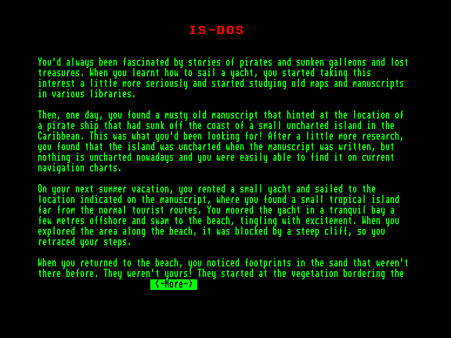
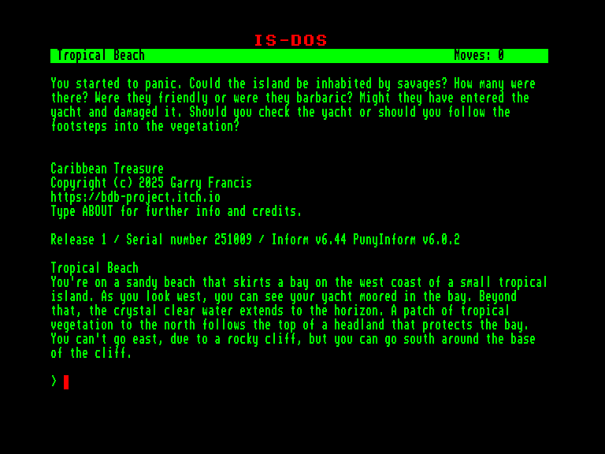
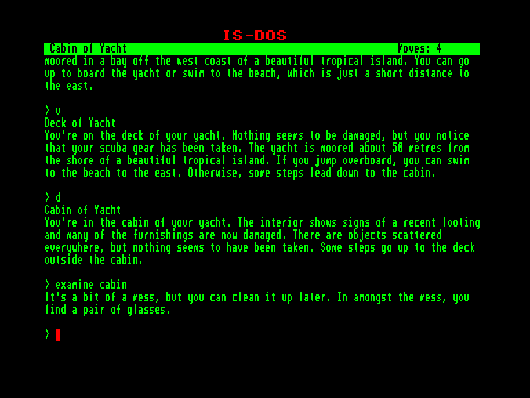
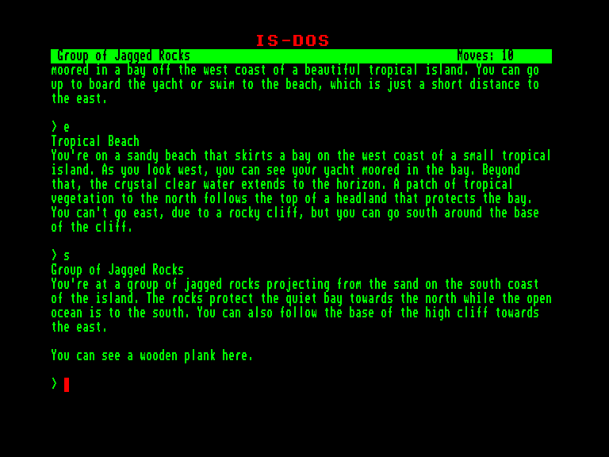

[0-9](../0/games-0.md) - [A](../a/games-a.md) - [B](../b/games-b.md) - [C](../c/games-c.md) - [D](../d/games-d.md) - [E](../e/games-e.md) - [F](../f/games-f.md) - [G](../g/games-g.md) - [H](../h/games-h.md) - [I](../i/games-i.md) - [J](../j/games-j.md) - [K](../k/games-k.md) - [L](../l/games-l.md) - [M](../m/games-m.md) - [N](../n/games-n.md) - [O](../o/games-o.md) - [P](../p/games-p.md) - [Q](../q/games-q.md) - [R](../r/games-r.md) - [S](../s/games-s.md) - [T](../t/games-t.md) - [U](../u/games-u.md) - [V](../v/games-v.md) - [W](../w/games-w.md) - [X](../x/games-x.md) - [Y](../y/games-y.md) - [Z](../z/games-z.md)

Ігри для [Enterprise 64k](../games-ep64.md) - [Enterprise 128k+RAMexp](../games-epramexp.md)

Ігри для систем [IS-DOS](../games-is-dos.md) - [SymbOS](../games-symbos.md) - [EDC Windows](../games-edcw.md)

Ігри для емуляторів [ZX Spectrum 48k/128k](../zxemu/games-zxemu.md) - [Amstrad CPC](../cpcemu/games-cpc.md) - [Sinclair ZX81](../zx81emu/games-zx81.md) - [Videoton TVC](../tvcemu/games-tvc.md) - [Commodore VIC-20](../vic20emu/games-vic20.md)

----------

# Caribbean Treasure

**ID:** caribbean-treasure-zcode

**Жанри:** Текстова пригода

## Примітка

Approved adaptation of the Italian adventure Alan Simmons: Bucaneer

## Скріншоти

## Опис

Занурившись у пошуки старих затонулих суден та загублених багатств, ви натрапили на зачіпку, яка вказувала на місце затонулого піратського судна неподалік від одного маленького карибського острівця. Озброївшись цими відомостями, ви не довго думаючи зафрахтували невеличку яхту і попрямували туди під час своїх літніх вакацій. Пришвартувавши судно у затишній бухті, ви вирушили оглядати південний бік острова.

Повернувшись на той самий пляж, звідки йшли, ви помітили свіжі відбитки на піску, яких зовсім недавно ще не було. Невже острів не порожній, а тут живуть дикі тубільці?

А тепер, у цій пригоді, вам належить ретельно прочесати острів, розкрити всі його загадки та вивідати потаємні секрети, шукаючи заповітний Карибський скарб.

## Основна інформація
- **Мови:** Англійська
### Загальні системні вимоги
- **Апаратні:** EXDOS
- **Програмні:** IS-DOS
### Геймплей
- **Керування:** Keyboard
- **Кількість гравців:** 1 player
- **Додаткові теги:** Z-code
### Розробка
- **Рік випуску:** 2025
- **Автор:** Garry Francis

## Посилання
- [Домашня сторінка гри](https://bdb-project.itch.io/caribbean-treasure)
- [Інформація про гру (SolutionArchive.com)](https://www.solutionarchive.com/game/id%2C10902/Caribbean+Treasure.html)

