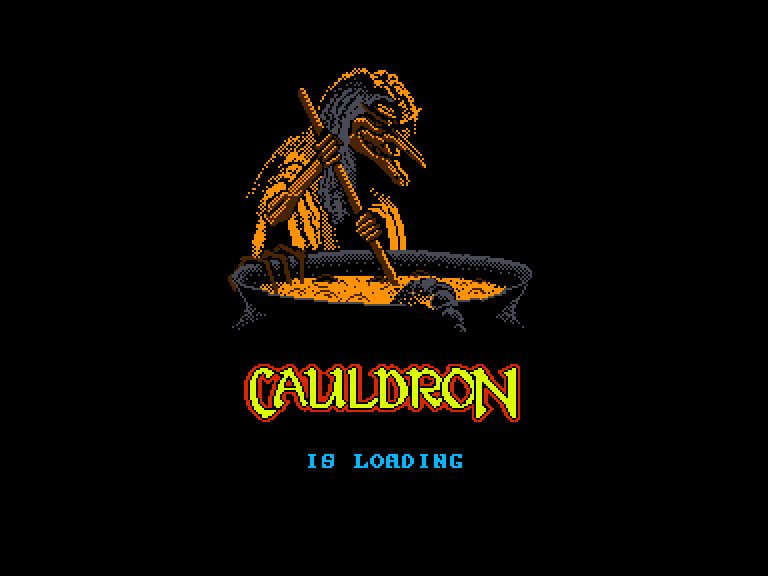
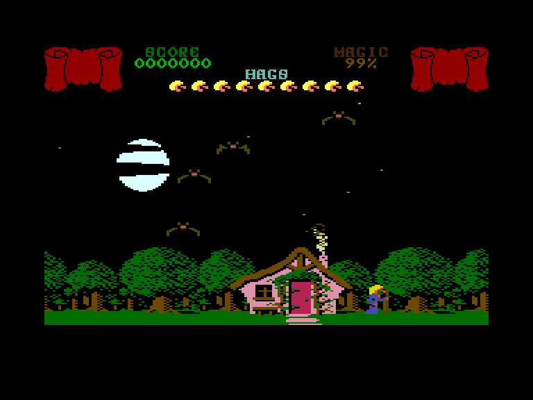
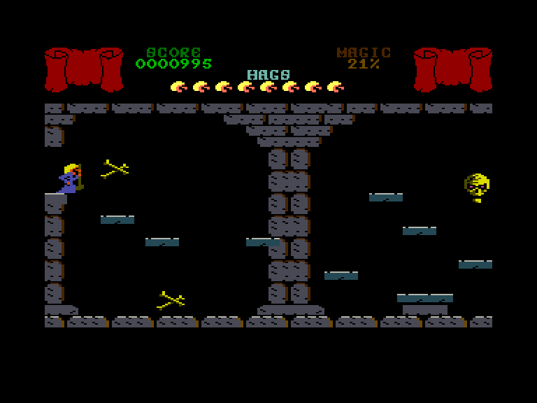
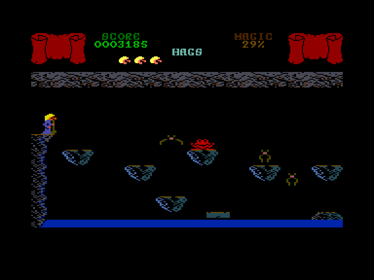

[0-9](../0/games-0.md) - [A](../a/games-a.md) - [B](../b/games-b.md) - [C](../c/games-c.md) - [D](../d/games-d.md) - [E](../e/games-e.md) - [F](../f/games-f.md) - [G](../g/games-g.md) - [H](../h/games-h.md) - [I](../i/games-i.md) - [J](../j/games-j.md) - [K](../k/games-k.md) - [L](../l/games-l.md) - [M](../m/games-m.md) - [N](../n/games-n.md) - [O](../o/games-o.md) - [P](../p/games-p.md) - [Q](../q/games-q.md) - [R](../r/games-r.md) - [S](../s/games-s.md) - [T](../t/games-t.md) - [U](../u/games-u.md) - [V](../v/games-v.md) - [W](../w/games-w.md) - [X](../x/games-x.md) - [Y](../y/games-y.md) - [Z](../z/games-z.md)

Ігри для [Enterprise 64k](../games-ep64.md) - [Enterprise 128k+RAMexp](../games-epramexp.md)

Ігри для систем [IS-DOS](../games-is-dos.md) - [SymbOS](../games-symbos.md) - [EDC Windows](../games-edcw.md)

Ігри для емуляторів [ZX Spectrum 48k/128k](../zxemu/games-zxemu.md) - [Amstrad CPC](../cpcemu/games-cpc.md) - [Sinclair ZX81](../zx81emu/games-zx81.md) - [Videoton TVC](../tvcemu/games-tvc.md) - [Commodore VIC-20](../vic20emu/games-vic20.md)

----------

# Cauldron

**ID:** cauldron

## Примітка

ℹ Офіційна конверсія.  
Реліз планувався, але так і не був реалізований через банкрутство компанії Enterprise Computers.

## Скріншоти

## Опис

Золота мітла — це головний приз для відьом, і ви хочете отримати його у свої руки! Ви знайшли заклинання, яке повинно дозволити вам перемогти гарбузи, що охороняють мітлу. На жаль, для заклинання потрібні шість доволі рідкісних інгредієнтів, які вам потрібно буде зібрати.

## Основна інформація
- **Мови:** Англійська
- **Оригінальна платформа:** Amstrad CPC
### Загальні системні вимоги
- **Апаратні:** EP128
### Геймплей
- **Кількість гравців:** 1 player

## Посилання
- [Опис гри на ep128.hu (угорською)](http://www.ep128.hu/Games/Cauldron.htm)
- [Інформація про оригінальну версію](https://www.cpc-power.com/index.php?page=detail&num=529)
- [Завантажити гру](http://www.ep128.hu/Ep_Games/Prg/Cauldron.rar)
- [Easy Load&Play](https://t.me/EP128k_Load_n_Play/1086) *(Telegram-канал Vibrant Waves)*

## Відео

<iframe src="https://www.youtube.com/embed/0YqjH5yHiBc"  
style="width:75%; aspect-ratio:16/9;" allowfullscreen></iframe>

- [Відео](https://tv.enterpriseforever.com/cauldron.mp4)
- [Відео](https://youtu.be/KURvWzC8uRo)

## [Керування](../controllers.md)

`Internal Joystick`  
`External Joystick 1`  
`External Joystick 2`  

`Fire`+`↔` (на мітлі): Жбурнути закляття  
`Fire` (у печері): Стрибати  

`Hold`/`Pause`: Пауза

## Детальна інформація

### Геймплей  

Інгредієнти заховані за шістьма кольоровими дверима, для відкриття яких потрібні шість ключів. Тож ваше перше завдання — знайти ці ключі, які зазвичай лежать під деревами по всій країні. Поки ви літаєте в їхніх пошуках, на вас нападатимуть різноманітні вороги — кажани, вогняні кулі, привиди та чайки, у яких можна стріляти. Утім, кожен постріл коштує один магічний бал, а оскільки кожне з ваших восьми життів (чи то пак відьом) має на початку лише 99 балів, марнотратство вам не під силу.  

Маючи ключ, ви зможете пройти крізь двері до печер. Кожна печера є, по суті, платформером, де вам доведеться долати різноманітні перешкоди, щоб дістатися потрібного інгредієнта. Знайшовши його, повертайтеся додому й кидайте в казан. Коли ви зберете всі шість інгредієнтів, то зможете завершити закляття проти гарбузів і забрати Золоту мітлу.  

### Історія розробки  

> **Джон Брендвуд**:  
>   
> Швидкий погляд на список ігр для завантаження показує, що версія гри для Ентерпрайза все ж якимось чином побачила світ, хоча за мою роботу над нею так ніхто й не заплатив.  
>   
> Хтось вчинив м'яко кажучи нечесно!  
>   
> Гра являла собою порт Cauldron від Palace Software для комп'ютера Enterprise.  
>   
> Мені надали вихідний код та ресурси з інших версій від Palace Software, тож у підсумку вийшов такий собі гібрид версій для Amstrad та C64 — із цілком пристойним накладанням масок для спрайтів, а не з тим жахливим малюванням через XOR, яке було в амстрадівській версії від Palace Software.  
>   
> У будь-якому разі... гра розроблялася на Enterprise 128 із двома дисководами під керуванням IS-DOS, із використанням ассемблера M80 та лінкера L80 від Microsoft.  
>   
> Після банкрутства Intelligent Software я в результаті пішов працювати в компанію з розробки відеоігор (OCEAN).  
>  
> Мого порту Cauldron виявилося цілком достатньо, щоб мене взяли на роботу. Тож наступні кілька років я писав код під Z80, поки згодом не перейшов на 68000.  
>  
> Оскільки мені не до душі була внутрішня система розробки на базі Tatung Einstein, яку використовувала компанія, свої перші дві гри для них я насправді продовжував писати на тому ж Enterprise 128 за допомогою M80/L80 — аж поки вони не перейшли на швидку систему розробки на базі Atari ST.