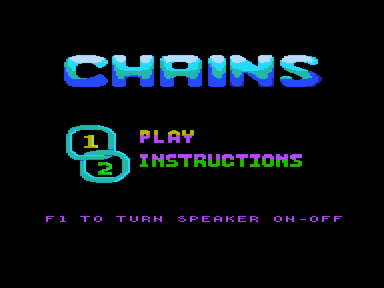
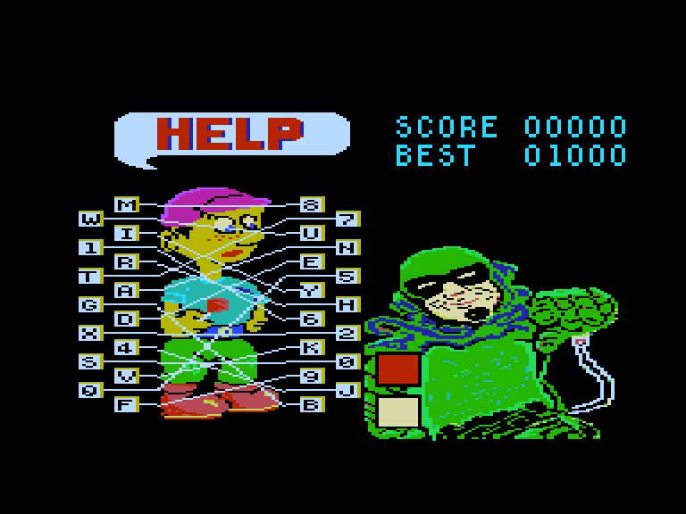
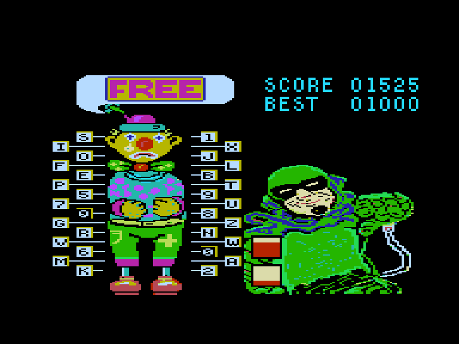
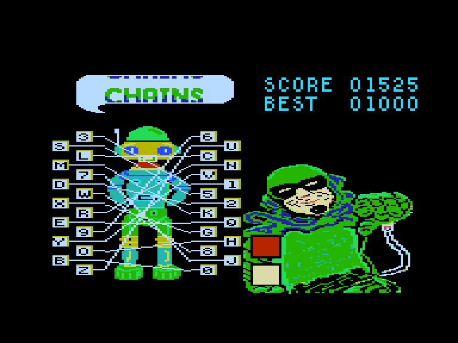

[0-9](../0/games-0.md) - [A](../a/games-a.md) - [B](../b/games-b.md) - [C](../c/games-c.md) - [D](../d/games-d.md) - [E](../e/games-e.md) - [F](../f/games-f.md) - [G](../g/games-g.md) - [H](../h/games-h.md) - [I](../i/games-i.md) - [J](../j/games-j.md) - [K](../k/games-k.md) - [L](../l/games-l.md) - [M](../m/games-m.md) - [N](../n/games-n.md) - [O](../o/games-o.md) - [P](../p/games-p.md) - [Q](../q/games-q.md) - [R](../r/games-r.md) - [S](../s/games-s.md) - [T](../t/games-t.md) - [U](../u/games-u.md) - [V](../v/games-v.md) - [W](../w/games-w.md) - [X](../x/games-x.md) - [Y](../y/games-y.md) - [Z](../z/games-z.md)

Ігри для [Enterprise 64k](../games-ep64.md) - [Enterprise 128k+RAMexp](../games-epramexp.md)

Ігри для систем [IS-DOS](../games-is-dos.md) - [SymbOS](../games-symbos.md) - [EDC Windows](../games-edcw.md)

Ігри для емуляторів [ZX Spectrum 48k/128k](../zxemu/games-zxemu.md) - [Amstrad CPC](../cpcemu/games-cpc.md) - [Sinclair ZX81](../zx81emu/games-zx81.md) - [Videoton TVC](../tvcemu/games-tvc.md) - [Commodore VIC-20](../vic20emu/games-vic20.md)

----------

# Chains

**ID:** chains

**Жанри:** Навчальний

## Примітка

ℹ Офіційний реліз.

## Скріншоти

## Опис

Зловісний Лінк захопив усіх друзів Майті Мена! Він прикував їх ланцюгами в похмурому підземеллі, і єдиний спосіб їх урятувати — розплутати ці ланцюги. Але ви змагаєтеся з часом: якщо не визволите друзів достатньо швидко, ви всі вибухнете!  

Що ще гірше, ланцюги переплелися в жахливий клубок. Вам потрібно вирахувати обидва кінці ланцюга, а потім ввести літеру чи цифру, розташовану на кожному з них.  

Якщо ви припуститеся помилки — не переймайтеся. Просто введіть ту літеру чи цифру, яку ви хотіли натиснути. Коли ви правильно визначите обидва кінці ланцюга, то зможете розімкнути його.  

Проте уважно стежте за таймером у руках Майті Мена. Пісок у ньому повільно пересипається, і як тільки він закінчиться — бомба вибухне!  

Ваші очки залежать від того, як швидко вам вдасться розімкнути кожен ланцюг і звільнити кожного з друзів. Але з кожним наступним бранцем часу на розрив ланцюгів ставатиме все менше...  

Ця програма створена для дітей, щоб навчити їх навичок друку, але й дорослі знайдуть її вельми захопливою — і добряче дратуючою!

## Основна інформація
- **Мови:** Англійська
### Загальні системні вимоги
- **Апаратні:** EP64, EP128
### Геймплей
- **Керування:** Keyboard
- **Кількість гравців:** 1 player
- **Додаткові теги:** 16-color mode
### Розробка
- **Рік випуску:** 1985

## Посилання
- [Опис гри на ep128.hu (угорською)](http://www.ep128.hu/Ep_Games/Leiras/Chains.htm)
- [Завантажити гру](http://www.ep128.hu/Ep_Games/Prg/Chains.rar)

## Керування

`Keyboard`

