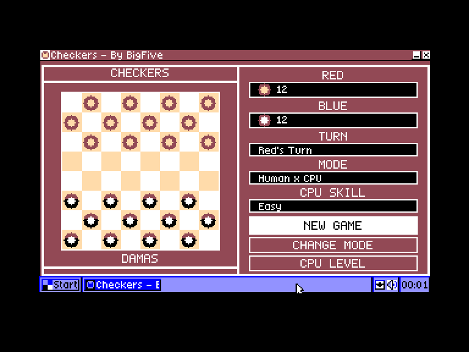
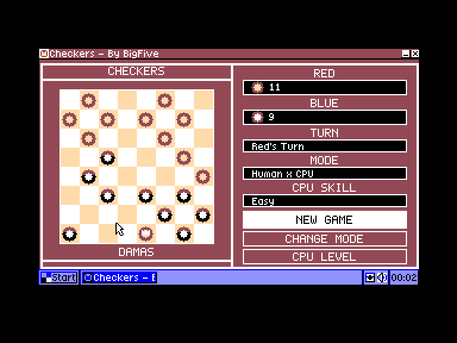
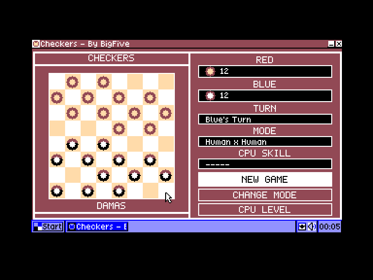
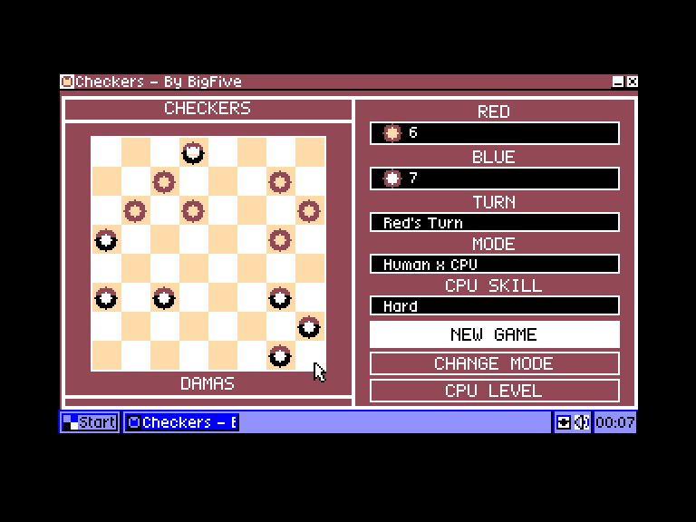

[0-9](../0/games-0.md) - [A](../a/games-a.md) - [B](../b/games-b.md) - [C](../c/games-c.md) - [D](../d/games-d.md) - [E](../e/games-e.md) - [F](../f/games-f.md) - [G](../g/games-g.md) - [H](../h/games-h.md) - [I](../i/games-i.md) - [J](../j/games-j.md) - [K](../k/games-k.md) - [L](../l/games-l.md) - [M](../m/games-m.md) - [N](../n/games-n.md) - [O](../o/games-o.md) - [P](../p/games-p.md) - [Q](../q/games-q.md) - [R](../r/games-r.md) - [S](../s/games-s.md) - [T](../t/games-t.md) - [U](../u/games-u.md) - [V](../v/games-v.md) - [W](../w/games-w.md) - [X](../x/games-x.md) - [Y](../y/games-y.md) - [Z](../z/games-z.md)

Ігри для [Enterprise 64k](../games-ep64.md) - [Enterprise 128k+RAMexp](../games-epramexp.md) - [2dfx](../games-2dfx.md)

Ігри для систем [IS-DOS](../games-is-dos.md) - [SymbOS](../games-symbos.md) - [EDC Windows](../games-edcw.md)

Ігри для емуляторів [ZX Spectrum 48k/128k](../zxemu/games-zxemu.md) - [Amstrad CPC](../cpcemu/games-cpc.md) - [Sinclair ZX81](../zx81emu/games-zx81.md) - [Videoton TVC](../tvcemu/games-tvc.md) - [Commodore VIC-20](../vic20emu/games-vic20.md)

----------

# Checkers

**ID:** checkers-symbos

**Жанри:** Настільна гра

## Примітка

ℹ Хоумбрю-гра.

## Скріншоти

## Опис

Checkers — це адаптація відомої настільної стратегічної гри, оснащена потужним штучним інтелектом. У цю якісну реалізацію можна грати як удовох, так і проти комп'ютера, який має три рівні складності. Хід полягає в переміщенні шашки на сусідню вільну клітинку. Якщо ж на сусідній клітинці стоїть шашка суперника, а клітинка одразу за нею вільна, цю шашку можна збити, перестрибнувши через неї.

## Основна інформація
- **Мови:** Англійська
### Загальні системні вимоги
- **Апаратні:** EP128+RAM, EXDOS
- **Програмні:** SymbOS 3.0
### Геймплей
- **Керування:** Mouse
- **Кількість гравців:** 1 player, 2 players (versus)
### Розробка
- **Рік випуску:** 2026
- **Автор:** BigFive

## Посилання
- [Домашня сторінка](https://symbos.org/appinfo.htm?00085)
- [Завантажити](https://symbos.org/download/apps/Checkers.zip)

