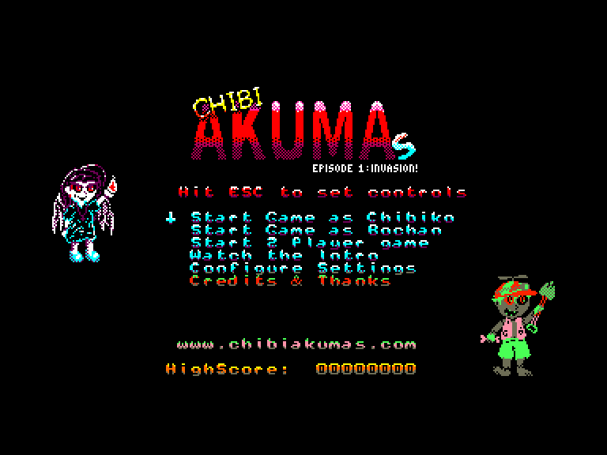
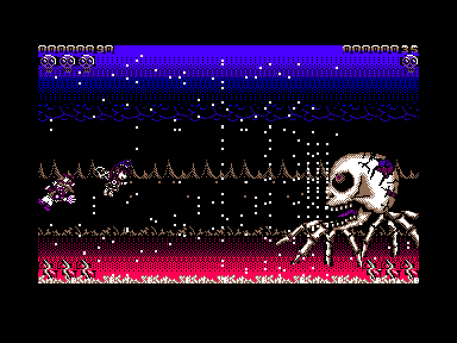
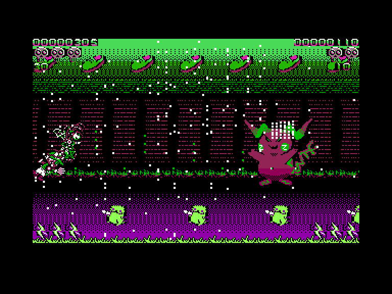
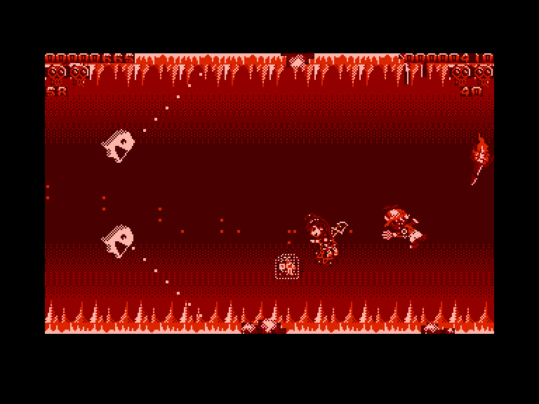

[0-9](../0/games-0.md) - [A](../a/games-a.md) - [B](../b/games-b.md) - [C](../c/games-c.md) - [D](../d/games-d.md) - [E](../e/games-e.md) - [F](../f/games-f.md) - [G](../g/games-g.md) - [H](../h/games-h.md) - [I](../i/games-i.md) - [J](../j/games-j.md) - [K](../k/games-k.md) - [L](../l/games-l.md) - [M](../m/games-m.md) - [N](../n/games-n.md) - [O](../o/games-o.md) - [P](../p/games-p.md) - [Q](../q/games-q.md) - [R](../r/games-r.md) - [S](../s/games-s.md) - [T](../t/games-t.md) - [U](../u/games-u.md) - [V](../v/games-v.md) - [W](../w/games-w.md) - [X](../x/games-x.md) - [Y](../y/games-y.md) - [Z](../z/games-z.md)

Ігри для [Enterprise 64k](../games-ep64.md) - [Enterprise 128k+RAMexp](../games-epramexp.md)

Ігри для систем [IS-DOS](../games-is-dos.md) - [SymbOS](../games-symbos.md) - [EDC Windows](../games-edcw.md)

Ігри для емуляторів [ZX Spectrum 48k/128k](../zxemu/games-zxemu.md) - [Amstrad CPC](../cpcemu/games-cpc.md) - [Sinclair ZX81](../zx81emu/games-zx81.md) - [Videoton TVC](../tvcemu/games-tvc.md) - [Commodore VIC-20](../vic20emu/games-vic20.md)

----------

# Chibi Akumas. Episode 1: Invasion!

**Альтернативні назви:**
 - Chibi Akuma's

**ID:** chibi-akumas-ep1

**Жанри:** Шутем-ап, Екшн, Булетхелл

## Примітка

ℹ Офіційна мультиплатформенна гра.

## Скріншоти

## Опис

Найлютіша — і наймиліша! — чибі-вампірка повертається! І цього разу жодному комп'ютеру на Z80 не мати спокою!  

Коли монстри вдираються на її батьківщину, вампірка Чібіко влаштує їм справжнє пекельне прочуханство!  
Приєднуйтесь до відьмочки Чібіко та її брата-гуля Бо-чана у найбожевільнішому аркадному булет-гелі, який тільки бачив Enterprise!  

У Chibi Akumas є все те, що інші гри просто побоялися додати:  

- 4 рівні суцільного шутерного екшену у всіх напрямках  
- Чудернацькі вороги та велетенські боси наприкінці кожного рівня  
- Спільний режим для двох гравців у найкращих традиціях аркад  
- До 256 куль одночасно на екрані під час рівнів  
- І аж до 1280 куль під час фінальної битви з босом!  
- Мультяшні катсцени  
- Чорний та безумний гумор  
- І найгірший приклад для наслідування, який ви тільки бачили у відеоіграх!  

Ви готові до абсолютного піка 8-бітного булет-гелу?  
Бо Chibi Akumas вже близько... Хочете ви цього чи ні!

## Основна інформація
- **Мови:** Англійська
- **Оригінальна платформа:** Multiplatform
### Загальні системні вимоги
- **Апаратні:** EP128, EXDOS
### Геймплей
- **Керування:** Keyboard, Internal Joy, External Joy 1, External Joy 2
- **Кількість гравців:** 1 player, 2 players (cooperative)
- **Додаткові теги:** 4-color mode, ExtJoy Multifire
### Розробка
- **Рік випуску:** 2018
- **Автор:** Keith S

## Посилання
- [Домашня сторінка гри](https://www.chibiakumas.com/games/)
- [Завантажити гру](http://www.ep128.hu/Ep_Games/Prg/Chibi_Akumas.rar)
- [Завантажити гру](https://www.chibiakumas.com/download/V1666.7z)

