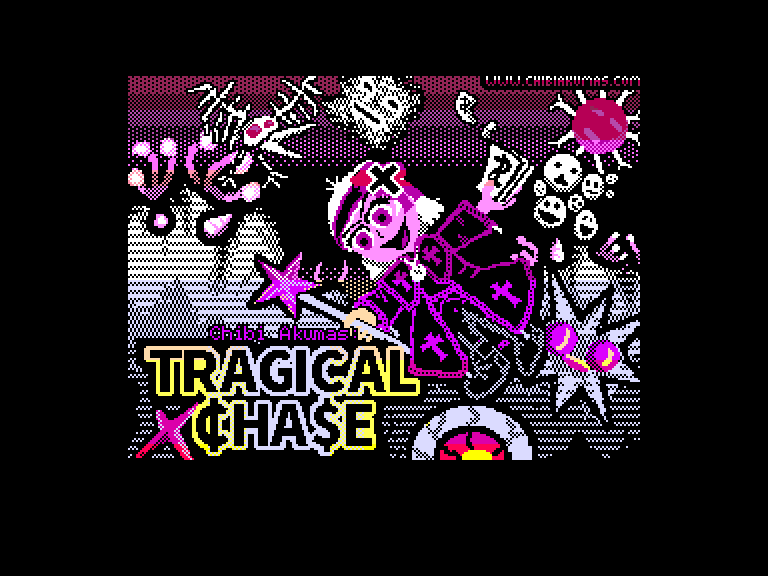
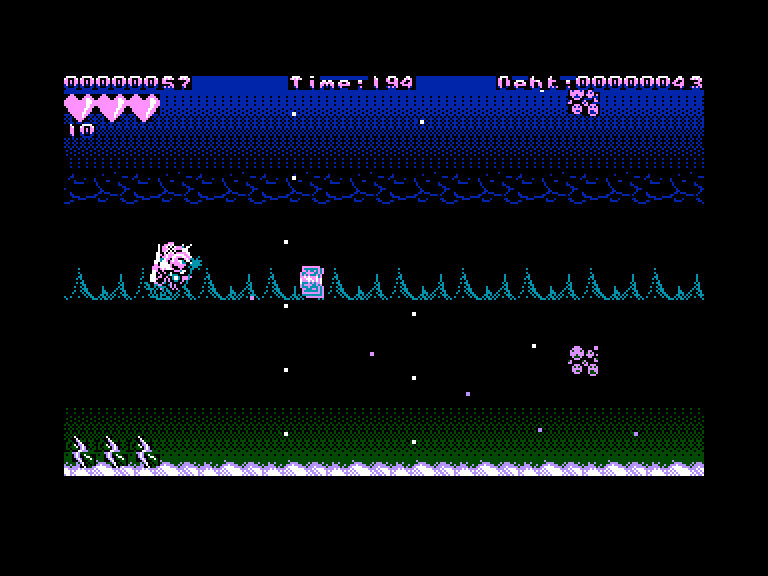
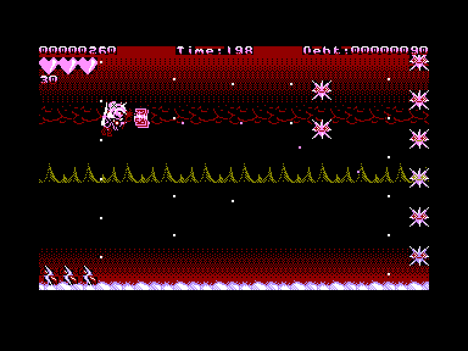
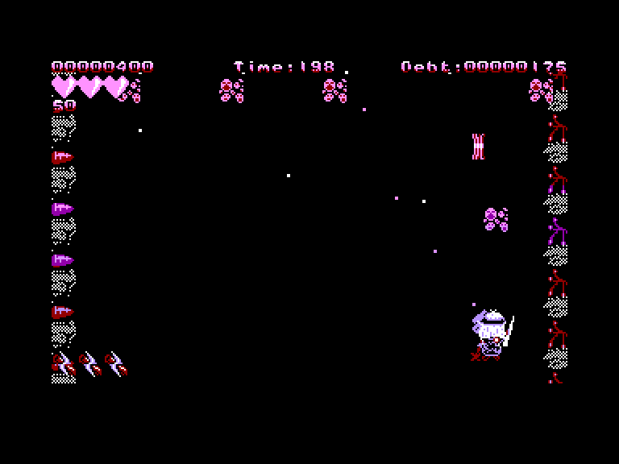

[0-9](../0/games-0.md) - [A](../a/games-a.md) - [B](../b/games-b.md) - [C](../c/games-c.md) - [D](../d/games-d.md) - [E](../e/games-e.md) - [F](../f/games-f.md) - [G](../g/games-g.md) - [H](../h/games-h.md) - [I](../i/games-i.md) - [J](../j/games-j.md) - [K](../k/games-k.md) - [L](../l/games-l.md) - [M](../m/games-m.md) - [N](../n/games-n.md) - [O](../o/games-o.md) - [P](../p/games-p.md) - [Q](../q/games-q.md) - [R](../r/games-r.md) - [S](../s/games-s.md) - [T](../t/games-t.md) - [U](../u/games-u.md) - [V](../v/games-v.md) - [W](../w/games-w.md) - [X](../x/games-x.md) - [Y](../y/games-y.md) - [Z](../z/games-z.md)

Ігри для [Enterprise 64k](../games-ep64.md) - [Enterprise 128k+RAMexp](../games-epramexp.md)

Ігри для систем [IS-DOS](../games-is-dos.md) - [SymbOS](../games-symbos.md) - [EDC Windows](../games-edcw.md)

Ігри для емуляторів [ZX Spectrum 48k/128k](../zxemu/games-zxemu.md) - [Amstrad CPC](../cpcemu/games-cpc.md) - [Sinclair ZX81](../zx81emu/games-zx81.md) - [Videoton TVC](../tvcemu/games-tvc.md) - [Commodore VIC-20](../vic20emu/games-vic20.md)

----------

# Chibi Acumas: Tragical Chase

**Альтернативні назви:**
 - Tragical Chase

**ID:** chibi-akumas-tragical-chase

**Жанри:** Булетхелл, Екшн, Шутем-ап

## Примітка

ℹ Офіційна мультиплатформенна гра.  
⚠ Містить критичні помилки.

## Скріншоти

## Опис

Юме Юуша в халепі! Спустивши купу грошей на усілякий мотлох на інтернет-аукціоні «C-Bay», вона нарешті зібрала весь колекційний непотріб, про який тільки мріяла... На жаль, залишилася одна «маленька» проблема — виплатити борги за всіма кредитками! Коли на горизонті замаячили фінансове банкрутство та загроза конфіскації майна, Юме змушена піти на невимовне... нарешті знайти роботу й заробляти на життя!  

Допоможіть Юме здолати достатньо монстрів, щоб заробити грошей і закрити борги до настання терміну виплат, врятувавши її улюблені мультяшні іграшки від лап колекторів!

## Основна інформація
- **Мови:** Англійська
- **Оригінальна платформа:** Multiplatform
### Загальні системні вимоги
- **Апаратні:** EP128, EXDOS
### Геймплей
- **Керування:** Internal Joy
- **Кількість гравців:** 1 player, 2 players (cooperative)
- **Додаткові теги:** 4-color mode
### Розробка
- **Рік випуску:** 2018
- **Автор:** Keith Sear

## Посилання
- [Домашня сторінка гри](https://www.chibiakumas.com/games/)
- [Завантажити гру](https://www.chibiakumas.com/download/Tragical.7z)

## Детальна інформація

### Геймплей  

Tragical Chase — це арена-шутер із круговим рухом у дусі Space Invaders чи Phoenix.  

Кожна хвиля вважається пройденою, коли гравець досягає «цільової суми боргу», заробляючи необхідну кількість очок.  

На кожну хвилю відведено ліміт часу: якщо час вичерпається, ви втратите життя.  

Деякі особливі хвилі (з босами або бонусами) не вимагають виконання боргової норми й закінчуються раніше — до вичерпання часу чи досягнення фінансової цілі.  

У грі нескінченна кількість хвиль, які циклюються з дедалі більшою складністю... тож головна мета — перевірити, як довго ви зможете вижити.  

Кожні 5 хвиль з'являється бонус «Розп'яття», який підсилює ваш вогонь (до максимального рівня), а також повністю відновлює серця та смарт-бомби!