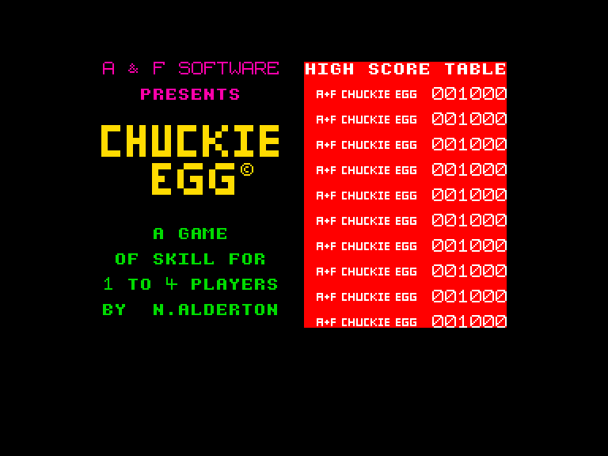
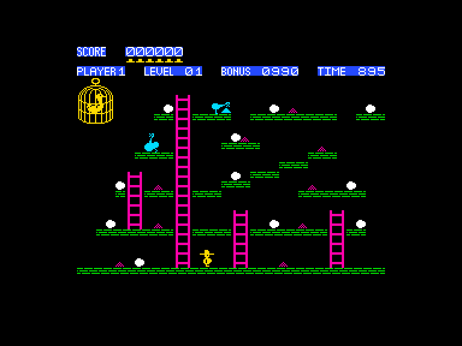
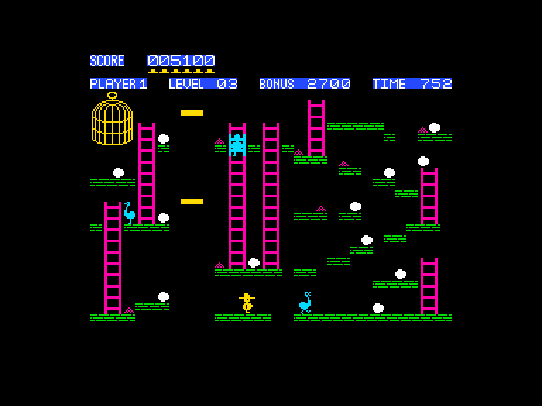
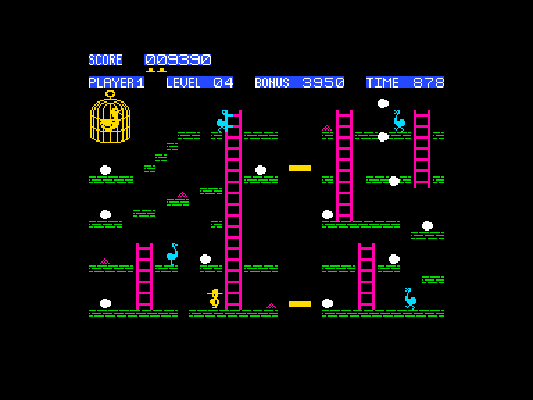

[0-9](../0/games-0.md) - [A](../a/games-a.md) - [B](../b/games-b.md) - [C](../c/games-c.md) - [D](../d/games-d.md) - [E](../e/games-e.md) - [F](../f/games-f.md) - [G](../g/games-g.md) - [H](../h/games-h.md) - [I](../i/games-i.md) - [J](../j/games-j.md) - [K](../k/games-k.md) - [L](../l/games-l.md) - [M](../m/games-m.md) - [N](../n/games-n.md) - [O](../o/games-o.md) - [P](../p/games-p.md) - [Q](../q/games-q.md) - [R](../r/games-r.md) - [S](../s/games-s.md) - [T](../t/games-t.md) - [U](../u/games-u.md) - [V](../v/games-v.md) - [W](../w/games-w.md) - [X](../x/games-x.md) - [Y](../y/games-y.md) - [Z](../z/games-z.md)

Ігри для [Enterprise 64k](../games-ep64.md) - [Enterprise 128k+RAMexp](../games-epramexp.md) - [2dfx](../games-2dfx.md)

Ігри для систем [IS-DOS](../games-is-dos.md) - [SymbOS](../games-symbos.md) - [EDC Windows](../games-edcw.md)

Ігри для емуляторів [ZX Spectrum 48k/128k](../zxemu/games-zxemu.md) - [Amstrad CPC](../cpcemu/games-cpc.md) - [Sinclair ZX81](../zx81emu/games-zx81.md) - [Videoton TVC](../tvcemu/games-tvc.md) - [Commodore VIC-20](../vic20emu/games-vic20.md)

----------

# Chuckie Egg

**ID:** chuckie-egg-zx

**Жанри:** Аркада, Платформер

## Примітка

ℹ Стара неофіційна конверсія з платформи ZX Spectrum.

## Скріншоти

## Опис

Хто б міг подумати, що життя на звичайній фермі може бути таким стресовим?  

Ви мусите зібрати всі яйця до того, як усілякі потвори вирвуться на волю й пожеруть ваше кукурудзяне зерно.  
І остерігайтеся скаженої качки — якщо вона втече з клітки, вам влаштують справжні непереливки!

## Основна інформація
- **Мови:** Англійська
- **Оригінальна платформа:** ZX Spectrum
### Геймплей
- **Керування:** Keyboard, Internal Joy, External Joy 1
- **Кількість гравців:** 1 player, 2 players (alternate), 3 players (alternate), 4 players (alternate)
- **Додаткові теги:** Attribute mode
### Розробка
- **Рік випуску:** 1983

## Посилання
- [Опис на ep128.hu (угорською)](http://www.ep128.hu/Games/Chuckie_Egg.htm)
- [Інформація про оригінальну версію](https://spectrumcomputing.co.uk/entry/958)
- [Завантажити](http://www.ep128.hu/Ep_Games/Prg/Chuckie_Egg.rar)
- [Easy Load&Play](https://t.me/EP128k_Load_n_Play/1022) *(Telegram-канал Vibrant Waves)*

## [Керування](../controllers.md)

`Keyboard`: (`2`, `W`, `9`, `0`, `Z`/`M`) (можливо перевизначити)  
`Internal Joystick` (Натисніть `I` і потім `2`)  
`External Joystick 1` (Натисніть `I` і потім `2`)  

Клавіши керування на стартовому екрані:  
`I`: Інструкції (також тут можна перевизначити керування)  
`R`: Перевизначити клавіши  
`S`: Почати гру  

Додаткові клавіши під час гри:  
`LShift`+`H`: Пауза (Натисніть `S` щоб продовжити гру)  
`LShift`+`A`: Вихід з поточної гри

