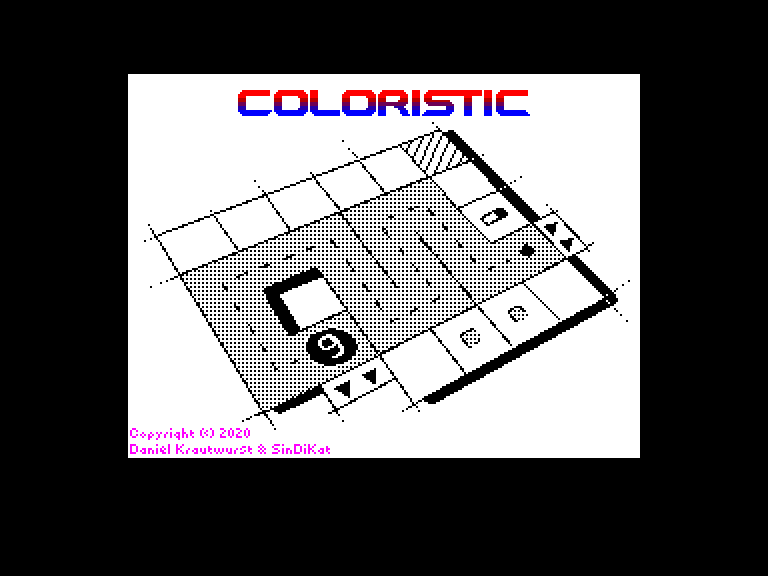
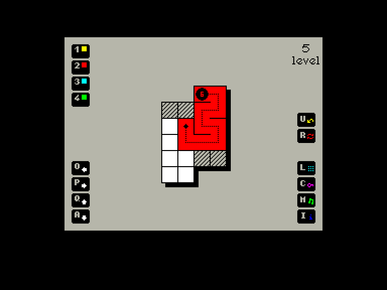
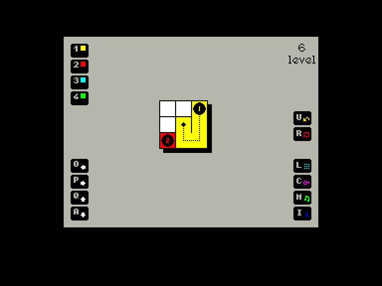
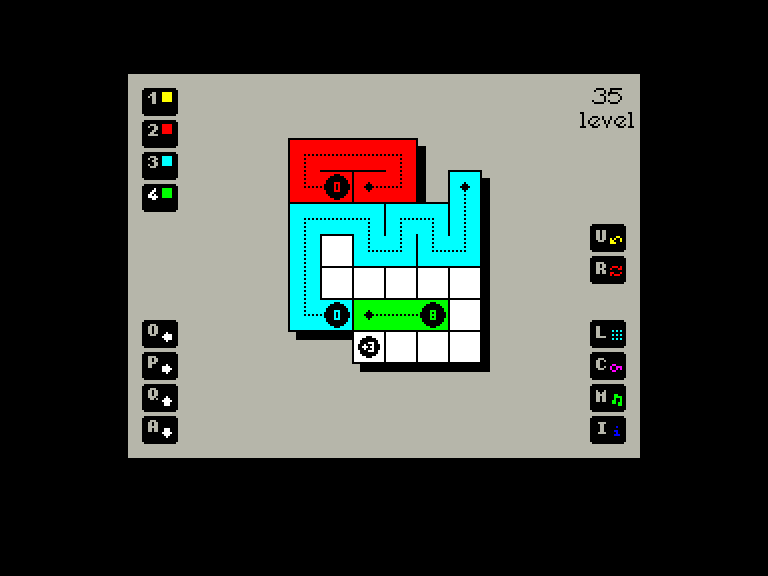

[0-9](../0/games-0.md) - [A](../a/games-a.md) - [B](../b/games-b.md) - [C](../c/games-c.md) - [D](../d/games-d.md) - [E](../e/games-e.md) - [F](../f/games-f.md) - [G](../g/games-g.md) - [H](../h/games-h.md) - [I](../i/games-i.md) - [J](../j/games-j.md) - [K](../k/games-k.md) - [L](../l/games-l.md) - [M](../m/games-m.md) - [N](../n/games-n.md) - [O](../o/games-o.md) - [P](../p/games-p.md) - [Q](../q/games-q.md) - [R](../r/games-r.md) - [S](../s/games-s.md) - [T](../t/games-t.md) - [U](../u/games-u.md) - [V](../v/games-v.md) - [W](../w/games-w.md) - [X](../x/games-x.md) - [Y](../y/games-y.md) - [Z](../z/games-z.md)

Ігри для [Enterprise 64k](../games-ep64.md) - [Enterprise 128k+RAMexp](../games-epramexp.md)

Ігри для систем [IS-DOS](../games-is-dos.md) - [SymbOS](../games-symbos.md) - [EDC Windows](../games-edcw.md)

Ігри для емуляторів [ZX Spectrum 48k/128k](../zxemu/games-zxemu.md) - [Amstrad CPC](../cpcemu/games-cpc.md) - [Sinclair ZX81](../zx81emu/games-zx81.md) - [Videoton TVC](../tvcemu/games-tvc.md) - [Commodore VIC-20](../vic20emu/games-vic20.md)

----------

# Coloristic

**ID:** coloristic-zx

## Примітка

ℹ Сучасна неофіційна конверсія з платформи ZX Spectrum.

## Скріншоти

## Опис

Мета гри — заповнити ігрове поле так, щоб у кожну клітинку зайти лише один раз. Поле, на яке ви вже наступили, буде зафарбоване. Трюк полягає в тому, щоб зробити це 1-4 різними кольорами. На стартовому полі кожного кольору число в осередку вказує, скільки ще ходів ви можете зробити цим кольором.

## Основна інформація
- **Оригінальна платформа:** ZX Spectrum

## Посилання
- [Опис гри на ep128.hu (угорською)](http://www.ep128.hu/Games/Coloristic.htm)
- [Інформація про оригінальну версію](https://spectrumcomputing.co.uk/entry/35334/ZX-Spectrum/Coloristic)
- [Завантажити гру](http://www.ep128.hu/Ep_Games/Prg/Coloristic.rar)
- [Easy Load&Play](https://t.me/EP128k_Load_n_Play/155?single) *(Telegram-канал Vibrant Waves)*

## Відео

<iframe src="https://www.youtube.com/embed/-k9EPJOLqxY"  
style="width:75%; aspect-ratio:16/9;" allowfullscreen></iframe>

- [Відео](https://www.youtube.com/watch?v=uZE9hkxlsA8)

## [Керування](../controllers.md)

`Keyboard`: `Q`, `A`, `O`, `P`  
`Internal Joystick`  
`External Joystick 1` (керування дуже чутливе)  
`External Joystick 2` (керування дуже чутливе)  

`1`-`4`: Вибір кольору  
`U`: Відмінити крок  
`R`: Перезапустити рівень  

`L`: Вибрати рівень  
`C`: Ввести код рівня  
`M`: Вимкнути/увімкнути музику  
`I`: Інформація

## Детальна інформація

### Геймплей  

- Клітинки, позначені стрілками, доступні лише з вказаного напрямку.  
- На клітинки, позначені маленькими кольоровими кубиками, можна наступати лише ідентичним кольором.  
- Перемикач відкриває недосяжні ділянки.  
- Наступання на клітинки з позначкою **+1**, **+2**, **+3** додає вказану кількість кроків до загальної кількості кроків.  

Головна складність, звісно, полягає в хитромудрій формі самих лабіринтів. Плутанина тут така, що сірі стрілки на краях стежки змушуватимуть вас телепортуватися на протилежний бік поля.  

Загалом у грі 80 рівнів. На щастя, проходити їх усі поспіль за один сеанс не потрібно: після кожного рівня видається пароль до наступного. Ввівши потрібний код, ви зможете продовжити гру з бажаного рівня.