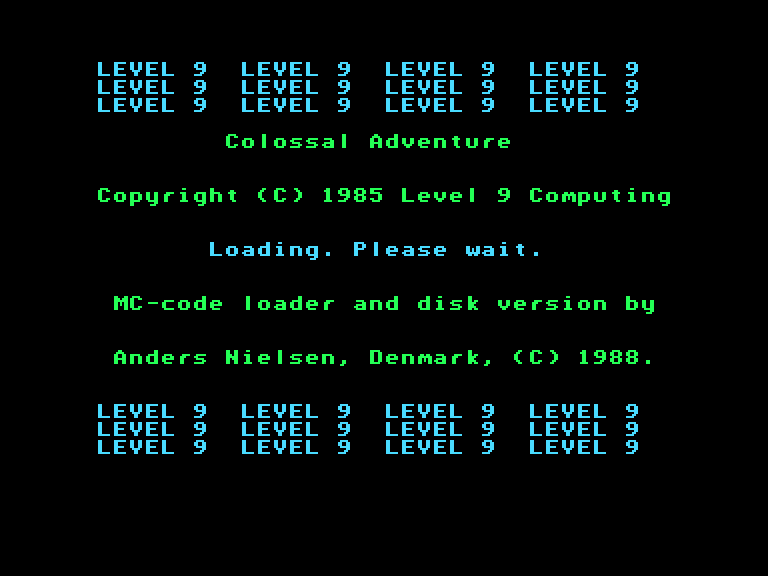
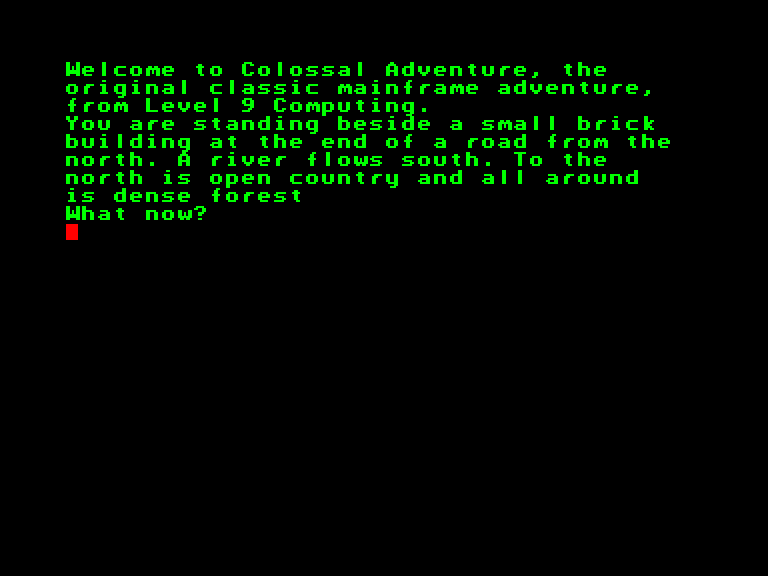
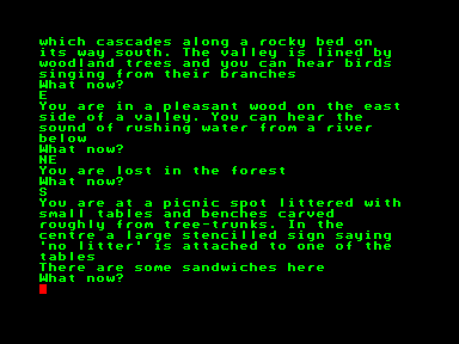
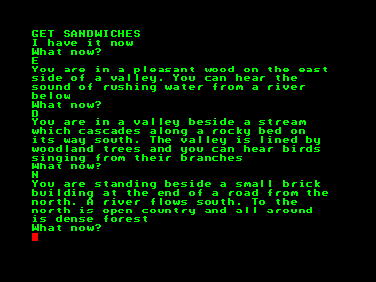

[0-9](../0/games-0.md) - [A](../a/games-a.md) - [B](../b/games-b.md) - [C](../c/games-c.md) - [D](../d/games-d.md) - [E](../e/games-e.md) - [F](../f/games-f.md) - [G](../g/games-g.md) - [H](../h/games-h.md) - [I](../i/games-i.md) - [J](../j/games-j.md) - [K](../k/games-k.md) - [L](../l/games-l.md) - [M](../m/games-m.md) - [N](../n/games-n.md) - [O](../o/games-o.md) - [P](../p/games-p.md) - [Q](../q/games-q.md) - [R](../r/games-r.md) - [S](../s/games-s.md) - [T](../t/games-t.md) - [U](../u/games-u.md) - [V](../v/games-v.md) - [W](../w/games-w.md) - [X](../x/games-x.md) - [Y](../y/games-y.md) - [Z](../z/games-z.md)

Ігри для [Enterprise 64k](../games-ep64.md) - [Enterprise 128k+RAMexp](../games-epramexp.md)

Ігри для систем [IS-DOS](../games-is-dos.md) - [SymbOS](../games-symbos.md) - [EDC Windows](../games-edcw.md)

Ігри для емуляторів [ZX Spectrum 48k/128k](../zxemu/games-zxemu.md) - [Amstrad CPC](../cpcemu/games-cpc.md) - [Sinclair ZX81](../zx81emu/games-zx81.md) - [Videoton TVC](../tvcemu/games-tvc.md) - [Commodore VIC-20](../vic20emu/games-vic20.md)

----------

# Colossal Adventure

**ID:** colossal-adventure

**Жанри:** Текстова пригода

## Примітка

ℹ Офіційний реліз.

## Скріншоти

## Опис

Одного вечора ви сидите в таверні, аж раптом усередину заходить укритий дорожнім пилом воїн і розраховується з шинкарем золотою монетою абсурдно високої цінності. За келихом він стверджує, що побував у легендарній Велетенській печері — і вибрався звідти живим!  

Протягом десятиліть чимало людей вирушали на пошуки славнозвісних печер, які, за переказами, приховують незліченні багатства... але й неймовірні небезпеки. Більшість вважає ці розповіді звичайними міфами. Зрештою, кожен шукач пригод, який вирушав на пошуки Печери, або не повертався взагалі, або повертався з порожніми руками, белькочучи дикі історії про гігантських змій та драконів.  

Інші відвідувачі лише глузують із заяв новоприбулого. Проте ви сумніваєтеся. У його очах застряг спогад про пережитий жах, і він відмовляється обговорювати свої подвиги. Тож коли ви випадково чуєте, що готується засада, аби відібрати в незнайомця золото й життя, ви виводите його в безпечне місце чорним ходом.  

Коли звуки переслідування вщухають, воїн вигукує: «Тисяча подяк! Я повинен винагородити тебе за твій благородний вчинок. Я віддаю тобі найцінніше, що маю, — місцерозташування Велетенської печери!» — і затискає у вашій долоні зім'ятий клапоть паперу.  

Ви сподівалися на золото, але все ж дякуєте за цю, здавалося б, мізерну нагороду та тиснете йому руку, перш ніж він розчиняється в ночі. Залишатися й ризикувати гнівом своїх компаньйонів було б явно нерозумно. Єдина альтернатива — перевірити, чи справжня карта, тож ви збираєте найнеобхідніші речі й вирушаєте в дорогу.  

Шлях виявляється довгим і важким — крізь річки, гори та незвідані землі. Коли до печери лишився лише день подорожі стається лихо. Поки ви звірялись з картою, раптовий шквал вітру вириває вицвілий папір із ваших рук просто в річку поряд. Стрімка течія миттєво відносить його геть, і, намокши, він іде на дно.  

Ви знаєте, що Печера десь поруч. Ви мусите знайти її, проникнути всередину та повернутися зі скарбами. І коли ви готуєтеся розпочати похід, який може принести вам або казкові багатства, або смерть, ви згадуєте написуваний у кутку втраченої карти запис: «Пам'ятай: у Печері працює магія!»

## Основна інформація
- **Мови:** Англійська
- **Оригінальна платформа:** Enterprise
### Загальні системні вимоги
- **Апаратні:** EP64, EP128
### Геймплей
- **Керування:** Keyboard
- **Кількість гравців:** 1 player
- **Додаткові теги:** Text40 mode
### Розробка
- **Рік випуску:** 1985
- **Компанія:** Level 9

## Посилання
- [Опис гри на ep128.hu (угорською)](http://www.ep128.hu/Ep_Games/Leiras/Colossal_Adventure.htm)
- [Завантажити гру](http://www.ep128.hu/Ep_Games/Prg/Colossal_Adventure.rar)

## [Керування](../controllers.md)

`Keyboard`

