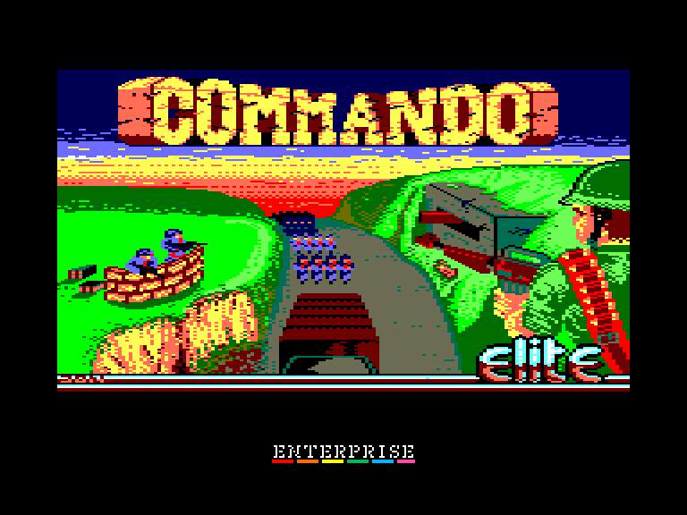
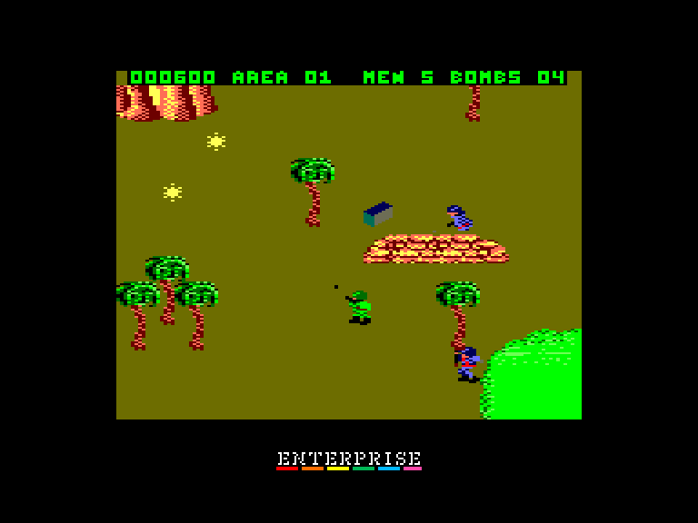
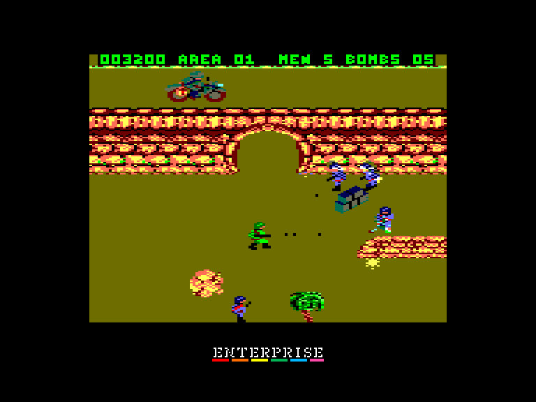
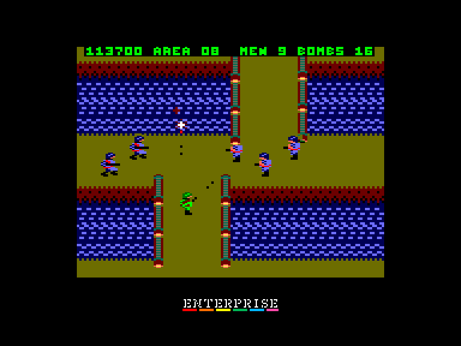

[0-9](../0/games-0.md) - [A](../a/games-a.md) - [B](../b/games-b.md) - [C](../c/games-c.md) - [D](../d/games-d.md) - [E](../e/games-e.md) - [F](../f/games-f.md) - [G](../g/games-g.md) - [H](../h/games-h.md) - [I](../i/games-i.md) - [J](../j/games-j.md) - [K](../k/games-k.md) - [L](../l/games-l.md) - [M](../m/games-m.md) - [N](../n/games-n.md) - [O](../o/games-o.md) - [P](../p/games-p.md) - [Q](../q/games-q.md) - [R](../r/games-r.md) - [S](../s/games-s.md) - [T](../t/games-t.md) - [U](../u/games-u.md) - [V](../v/games-v.md) - [W](../w/games-w.md) - [X](../x/games-x.md) - [Y](../y/games-y.md) - [Z](../z/games-z.md)

Ігри для [Enterprise 64k](../games-ep64.md) - [Enterprise 128k+RAMexp](../games-epramexp.md)

Ігри для систем [IS-DOS](../games-is-dos.md) - [SymbOS](../games-symbos.md) - [EDC Windows](../games-edcw.md)

Ігри для емуляторів [ZX Spectrum 48k/128k](../zxemu/games-zxemu.md) - [Amstrad CPC](../cpcemu/games-cpc.md) - [Sinclair ZX81](../zx81emu/games-zx81.md) - [Videoton TVC](../tvcemu/games-tvc.md) - [Commodore VIC-20](../vic20emu/games-vic20.md)

----------

# Commando

**ID:** commando-cpc

**Жанри:** Аркада, Екшн, Шутем-ап

## Примітка

ℹ Сучасна неофіційна конверсія з платформи Amstrad CPC.

## Скріншоти

## Опис

Ви — Супер Джо, елітний боєць вісімдесятих (!), який всупереч усім шансам биється проти наступаючих сил заколотників. Озброєний лише кулеметом M60 та шістьма ручними гранатами, ви ведете свій хрестовий похід наодинці, пробиваючись углиб ворожої території.  

Мінометні міни, гранати та динамітні шашки дощем сиплються з неба й вибухають навколо вас. Ворожі кулі свистять з усіх боків, а окопи, кручі та озера перегороджують вам шлях.  

Війська повстанців виринають із печер, укріплень і бронетранспортерів, аби зупинити ваш просув. Ви не повинні знати милосердя. Ви не маєте права відступати. Ви мусите прориватися все далі й далі углиб ворожих позицій, підбираючи запаси гранат на розгромлених аванпостах, аж поки не досягнете своєї фінальної мети — фортеці ворога.

## Основна інформація
- **Мови:** Англійська
- **Оригінальна платформа:** Amstrad CPC
### Загальні системні вимоги
- **Апаратні:** EP128
### Геймплей
- **Керування:** Keyboard, Internal Joy, External Joy 1
- **Додаткові теги:** 16-color mode
### Розробка
- **Рік випуску:** 1985

## Посилання
- [Опис гри на ep128.hu (угорською)](http://www.ep128.hu/Ep_Games/Leiras/Commando.htm)
- [Інформація про оригінальну версію](https://www.cpc-power.com/index.php?page=detail&num=103)
- [Завантажити гру](http://www.ep128.hu/Ep_Games/Prg/Commando_CPC.rar)
- [Easy Load&Play](https://t.me/EP128k_Load_n_Play/164) *(Telegram-канал Vibrant Waves)*

## Відео

<iframe src="https://www.youtube.com/embed/EnTdd_PKatE"  
style="width:75%; aspect-ratio:16/9;" allowfullscreen></iframe>

## [Керування](../controllers.md)

`Keyboard` (можливо перевизначити)  
`Internal Joystick` (можна задіяти під час перевизначення клавіш)  
`External Joystick 1`  

Керування по замовчуванню:  
`Internal Joystick`  
`M`: Стріляти  
`Space`: Жбурнути гранату  

Клавіши керування на початковому екрані:  
`S`: почати нову гру  
`K`: перевизначити клавіши  
`J`: Вибрати `External Joystick 1` (`Space`: гранати)

## Детальна інформація

### Чіти  

(активуються після завантаження):  

- Нескінченні життя  
- Нескінченні гранати  
- Невразливість