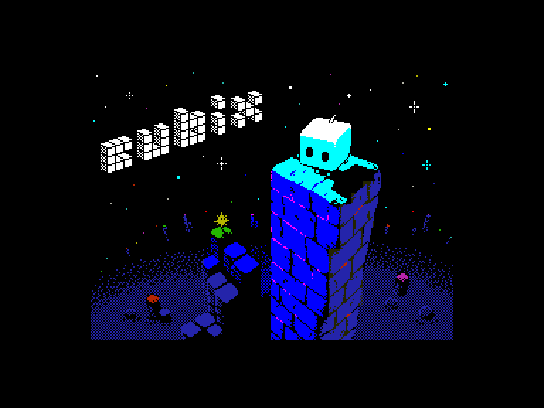
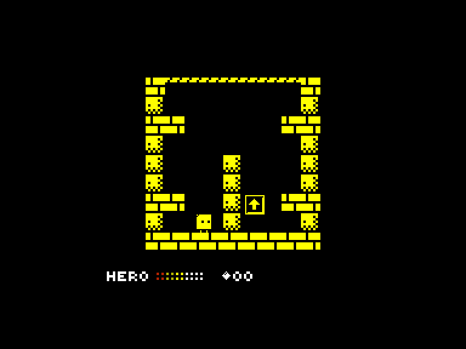
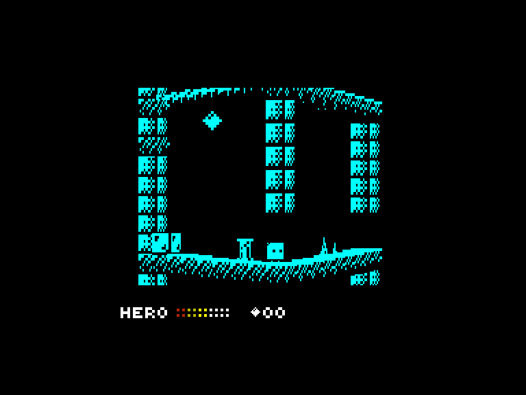
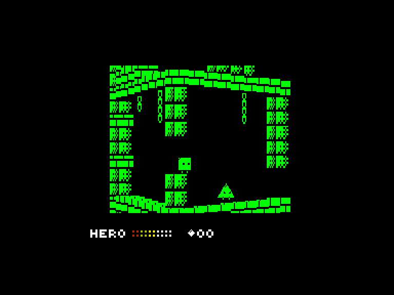

[0-9](../0/games-0.md) - [A](../a/games-a.md) - [B](../b/games-b.md) - [C](../c/games-c.md) - [D](../d/games-d.md) - [E](../e/games-e.md) - [F](../f/games-f.md) - [G](../g/games-g.md) - [H](../h/games-h.md) - [I](../i/games-i.md) - [J](../j/games-j.md) - [K](../k/games-k.md) - [L](../l/games-l.md) - [M](../m/games-m.md) - [N](../n/games-n.md) - [O](../o/games-o.md) - [P](../p/games-p.md) - [Q](../q/games-q.md) - [R](../r/games-r.md) - [S](../s/games-s.md) - [T](../t/games-t.md) - [U](../u/games-u.md) - [V](../v/games-v.md) - [W](../w/games-w.md) - [X](../x/games-x.md) - [Y](../y/games-y.md) - [Z](../z/games-z.md)

Ігри для [Enterprise 64k](../games-ep64.md) - [Enterprise 128k+RAMexp](../games-epramexp.md)

Ігри для систем [IS-DOS](../games-is-dos.md) - [SymbOS](../games-symbos.md) - [EDC Windows](../games-edcw.md)

Ігри для емуляторів [ZX Spectrum 48k/128k](../zxemu/games-zxemu.md) - [Amstrad CPC](../cpcemu/games-cpc.md) - [Sinclair ZX81](../zx81emu/games-zx81.md) - [Videoton TVC](../tvcemu/games-tvc.md) - [Commodore VIC-20](../vic20emu/games-vic20.md)

----------

# Cubix

**ID:** cubix-zx

**Жанри:** Платформер, Пазл

## Примітка

ℹ Сучасна схвалена конверсія з платформи ZX Spectrum.

## Скріншоти

## Опис

У далекий, гармонійний і кубічний усесвіт завітали темні часи.  

Колись там мешкали кубики, чий ідеально впорядкований світ тримався на Священному Талісмані — магічному гральному кубику, що уособлював всесвітній баланс. Але хаотичний лиходій Гексатрон викрав і розбив Талісман, розвіявши його шість граней по небезпечних вежах.  

Цей злочин занурив царство кубиків у хаос, викрививши саму реальність і спотворивши його мешканців. Лише Бікс — останній кубик, якого не торкнулося прокляття, — наважується зібрати уламки, відновити Талісман і здолати Гексатрона, щоб повернути у свій світ спокій.

## Основна інформація
- **Мови:** Англійська
- **Оригінальна платформа:** ZX Spectrum
### Загальні системні вимоги
- **Апаратні:** EP128+RAM, EP128
### Геймплей
- **Керування:** Keyboard, Internal Joy, External Joy 1, External Joy 2
- **Кількість гравців:** 1 player
- **Додаткові теги:** Attribute mode
### Розробка
- **Рік випуску:** 2025
- **Автор:** Sergei Smirnov

## Посилання
- [Інформація про оригінальну версію](https://spectrumcomputing.co.uk/entry/44487/ZX-Spectrum/Cubix)
- [Завантажити гру](https://www.ep128.hu/Ep_Games/Prg/Cubix.rar)
- [Easy Load&Play](https://t.me/EP128k_Load_n_Play/1138) *(Telegram-канал Vibrant Waves)*

## Відео

<iframe src="https://www.youtube.com/embed/8CSYSlJrtc4"  
style="width:75%; aspect-ratio:16/9;" allowfullscreen></iframe>

## Керування

`Keyboard`: `W`, `A`, `S`, `D`  
`Keyboard`: `Q`, `A`, `O`, `P`  
`Internal Joystick`  
`External Joystick 1`  
`External Joystick 2`  

Додаткові клавіши:  
`R`: Меню паузи  

Налаштування аудіоплеєра (активація після завантаження):  
- Емуляція огинаючої AY  
   - `F1`: **ON** - огинаючі AY емулюються через переривання 1 кГц. Працює неідеально, оскільки під час гри переривання вимикаються на тривалий час і частина з них втрачається.  
   - `F2`: **OFF** - огинаючі AY не емулюються; замість цього для каналу Dave встановлюється звичайний тон на основі частоти періоду огинаючої AY.  
- Тон + шум AY (емуляція одночасного відтворення тону та шуму на каналі AY)  
   - `F1`: **ToneFRQ->noise** - встановлює частоту тону AY як частоту шуму для каналу Dave.  
   - `F2`: **Noise** - встановлює частоту шуму AY як частоту шуму для каналу Dave.  

(Вибір автора: `F2`+`F2`)

## Детальна інформація

### Чіти  

(активуються після завантаження):  
`F1`: звичайна гра  
`F2`: невразливість