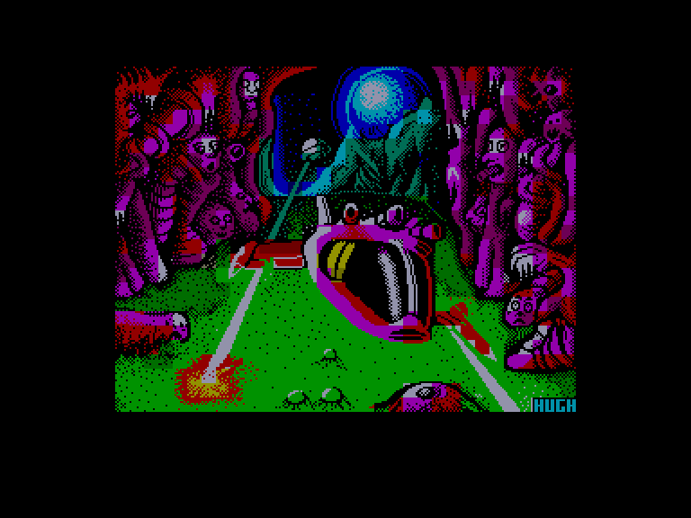
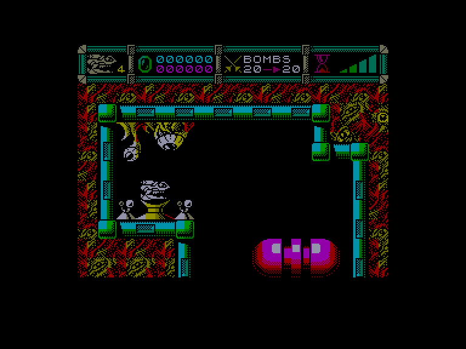
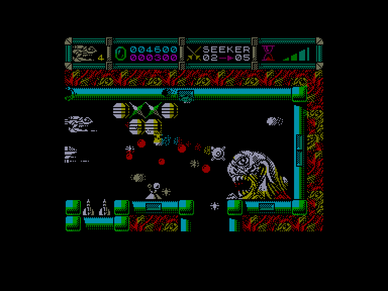
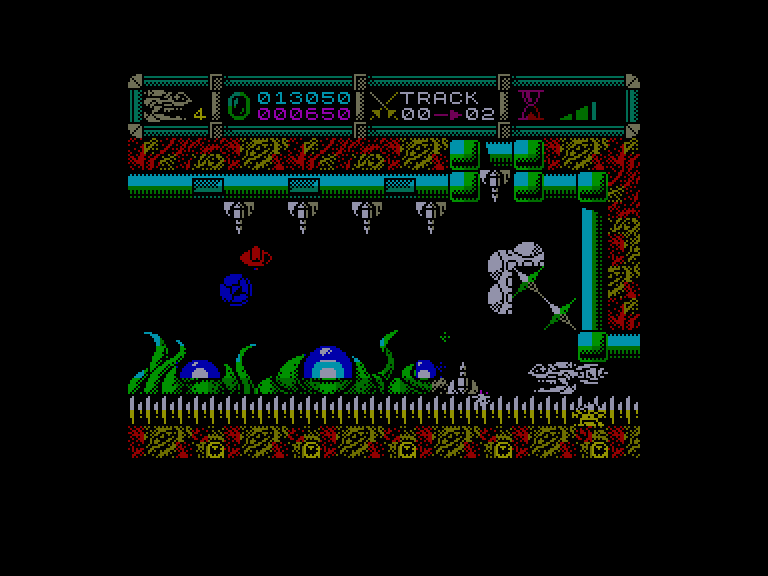

[0-9](../0/games-0.md) - [A](../a/games-a.md) - [B](../b/games-b.md) - [C](../c/games-c.md) - [D](../d/games-d.md) - [E](../e/games-e.md) - [F](../f/games-f.md) - [G](../g/games-g.md) - [H](../h/games-h.md) - [I](../i/games-i.md) - [J](../j/games-j.md) - [K](../k/games-k.md) - [L](../l/games-l.md) - [M](../m/games-m.md) - [N](../n/games-n.md) - [O](../o/games-o.md) - [P](../p/games-p.md) - [Q](../q/games-q.md) - [R](../r/games-r.md) - [S](../s/games-s.md) - [T](../t/games-t.md) - [U](../u/games-u.md) - [V](../v/games-v.md) - [W](../w/games-w.md) - [X](../x/games-x.md) - [Y](../y/games-y.md) - [Z](../z/games-z.md)

Ігри для [Enterprise 64k](../games-ep64.md) - [Enterprise 128k+RAMexp](../games-epramexp.md)

Ігри для систем [IS-DOS](../games-is-dos.md) - [SymbOS](../games-symbos.md) - [EDC Windows](../games-edcw.md)

Ігри для емуляторів [ZX Spectrum 48k/128k](../zxemu/games-zxemu.md) - [Amstrad CPC](../cpcemu/games-cpc.md) - [Sinclair ZX81](../zx81emu/games-zx81.md) - [Videoton TVC](../tvcemu/games-tvc.md) - [Commodore VIC-20](../vic20emu/games-vic20.md)

----------

# Cybernoid II: The Revenge

**ID:** cybernoid2-zx

**Жанри:** Екшн

## Примітка

ℹ Стара неофіційна конверсія з платформи ZX Spectrum.  
(краще користуватись сучасним портом з Amstrad CPC)

## Скріншоти

## Опис

Пірати, яких ви розгромили в оригінальній грі CYBERNOID, повернулися на новому крейсері — ще більшому, лютішому та небезпечнішому, ніж раніше. І знову саме вам доручили місію повернути вантаж, викрадений піратами. Цього разу у вашому розпорядженні сяючий новий корабель і ще більший арсенал зброї, проте й завдання буде куди ризикованішим...

## Основна інформація
- **Мови:** Англійська
- **Оригінальна платформа:** ZX Spectrum
### Загальні системні вимоги
- **Апаратні:** EP128
### Геймплей
- **Кількість гравців:** 1 player
- **Додаткові теги:** Attribute mode
### Розробка
- **Рік випуску:** 1988

## Посилання
- [Опис гри на ep128.hu (угорською)](http://www.ep128.hu/Games/Cybernoid2.htm)
- [Інформація про оригінальну версію](https://spectrumcomputing.co.uk/entry/1199)
- [Завантажити гру](http://www.ep128.hu/Ep_Games/Prg/Cybernoid2.rar)
- [Easy Load&Play](https://t.me/EP128k_Load_n_Play/231) *(Telegram-канал Vibrant Waves)*

## Детальна інформація

### Геймплей  

Літайте навколо та нищіть усе, що рухається (і все, що стоїть на місці...). Коли піратські кораблі вибухають, із них випадає здобич — підбирайте її та використовуйте собі на користь. Щоб здолати піратів за відведений час, вам доведеться застосовувати різноманітне озброєння (кольоровий графік у правому нижньому кутку показує залишок часу). У грі є сім видів спеціальної зброї, які вибираються клавішами 1–7 та випускаються затисканням кнопки вогню:  

1. Бомби — знищують великі вогневі точки та турелі.  
2. Бомби уповільненої дії (Time bombs) — вибухають за кілька секунд після скидання.  
3. Щит (Shield) — тимчасово робить ваш корабель абсолютно невразливим.  
4. Рікошетні бомби (Bounce bombs) — відбиваються від перешкод і вибухають при зіткненні.  
5. Самонавідні ракети (Seeker) — самі знаходять і вражають ціль.  
6. Смарт-бомба (Smart) — миттєво знищує всі вогневі позиції на екрані.  
7. Трасер (Tracer) — рухається вздовж країв екрана, зносячи все на своєму шляху.