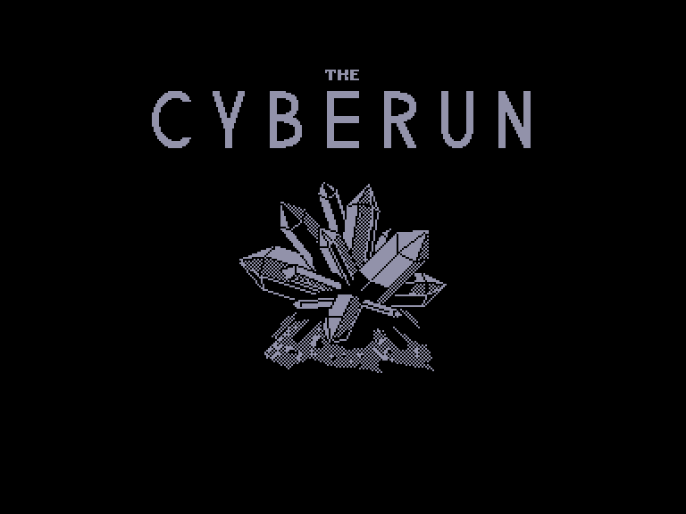
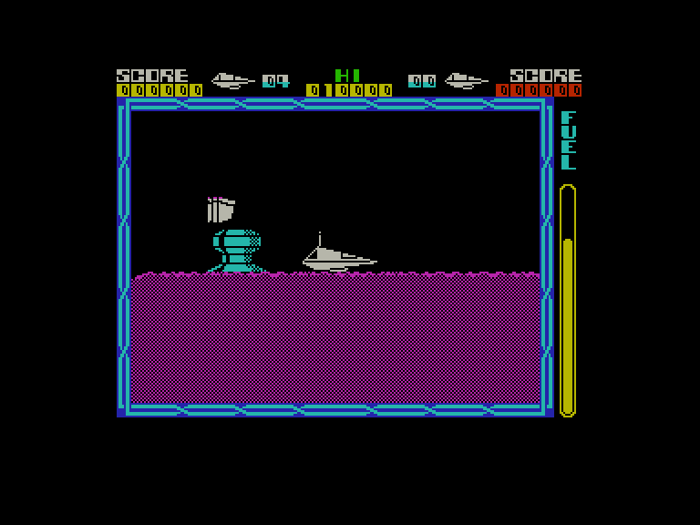
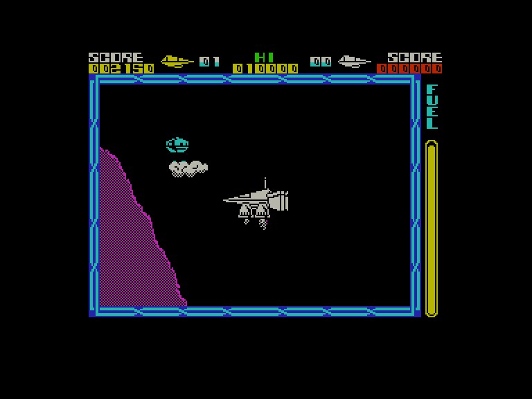

[0-9](../0/games-0.md) - [A](../a/games-a.md) - [B](../b/games-b.md) - [C](../c/games-c.md) - [D](../d/games-d.md) - [E](../e/games-e.md) - [F](../f/games-f.md) - [G](../g/games-g.md) - [H](../h/games-h.md) - [I](../i/games-i.md) - [J](../j/games-j.md) - [K](../k/games-k.md) - [L](../l/games-l.md) - [M](../m/games-m.md) - [N](../n/games-n.md) - [O](../o/games-o.md) - [P](../p/games-p.md) - [Q](../q/games-q.md) - [R](../r/games-r.md) - [S](../s/games-s.md) - [T](../t/games-t.md) - [U](../u/games-u.md) - [V](../v/games-v.md) - [W](../w/games-w.md) - [X](../x/games-x.md) - [Y](../y/games-y.md) - [Z](../z/games-z.md)

Ігри для [Enterprise 64k](../games-ep64.md) - [Enterprise 128k+RAMexp](../games-epramexp.md)

Ігри для систем [IS-DOS](../games-is-dos.md) - [SymbOS](../games-symbos.md) - [EDC Windows](../games-edcw.md)

Ігри для емуляторів [ZX Spectrum 48k/128k](../zxemu/games-zxemu.md) - [Amstrad CPC](../cpcemu/games-cpc.md) - [Sinclair ZX81](../zx81emu/games-zx81.md) - [Videoton TVC](../tvcemu/games-tvc.md) - [Commodore VIC-20](../vic20emu/games-vic20.md)

----------

# Cyberun

**ID:** cyberun-zx

**Жанри:** Екшн

## Примітка

ℹ Стара неофіційна конверсія з платформи ZX Spectrum.

## Скріншоти

## Опис

У глибокому та віддаленому секторі галактики лежить система Зеберама — скупчення зірок і планет, об’єднаних незвичною решіткою з плазмової енергії. Ніхто й не звернув би на неї уваги, якби не той факт, що ця система складається з кіберніту — неймовірно рідкісної речовини, критично важливої для зоряного видобутку. Утім, енергетична решітка настільки потужна, що лише надзвичайно міцний корабель має хоч якийсь шанс повернутися із Зеберами. Такий корабель розробили по частинах і доставили в систему; вас же обрали пілотом командного модуля, який мусить повернутися із заповненими кібернітом трюмами...

## Основна інформація
- **Мови:** Англійська
- **Оригінальна платформа:** ZX Spectrum
### Загальні системні вимоги
- **Апаратні:** EP128
### Геймплей
- **Додаткові теги:** Attribute mode

## Посилання
- [Опис гри на ep128.hu (угорською)](http://www.ep128.hu/Games/Cyberun.htm)
- [Інформація про оригінальну версію](https://spectrumcomputing.co.uk/entry/9329)
- [Завантажити гру](http://www.ep128.hu/Ep_Games/Prg/Cyberun.rar)

## Детальна інформація

### Геймплей  

Ваше завдання складається з двох основних частин: знайти прискорювачі, сонячні вітрила та інші модулі вашого корабля, а також вирватися на волю із повними трюмами кіберніту. Деталі розкидано по двовимірному ландшафту із бічним скролінгом, який, як зазвичай, кишить ворожими прибульцями — вони зроблять усе можливе, щоб ускладнити вам життя. Хоча ваш корабель має щити, прибульці швидко їх виснажуватимуть і забрають чимало з ваших чотирьох життів. Рівень пошкоджень відображається на невеличкому силуеті корабля у верхній частині екрана, який змінює колір у міру отримання шкоди.  

Запас пального також обмежений — його рівень показує датчик у правій частині екрана. Додаткове пальне можна підбирати на паливних станціях, розкиданих по поверхні планети, які генерують краплі пального, а ви мусите їх ловити. Початково ви озброєні доволі слабким лазером, але його можна покращити до потужного плазмового випромінювача (якщо, звісно, ви його знайдете!).