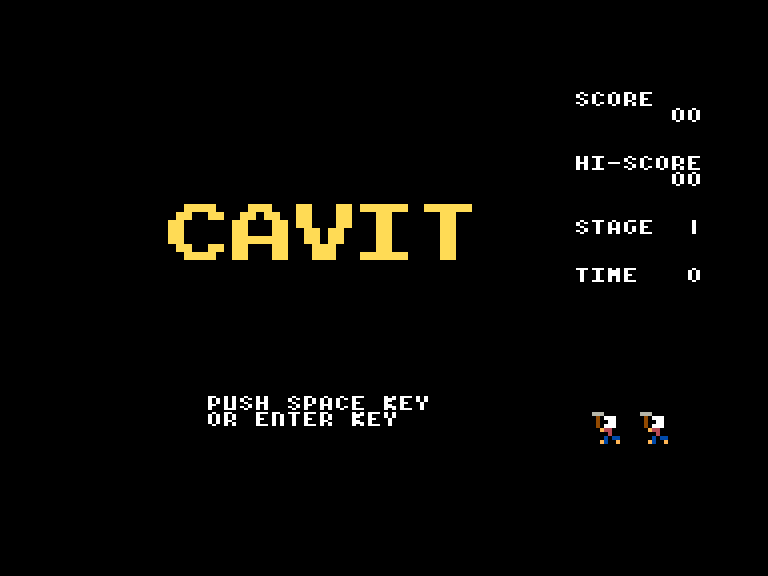
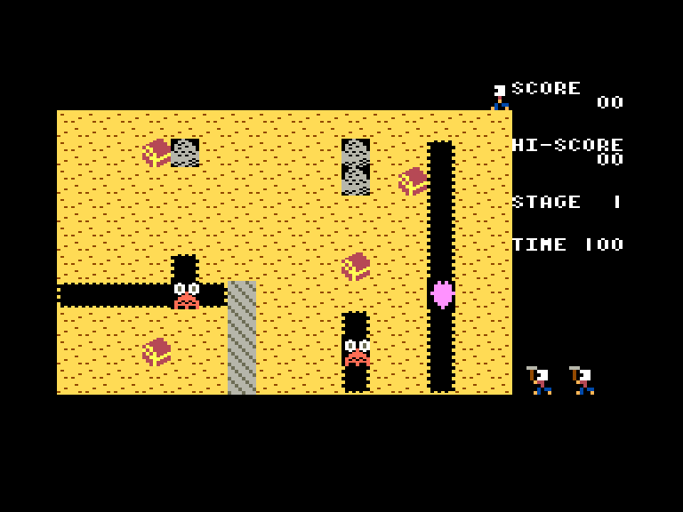
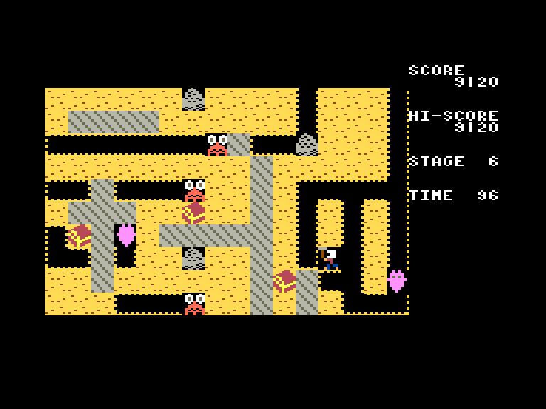

# Cavit

| | | | |
| --- | --- | --- | --- |
|||||

Жанр: аркада  
Кількість гравців: 1  
Мова гри: англійська  

## Опис

Вам необхідно зібрати усі скрині із скарбами. Але крім скарбів під землею можна натрапити на різних монстрів. Червоний монстр просто намагається вас упіймати, але він не може вибратись за межі своєї печери, а привиди, у деяких випадках, можуть проходити крізь ґрунт. Щоб їх знищити достатньо скинути на них важкеньку каменюку.

У грі 10 різних рівней, після чого вони починають повторюватись.

Якщо ви знайомі з класичною грою Digger, то і тут ви не розгубитесь.

## Системні вимоги

|Мінімальні системні вимоги:|Рекомендовані системні вимоги:|
|---------------------------|------------------------------|
|Оперативна пам'ять: **64 КБ** (тільки картридж-версія)|Оперативна пам'ять: **128 КБ (або більше)**|  

## Керування та тонкощі запуску
### Елементи керування меню:

`Enter`/`Space`/`X`/`Z`: Почати гру  

### Основні [елементи керування](../controllers.md):
⌨ Клавіатура (`L`, `,`, `.`, `/`)  
🕹 Вбудований джойстик  

## Посилання

▶ [Easy Load&Play](https://t.me/EP128k_Load_n_Play/801) *(Telegram-канал Vibrant Waves)*  
💾 [Завантажити гру]()  
🏡 [Домашня сторінка гри](http://inufuto.web.fc2.com/8bit/cavit/#ep64)

## Автори
👨‍💻 Розробник: [Inufuto](../../community/inufuto.md)  
📅 Рік релізу: [2025](../release_years/2025.md)  